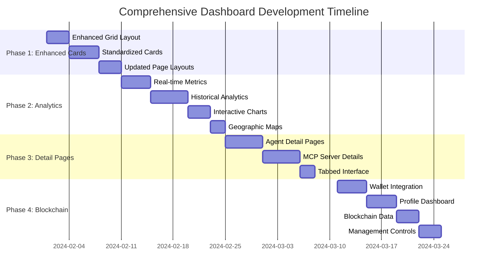
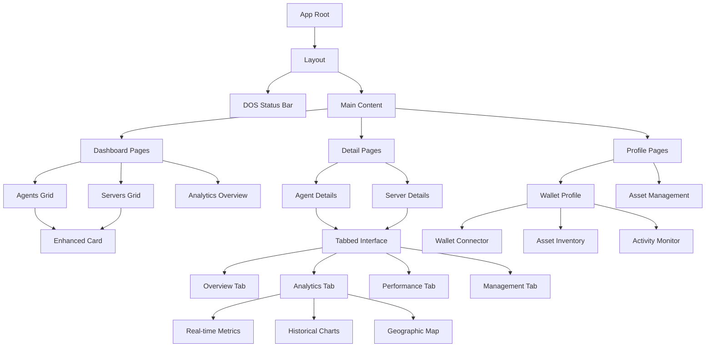
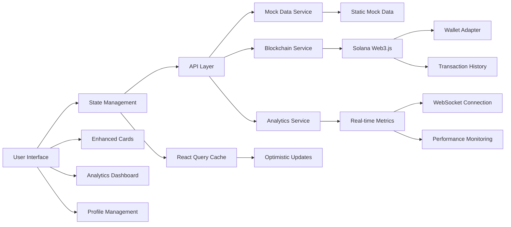
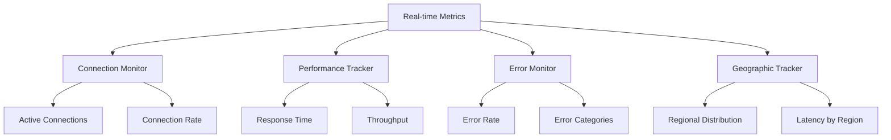
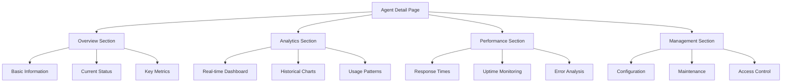
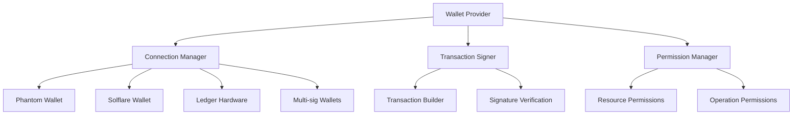

# Dashboard Implementation Roadmap

## 🗺️ Development Timeline & Architecture

### Phase Overview



## 🏗️ System Architecture

### Component Hierarchy



### Data Flow Architecture



## 📋 Detailed Implementation Tasks

### Phase 1: Enhanced Card System (Week 1-2)

#### Task 1.1: Enhanced Grid Layout
**Priority**: High | **Effort**: 3 days

```typescript
// Component Structure
frontend/components/common/
├── EnhancedGrid.tsx          // Main grid container
├── GridItem.tsx              // Individual grid item wrapper
└── ResponsiveContainer.tsx   // Responsive layout logic
```

**Key Features**:
- CSS Grid with auto-fit columns
- Consistent 16px spacing system
- Responsive breakpoints (320px, 768px, 1024px, 1440px)
- Smooth transitions and animations

**Acceptance Criteria**:
- [ ] Grid adapts to screen size automatically
- [ ] Consistent spacing across all breakpoints
- [ ] Smooth animations on layout changes
- [ ] Accessibility compliance (WCAG AA)

#### Task 1.2: Standardized Card Component
**Priority**: High | **Effort**: 4 days

```typescript
// Enhanced Card Props Interface
interface EnhancedCardProps {
  type: 'agent' | 'mcp_server' | 'summary';
  data: AgentData | MCPServerData | SummaryData;
  size: 'compact' | 'standard' | 'expanded';
  showAnalytics?: boolean;
  onAction?: (action: string, data: any) => void;
}
```

**Key Features**:
- Consistent visual hierarchy
- Hover states with elevation
- Status indicators with color coding
- Performance metrics display
- Quick action buttons

**Acceptance Criteria**:
- [ ] Consistent typography across all cards
- [ ] Proper visual hierarchy (title → status → metrics → actions)
- [ ] Smooth hover animations
- [ ] Accessible keyboard navigation
- [ ] Mobile-optimized touch targets

#### Task 1.3: Updated Page Layouts
**Priority**: Medium | **Effort**: 3 days

**Files to Update**:
- `frontend/app/agents/page.tsx`
- `frontend/app/servers/page.tsx`
- `frontend/app/page.tsx` (dashboard overview)

**Key Features**:
- Enhanced search and filtering
- Improved sorting options
- Better loading states
- Pagination for large datasets

### Phase 2: Analytics Dashboard (Week 3-4)

#### Task 2.1: Real-time Metrics Dashboard
**Priority**: High | **Effort**: 4 days



**Component Structure**:
```typescript
frontend/components/analytics/
├── RealTimeMetrics.tsx       // Main dashboard
├── ConnectionMonitor.tsx     // Live connections
├── PerformanceGauge.tsx     // Performance indicators
├── ErrorTracker.tsx         // Error monitoring
└── GeographicOverview.tsx   // Regional data
```

#### Task 2.2: Historical Analytics
**Priority**: High | **Effort**: 5 days

**Chart Types**:
- Time-series line charts for trends
- Area charts for cumulative metrics
- Bar charts for comparative data
- Heat maps for geographic distribution

**Time Ranges**:
- Last 24 hours (hourly data points)
- Last 7 days (daily data points)
- Last 30 days (daily data points)
- Last 90 days (weekly data points)

#### Task 2.3: Interactive Visualizations
**Priority**: Medium | **Effort**: 3 days

**Chart Library**: Chart.js with React wrapper

**Features**:
- Zoom and pan functionality
- Tooltip with detailed information
- Legend with toggle visibility
- Export functionality (PNG, SVG, CSV)

### Phase 3: Individual Detail Pages (Week 5-6)

#### Task 3.1: Agent Detail Pages
**Priority**: High | **Effort**: 5 days



**Page Structure**:
```typescript
frontend/app/agents/[id]/
├── page.tsx                  // Main detail page
├── analytics/
│   └── page.tsx             // Dedicated analytics page
├── performance/
│   └── page.tsx             // Performance monitoring
└── management/
    └── page.tsx             // Management interface
```

#### Task 3.2: MCP Server Detail Pages
**Priority**: High | **Effort**: 5 days

**Unique Features for MCP Servers**:
- Tool documentation and examples
- Resource availability monitoring
- Prompt template management
- API endpoint testing interface

#### Task 3.3: Tabbed Interface System
**Priority**: Medium | **Effort**: 2 days

**Tab Configuration**:
```typescript
interface TabConfig {
  id: string;
  label: string;
  icon?: string;
  component: React.ComponentType;
  badge?: number | string;
  disabled?: boolean;
}

const agentTabs: TabConfig[] = [
  { id: 'overview', label: 'Overview', component: OverviewTab },
  { id: 'analytics', label: 'Analytics', component: AnalyticsTab, badge: 'LIVE' },
  { id: 'performance', label: 'Performance', component: PerformanceTab },
  { id: 'management', label: 'Management', component: ManagementTab },
  { id: 'logs', label: 'Logs', component: LogsTab },
];
```

### Phase 4: Solana Blockchain Integration (Week 7-8)

#### Task 4.1: Wallet Connection System
**Priority**: High | **Effort**: 4 days



**Integration Points**:
- Solana Wallet Adapter
- Web3.js for blockchain interactions
- Transaction history tracking
- Multi-signature support

#### Task 4.2: User Profile Dashboard
**Priority**: High | **Effort**: 4 days

**Profile Sections**:
```typescript
interface UserProfile {
  wallet: {
    address: string;
    balance: number;
    isMultiSig: boolean;
  };
  assets: {
    agents: OwnedAgent[];
    mcpServers: OwnedMCPServer[];
    totalValue: number;
  };
  activity: {
    recentTransactions: Transaction[];
    deploymentHistory: Deployment[];
    performanceMetrics: ProfileMetrics;
  };
  settings: {
    notifications: NotificationSettings;
    privacy: PrivacySettings;
    preferences: UserPreferences;
  };
}
```

#### Task 4.3: Blockchain Data Integration
**Priority**: Medium | **Effort**: 3 days

**Data Sources**:
- On-chain transaction history
- Smart contract state
- Token balances and transfers
- Deployment metadata

**Caching Strategy**:
- React Query for API data
- Local storage for user preferences
- Session storage for temporary data
- IndexedDB for large datasets

#### Task 4.4: Management Controls
**Priority**: Medium | **Effort**: 3 days

**Management Features**:
- Bulk operations (start/stop/update)
- Maintenance scheduling
- Configuration management
- Access control and permissions

## 🎨 Design System Implementation

### Enhanced Color System

```css
:root {
  /* Status Colors */
  --status-active: #22c55e;
  --status-inactive: #ef4444;
  --status-pending: #f59e0b;
  --status-maintenance: #8b5cf6;
  
  /* Performance Colors */
  --perf-excellent: #10b981;  /* 95-100% */
  --perf-good: #84cc16;       /* 80-94% */
  --perf-fair: #f59e0b;       /* 60-79% */
  --perf-poor: #ef4444;       /* <60% */
  
  /* Chart Colors */
  --chart-primary: #3b82f6;
  --chart-secondary: #8b5cf6;
  --chart-accent: #06b6d4;
  --chart-success: #10b981;
  --chart-warning: #f59e0b;
  --chart-danger: #ef4444;
  
  /* Gradient Overlays */
  --gradient-performance: linear-gradient(135deg, var(--perf-excellent), var(--perf-good));
  --gradient-analytics: linear-gradient(135deg, var(--chart-primary), var(--chart-secondary));
}
```

### Typography Enhancements

```css
/* Metric Display */
.metric-display {
  font-family: 'Courier New', monospace;
  font-variant-numeric: tabular-nums;
}

.metric-value-large {
  font-size: 2.5rem;
  font-weight: bold;
  line-height: 1;
}

.metric-value-medium {
  font-size: 1.5rem;
  font-weight: bold;
  line-height: 1.2;
}

.metric-value-small {
  font-size: 1rem;
  font-weight: bold;
  line-height: 1.4;
}

.metric-label {
  font-size: 0.75rem;
  text-transform: uppercase;
  letter-spacing: 0.05em;
  color: var(--ascii-neutral-600);
}

/* Status Indicators */
.status-indicator {
  display: inline-flex;
  align-items: center;
  gap: 0.5rem;
  font-family: 'Courier New', monospace;
  font-weight: bold;
  text-transform: uppercase;
  padding: 0.25rem 0.75rem;
  border: 1px solid;
  font-size: 0.75rem;
}

.status-active {
  background-color: var(--status-active);
  border-color: var(--status-active);
  color: white;
}

.status-inactive {
  background-color: var(--status-inactive);
  border-color: var(--status-inactive);
  color: white;
}
```

### Animation System

```css
/* Card Animations */
@keyframes cardHover {
  from {
    transform: translateY(0);
    box-shadow: 2px 2px 0px var(--ascii-neutral-400);
  }
  to {
    transform: translateY(-2px);
    box-shadow: 4px 4px 0px var(--ascii-neutral-400);
  }
}

.enhanced-card {
  transition: all 0.2s ease;
}

.enhanced-card:hover {
  animation: cardHover 0.2s ease forwards;
}

/* Loading Animations */
@keyframes shimmer {
  0% {
    background-position: -200px 0;
  }
  100% {
    background-position: calc(200px + 100%) 0;
  }
}

.loading-shimmer {
  background: linear-gradient(
    90deg,
    var(--ascii-neutral-200) 0px,
    var(--ascii-neutral-300) 40px,
    var(--ascii-neutral-200) 80px
  );
  background-size: 200px 100%;
  animation: shimmer 1.5s infinite;
}

/* Chart Animations */
@keyframes chartFadeIn {
  from {
    opacity: 0;
    transform: scale(0.95);
  }
  to {
    opacity: 1;
    transform: scale(1);
  }
}

.chart-container {
  animation: chartFadeIn 0.5s ease;
}
```

## 📊 Mock Data Strategy

### Realistic Data Generation

```typescript
// Performance metrics generator
export const generatePerformanceMetrics = (baselinePerformance: number = 0.95): PerformanceMetrics => {
  const variance = 0.1;
  const uptime = Math.max(0.8, Math.min(1, baselinePerformance + (Math.random() - 0.5) * variance));
  const responseTime = Math.max(10, 100 - (baselinePerformance * 80) + (Math.random() * 50));
  const errorRate = Math.max(0, (1 - baselinePerformance) * 0.1 + (Math.random() * 0.02));
  
  return {
    uptime,
    averageResponseTime: responseTime,
    errorRate,
    requestsPerSecond: Math.floor(Math.random() * 1000) + 100,
    healthScore: calculateHealthScore({ uptime, averageResponseTime: responseTime, errorRate }),
  };
};

// Geographic data generator
export const generateGeographicData = (): GeographicDistribution[] => {
  const regions = [
    { name: 'North America', code: 'NA', baseConnections: 1000 },
    { name: 'Europe', code: 'EU', baseConnections: 800 },
    { name: 'Asia Pacific', code: 'APAC', baseConnections: 1200 },
    { name: 'South America', code: 'SA', baseConnections: 300 },
    { name: 'Africa', code: 'AF', baseConnections: 200 },
  ];
  
  return regions.map(region => ({
    ...region,
    connections: region.baseConnections + Math.floor(Math.random() * 200),
    averageLatency: Math.floor(Math.random() * 100) + 50,
    errorRate: Math.random() * 0.05,
  }));
};

// Time series data generator
export const generateTimeSeriesData = (
  hours: number = 24,
  baseValue: number = 100,
  volatility: number = 0.2
): TimeSeriesPoint[] => {
  const data: TimeSeriesPoint[] = [];
  let currentValue = baseValue;
  
  for (let i = 0; i < hours; i++) {
    const timestamp = new Date(Date.now() - (hours - i) * 60 * 60 * 1000);
    const change = (Math.random() - 0.5) * volatility * baseValue;
    currentValue = Math.max(0, currentValue + change);
    
    data.push({
      timestamp,
      value: currentValue,
      connections: Math.floor(currentValue * (0.8 + Math.random() * 0.4)),
      requests: Math.floor(currentValue * 10 * (0.8 + Math.random() * 0.4)),
      errors: Math.floor(currentValue * 0.01 * Math.random()),
    });
  }
  
  return data;
};
```

## 🔧 Technical Implementation Guidelines

### State Management Strategy

```typescript
// Zustand store for global state
interface AppStore {
  // Authentication
  wallet: WalletState | null;
  setWallet: (wallet: WalletState | null) => void;
  
  // UI State
  theme: 'light' | 'dark';
  sidebarCollapsed: boolean;
  activeFilters: FilterState;
  
  // Data State
  agents: Agent[];
  mcpServers: MCPServer[];
  analytics: Record<string, AnalyticsData>;
  
  // Actions
  updateAgent: (id: string, updates: Partial<Agent>) => void;
  updateMCPServer: (id: string, updates: Partial<MCPServer>) => void;
  setAnalytics: (resourceId: string, data: AnalyticsData) => void;
}

// React Query for server state
const useAgentAnalytics = (agentId: string, timeRange: string) => {
  return useQuery({
    queryKey: ['agent-analytics', agentId, timeRange],
    queryFn: () => fetchAgentAnalytics(agentId, timeRange),
    staleTime: 5 * 60 * 1000, // 5 minutes
    refetchInterval: 30 * 1000, // 30 seconds for real-time data
  });
};
```

### Performance Optimization

```typescript
// Virtual scrolling for large lists
import { FixedSizeList as List } from 'react-window';

const VirtualizedAgentList = ({ agents }: { agents: Agent[] }) => {
  const Row = ({ index, style }: { index: number; style: React.CSSProperties }) => (
    <div style={style}>
      <EnhancedCard data={agents[index]} type="agent" size="compact" />
    </div>
  );

  return (
    <List
      height={600}
      itemCount={agents.length}
      itemSize={200}
      width="100%"
    >
      {Row}
    </List>
  );
};

// Memoization for expensive calculations
const MemoizedChart = React.memo(({ data, options }: ChartProps) => {
  const processedData = useMemo(() => {
    return processChartData(data);
  }, [data]);

  return <Chart data={processedData} options={options} />;
});

// Code splitting for analytics components
const AnalyticsDashboard = lazy(() => 
  import('./components/analytics/AnalyticsDashboard').then(module => ({
    default: module.AnalyticsDashboard
  }))
);
```

### Testing Strategy

```typescript
// Component testing with React Testing Library
describe('EnhancedCard', () => {
  it('displays agent information correctly', () => {
    const mockAgent = createMockAgent();
    render(<EnhancedCard data={mockAgent} type="agent" />);
    
    expect(screen.getByText(mockAgent.name)).toBeInTheDocument();
    expect(screen.getByText(`v${mockAgent.version}`)).toBeInTheDocument();
    expect(screen.getByText(mockAgent.status)).toBeInTheDocument();
  });

  it('handles hover interactions', async () => {
    const mockAgent = createMockAgent();
    render(<EnhancedCard data={mockAgent} type="agent" />);
    
    const card = screen.getByRole('article');
    await user.hover(card);
    
    expect(card).toHaveClass('card-hovered');
  });
});

// Integration testing for analytics
describe('Analytics Dashboard', () => {
  it('fetches and displays real-time metrics', async () => {
    const mockMetrics = createMockMetrics();
    mockAPI.get('/api/metrics/realtime').reply(200, mockMetrics);
    
    render(<AnalyticsDashboard resourceId="test-agent" />);
    
    await waitFor(() => {
      expect(screen.getByText(mockMetrics.activeConnections)).toBeInTheDocument();
    });
  });
});
```

## 🚀 Deployment Strategy

### Build Optimization

```typescript
// Next.js configuration for optimal builds
const nextConfig = {
  experimental: {
    optimizeCss: true,
    optimizePackageImports: ['chart.js', 'react-window'],
  },
  compiler: {
    removeConsole: process.env.NODE_ENV === 'production',
  },
  images: {
    formats: ['image/webp', 'image/avif'],
  },
  webpack: (config) => {
    config.optimization.splitChunks = {
      chunks: 'all',
      cacheGroups: {
        analytics: {
          test: /[\\/]components[\\/]analytics[\\/]/,
          name: 'analytics',
          chunks: 'all',
        },
        charts: {
          test: /[\\/]node_modules[\\/](chart\.js|react-chartjs-2)[\\/]/,
          name: 'charts',
          chunks: 'all',
        },
      },
    };
    return config;
  },
};
```

### Environment Configuration

```bash
# Development environment
NEXT_PUBLIC_ENV=development
NEXT_PUBLIC_API_BASE_URL=http://localhost:3000/api
NEXT_PUBLIC_SOLANA_NETWORK=devnet
NEXT_PUBLIC_SOLANA_RPC_URL=https://api.devnet.solana.com

# Production environment
NEXT_PUBLIC_ENV=production
NEXT_PUBLIC_API_BASE_URL=https://api.aeamcp.com
NEXT_PUBLIC_SOLANA_NETWORK=mainnet-beta
NEXT_PUBLIC_SOLANA_RPC_URL=https://api.mainnet-beta.solana.com
```

## 📈 Success Metrics & KPIs

### User Experience Metrics
- **Page Load Time**: < 2 seconds (target: 1.5s)
- **Time to Interactive**: < 3 seconds (target: 2s)
- **Cumulative Layout Shift**: < 0.1 (target: 0.05)
- **First Contentful Paint**: < 1.5 seconds (target: 1s)

### Feature Adoption Metrics
- **Analytics Page Views**: Target 60% of users
- **Wallet Connection Rate**: Target 40% of users
- **Dashboard Engagement**: Target 5+ minutes average session
- **Mobile Usage**: Target 30% of total traffic

### Technical Performance
- **API Response Time**: < 500ms (target: 200ms)
- **Real-time Update Latency**: < 1 second (target: 500ms)
- **Error Rate**: < 1% (target: 0.5%)
- **Uptime**: > 99.9% (target: 99.95%)

This comprehensive roadmap provides a clear path from the current basic card system to a sophisticated, analytics-rich dashboard with full Solana blockchain integration. Each phase builds upon the previous one, ensuring steady progress while maintaining system stability and user experience quality.