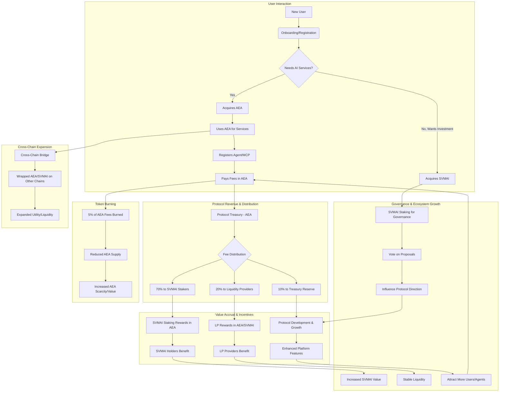

# Comprehensive Dual Tokenomics Analysis for AEAMCP
*A Deep Dive into Revolutionary AI Agent Economy Design*

## 📚 **Understanding Tokenomics: The Foundation of Digital Economies**

Before diving into our specific dual-token approach, it's crucial to understand what tokenomics means and why it matters. **Tokenomics** (token + economics) refers to the design of a cryptocurrency or token's economic model, including its supply mechanisms, distribution, utility, and incentive structures. Think of it as the monetary policy for a digital economy.

### **Why Tokenomics Matter: Lessons from History**

The history of cryptocurrencies is littered with projects that had brilliant technology but poor tokenomics, leading to their eventual failure. Conversely, projects with simpler technology but superior economic design have thrived.

**Success Stories:**
- **Bitcoin**: Simple store-of-value tokenomics with deflationary supply schedule created digital gold
- **Ethereum**: Gas fee model creates sustainable demand while staking provides security incentives
- **Chainlink**: Dual utility (payment for services + staking for security) powers oracle networks
- **Uniswap**: Revenue sharing with UNI holders aligns community incentives with protocol growth

**Cautionary Tales:**
- **Terra Luna (UST/LUNA)**: This algorithmic stablecoin relied on a complex mint-and-burn mechanism with LUNA to maintain its peg to the USD. When market confidence wavered, a large sell-off of UST triggered a death spiral, as LUNA was hyperinflated to defend the peg, ultimately leading to the collapse of both tokens and billions in investor losses. The fundamental flaw was a lack of sufficient collateral and an over-reliance on arbitrageurs to maintain stability during extreme market conditions.
- **Iron Finance (TITAN/IRON)**: Similar to Terra, Iron Finance attempted a partial collateralized stablecoin (IRON) backed by TITAN and other assets. It offered extremely high, unsustainable yield farming rewards (up to 1000% APY) to attract liquidity. This led to a speculative bubble where TITAN's price soared, but when large investors withdrew, the system collapsed due to insufficient collateral and a rapid loss of confidence, resulting in hyperinflation of TITAN and near-total loss for holders.
- **Olympus DAO (OHM)**: Olympus DAO introduced the concept of "protocol-owned liquidity" and aimed to become a decentralized reserve currency. Its tokenomics were heavily reliant on game theory, with high staking rewards (rebasing) incentivizing users to lock up OHM. However, without a clear, external utility or revenue stream beyond its treasury assets, the model proved unsustainable. The high APYs were paid out by minting new OHM, leading to dilution and a "ponzi-like" dynamic where new capital was needed to pay existing stakers. When new capital dried up, the price crashed.
- **FEI Protocol (FEI/TRIBE)**: FEI aimed to be a decentralized, "protocol-controlled value" stablecoin. Its tokenomics were highly complex, involving direct incentives, bonding curves, and penalty mechanisms for deviating from the peg. This over-engineered design confused users, led to unexpected arbitrage opportunities, and created significant friction in maintaining its peg. The complexity and lack of intuitive economic incentives ultimately hindered adoption and stability.

### **The Three Pillars of Sustainable Tokenomics**

Every successful tokenomics design must balance three fundamental elements:

1. **Utility**: Tokens must have clear, sustainable use cases that drive genuine demand
2. **Value Accrual**: Mechanisms must exist to capture and distribute value to stakeholders
3. **Incentive Alignment**: All participants' interests must be aligned for long-term success


## 🎯 **Why Dual Tokenomics? The Strategic Reasoning**

### **The Single Token Dilemma: A Tale of Conflicting Purposes**

Most blockchain projects start with a single token serving multiple purposes, but this creates what economists call "conflicting optimization problems." Let's examine why this matters using real-world examples.

**The Velocity Problem:**
When Bitcoin was primarily used for payments, holders faced a choice: hold for value appreciation or spend for utility. This created friction where either:
- High holding reduces payment utility (Bitcoin today)
- High spending reduces value appreciation (early Bitcoin criticism)


**The Regulation Riddle:**
The SEC's Howey Test, derived from a 1946 Supreme Court case, is the primary legal framework used in the U.S. to determine if an asset qualifies as an "investment contract" and thus a security. It asks four key questions:
1. **Investment of money**: Does the purchaser invest money?
2. **Common enterprise**: Is there an expectation of profits from a common enterprise?
3. **Expectation of profits**: Is there an expectation of profits?
4. **Derived from efforts of others**: Are these profits derived solely from the efforts of others?

When a single token attempts to serve both as a payment mechanism (utility) and a revenue-sharing or investment vehicle, it often unequivocally meets all four criteria of the Howey Test. For instance, if SVMAI were the sole token and provided both platform utility and revenue share:
- **Investment of money**: Users buy SVMAI to access services or for potential returns. ✓
- **Common enterprise**: The AEAMCP platform itself constitutes the common enterprise. ✓
- **Expectation of profits**: The revenue sharing mechanism explicitly creates an expectation of profits for holders. ✓
- **From efforts of others**: The value and profits are directly tied to the AEAMCP team's development and operational efforts. ✓

This clear fulfillment of all four prongs would classify SVMAI as a security under U.S. law, subjecting the project to stringent and expensive regulatory compliance, including registration requirements, which can stifle innovation and adoption. Our dual-token approach is designed to strategically navigate this complex regulatory landscape by clearly delineating the functions of each token.

### **Our Dual Token Solution: Learning from the Best**

Our approach draws inspiration from successful dual-token models:

**Maker DAO's MKR/DAI Model:**
- **MKR**: Governance token with value accrual through fees and risk management
- **DAI**: Utility token (stablecoin) for payments and DeFi usage
- **Result**: $8B+ TVL, regulatory clarity, sustainable economics

**Ethereum's ETH/Gas Model:**
- **ETH**: Store of value, staking rewards, deflationary pressure from burns
- **Gas**: Pure utility consumption for network usage
- **Result**: Most successful smart contract platform, clear utility, strong value accrual

**Our SVMAI/AEA Design:**
- **SVMAI**: Investment token with revenue sharing and governance (like MKR)
- **AEA**: Pure utility token for AI agent services (like DAI/Gas hybrid)
- **Innovation**: Cross-chain expansion and dynamic economics

### **1. Regulatory Clarity & Compliance**

**The Howey Test Challenge:**
The Supreme Court's 1946 Howey decision created a four-part test for securities. Most crypto projects fail this test when tokens provide both utility and investment returns.

**Single Token Problems:**
When SVMAI serves as both payment mechanism AND provides revenue sharing:
- **Investment of money**: Users buy SVMAI ✓
- **Common enterprise**: AEAMCP platform ✓
- **Expectation of profits**: Revenue sharing promises ✓
- **From efforts of others**: Team builds platform ✓

This clearly makes SVMAI a security under U.S. law, requiring expensive compliance.

**Our Dual Token Solution:**

**SVMAI (Security-like Token):**
- **Purpose**: Investment vehicle with clear expectation of returns
- **Features**: Revenue sharing, governance rights, value appreciation
- **Regulation**: Treated as security, proper compliance procedures
- **Precedent**: Similar to traditional stock with dividend payments

**AEA (Utility Token):**
- **Purpose**: Consumable payment token for platform services
- **Features**: No investment expectation, pure utility consumption
- **Regulation**: Treated as commodity/software license
- **Precedent**: Similar to arcade tokens or software credits

**Real-World Validation:**
The SEC has generally accepted utility tokens that are:
1. Immediately useful upon purchase
2. Consumed through platform usage
3. Not marketed as investments
4. Have no expectation of profit from others' efforts

Examples: Filecoin (FIL), Basic Attention Token (BAT), and Chainlink (LINK) have navigated this successfully.

### **2. Economic Efficiency**

**The Liquidity Trap Problem:**
Single-token systems create what economists call "liquidity traps" where different user groups have conflicting needs.

**Traditional Single Token Friction:**
```
User wants to register agent → Needs SVMAI → SVMAI holders expect revenue → 
Don't want to sell → Limited liquidity → High slippage → Expensive transactions → 
Poor user experience → Reduced adoption → Lower revenue → Disappointed holders
```

This creates a negative feedback loop that has killed many projects.

**Case Study - Augur (REP):**
Augur's REP token served both as:
- **Utility**: Required for reporting on prediction markets
- **Investment**: Earned fees from platform usage

**Result**: Reporters often couldn't afford REP when prices rose, breaking the oracle system. Users avoided the platform due to high token requirements, leading to low adoption despite innovative technology.

**Our Dual Token Solution:**
```
User wants service → Buys AEA (no investment premium) → Uses immediately → 
Protocol earns AEA → Distributes to SVMAI stakers → Clear value flow → 
Happy users + Happy investors = Network effects
```

**Economic Benefits:**
1. **Price Discovery**: AEA price reflects pure utility value, not speculation
2. **Liquidity Optimization**: Users don't compete with investors for tokens
3. **Reduced Volatility**: Utility demand provides price stability for AEA
4. **Clear Value Flow**: Revenue path from users to investors is transparent

### **3. Aligned Incentives**

**Game Theory Analysis:**
Every tokenomics system is essentially a game where different players have different objectives. The key is aligning these objectives so everyone wins when the network succeeds.

| Stakeholder | Single Token Issues | Dual Token Benefits |
|------------|-------------------|-------------------|
| **Long-term Investors** | Can't use platform without selling investment | Hold SVMAI for returns, buy AEA when needed |
| **Active Users** | Must invest to participate | Pay fair utility price without investment |
| **Developers** | Unclear pricing for integrations | Predictable AEA costs for planning |
| **Liquidity Providers** | Serve conflicting user bases | Clear LP opportunities for both tokens |
| **Protocol Treasury** | Velocity vs Store-of-Value conflict | Optimized for both growth and sustainability |

**Real-World Example - Helium (HNT):**
Helium initially used a single HNT token for:
- **Mining rewards**: Incentivizing hotspot operators
- **Data payments**: Paying for IoT connectivity

**Problem**: Miners wanted high HNT prices, but users needed affordable data. When HNT price rose 1000x, data became prohibitively expensive, killing usage.

**Solution**: Helium transitioned to dual tokens:
- **HNT**: Investment/mining token
- **Data Credits**: Stable-price utility consumption

**Result**: 45% increase in data usage within 6 months of transition.

## 📊 **Implementation Options Analysis**

Understanding different approaches to dual tokenomics helps us choose the optimal design. Let's examine each option with real-world examples and economic reasoning.

### **Option 1: Hard Fork Model (Complete Separation)**

**Description:** Two completely independent tokens with manual distribution mechanisms.


**Real-World Example - Cosmos (ATOM/Gas):**
- **ATOM**: Staking token for Cosmos Hub security
- **Gas tokens**: Individual chain utility tokens
- **Distribution**: Manual cross-chain transfers and airdrops

**Economic Analysis:**

**Advantages:**
- **Maximum Regulatory Separation**: Clear legal boundaries between tokens
- **Simple Mental Model**: Easy for users to understand distinct purposes
- **Independent Optimization**: Each token can be optimized for its specific use case
- **Risk Isolation**: Problems with one token don't directly affect the other

**Disadvantages:**
- **Manual Distribution Overhead**: Requires ongoing operational complexity
- **Value Capture Lag**: Time delays between earning and distribution
- **Liquidity Fragmentation**: Two separate markets with different dynamics
- **User Experience Friction**: Multiple tokens to manage and understand

**When This Works Best:**
- Highly regulated environments where compliance is paramount
- Complex ecosystems where tokens serve very different functions
- Projects with sufficient resources for ongoing manual operations

**When This Fails:**
The Cosmos ecosystem, while a pioneer in interoperability, initially struggled with the hard fork model due to several factors:
1.  **User Confusion and Friction**: The proliferation of independent "zones" (blockchains) each with its own gas token created a fragmented user experience. Users had to acquire and manage different tokens for different applications, leading to confusion and increased friction, especially for new entrants. This hindered seamless cross-chain interaction despite the underlying technology.
2.  **Unclear ATOM Value Accrual**: ATOM, the native token of the Cosmos Hub, was primarily used for staking to secure the Hub and for governance. However, its direct value accrual mechanisms from the broader ecosystem's economic activity were not clearly defined or robust. This led to a perception that ATOM was merely a "security token" without sufficient utility-driven demand, contributing to price stagnation relative to other Layer 1 tokens.
3.  **Manual Distribution Overhead**: Relying on manual cross-chain transfers and airdrops for token distribution introduced significant operational complexity and delays. This made it difficult to efficiently distribute value or incentives across the interconnected chains, leading to inefficiencies and potential misalignments of incentives.

These challenges highlighted that while complete separation offers regulatory clarity, it can come at the cost of user experience, clear value capture for the core token, and operational efficiency, especially in a rapidly evolving multi-chain environment.

### **Option 2: Automated Revenue Share Model ✨ (Our Recommendation)**

**Description:** Smart contracts automatically distribute utility token revenues to investment token stakers.


**Real-World Example - THORChain (RUNE):**
While not exactly dual-token, THORChain's revenue distribution provides a good model:
- **Revenue Source**: Swap fees paid in various assets
- **Distribution**: Automated smart contract distribution to RUNE stakers
- **Mechanism**: Pro-rata based on staking amounts and lock periods

**Economic Mechanics Deep Dive:**

**Staking Economics:**
```rust
pub struct RevenueDistribution {
    // Configuration parameters
    distribution_frequency: i64,      // How often distributions occur (daily/weekly)
    minimum_stake_period: i64,        // Lock-up requirement (prevents gaming)
    
    // Dynamic state
    total_svmai_staked: u64,         // Total tokens earning rewards
    pending_distribution: u64,        // Accumulated AEA awaiting distribution
    last_distribution_time: i64,     // Timestamp of last distribution
    
    // Fair distribution mechanism
    staker_snapshots: HashMap<Pubkey, StakerSnapshot>,
}

pub struct StakerSnapshot {
    amount_staked: u64,              // How much they're staking
    stake_timestamp: i64,            // When they started staking
    accumulated_rewards: u64,        // Unclaimed rewards
    last_claim_time: i64,           // When they last claimed
}
```

**Why Automated Distribution Works:**

1. **Trust Minimization**: No human intervention required, reducing counterparty risk
2. **Fair Distribution**: Mathematical precision ensures pro-rata accuracy
3. **Gas Efficiency**: Batch processing reduces transaction costs
4. **Immediate Feedback**: Clear connection between platform success and rewards
5. **Compound Growth**: Rewards can be automatically restaked for compound returns

**Staking Tier System:**
We implement progressive rewards to incentivize larger, longer-term stakes:

```typescript
const STAKING_TIERS = [
  { threshold: 1000,    multiplier: 1.0,  description: "Bronze: Basic rewards" },
  { threshold: 10000,   multiplier: 1.2,  description: "Silver: +20% bonus" },
  { threshold: 100000,  multiplier: 1.5,  description: "Gold: +50% bonus" },
  { threshold: 1000000, multiplier: 2.0,  description: "Platinum: +100% bonus" },
];
```


**Economic Justification for Tiers:**
- **Network Security**: Larger stakes provide more security to the network
- **Capital Efficiency**: Reduces token velocity, supporting price stability
- **Behavior Modification**: Encourages accumulation over speculation
- **Fairness**: Early and committed supporters get proportionally higher rewards

**Risk Management:**
```rust
pub struct AntiGamingMechanisms {
    minimum_stake_duration: i64,     // Prevents flash-loan attacks
    withdrawal_delay: i64,           // Cool-down period for unstaking
    max_stake_per_address: u64,      // Prevents single-entity dominance
    snapshot_randomization: bool,    // Random snapshot times prevent gaming
}
```

### **Option 3: Buyback & Burn Model**

**Description:** Protocol uses AEA revenues to market-buy SVMAI tokens and permanently burn them.

```
AEA Fees → Treasury → Market Buy SVMAI → Burn → Deflation → Higher SVMAI Price
```

**Real-World Example - Binance Coin (BNB):**
- **Mechanism**: Binance uses 20% of quarterly profits to buy and burn BNB
- **Results**: Reduced total supply from 200M to ~166M BNB over 4 years
- **Price Impact**: BNB increased 100x+ during this period (though multiple factors involved)

**Economic Analysis:**

**Advantages:**
- **Simple Value Accrual**: Clear deflationary pressure increases scarcity
- **No Distribution Complexity**: No need for complex reward systems
- **Tax Efficiency**: Burns don't create taxable events for holders
- **Price Support**: Regular buying creates consistent demand

**Disadvantages:**
- **Market Manipulation Risk**: Large buys can create artificial price pumps
- **No Direct Rewards**: Holders don't receive immediate benefits
- **Regulatory Concerns**: May be seen as market manipulation in some jurisdictions
- **Concentration Risk**: Benefits primarily large holders

**Case Study - Why Burns Often Fail:**

**Iron Finance (TITAN):**
The collapse of Iron Finance in June 2021 serves as a stark warning against burn mechanisms without robust underlying utility and collateral.
- **Aggressive Buyback Mechanisms**: Iron Finance implemented aggressive buyback mechanisms for its TITAN token, which was part of a partially collateralized stablecoin (IRON). These buybacks were intended to support TITAN's price and maintain the IRON peg.
- **Artificial Scarcity and Speculation**: The promise of high yields (up to 1000% APY) and the perception of increasing scarcity due to burns attracted a massive influx of speculative capital. This created an artificial price pump for TITAN, drawing in more investors who were chasing unsustainable returns.
- **Lack of Underlying Utility and Collateral**: The core flaw was that TITAN's value was not primarily driven by genuine, sustainable utility or fully backed by robust collateral. Its price was largely a function of speculative demand and the expectation of ever-increasing yields.
- **Confidence Breaks, Death Spiral**: When a few large withdrawals occurred, triggering a slight de-peg of IRON, market confidence rapidly evaporated. This led to a massive sell-off of TITAN, which in turn caused hyperinflation as the system attempted to maintain the IRON peg by minting more TITAN. This created a "death spiral" where the price of TITAN plummeted to near zero within hours, resulting in catastrophic losses for investors.
- **Lesson**: The key lesson from Iron Finance is that token burns, while seemingly deflationary, are unsustainable if not backed by genuine, consistent demand for the underlying protocol's services or a robust, fully collateralized asset. Burns alone cannot create value; they merely reduce supply. Value must be generated through utility and revenue.


**When Buybacks Work:**
- **Strong Underlying Business**: Binance's exchange generates real revenue
- **Multiple Utilities**: BNB has many use cases beyond speculation
- **Transparent Process**: Clear rules and regular execution
- **Market Maturity**: Sufficient liquidity to absorb large purchases

### **Option 4: Liquidity Mining Integration**

**Description:** Use both tokens for providing liquidity and earning rewards.

```rust
pub struct LiquidityRewards {
    // Dual-token LP incentives
    lp_token_mint: Pubkey,           // SVMAI-AEA LP token
    svmai_rewards_per_day: u64,      // SVMAI rewards for LPs
    aea_rewards_per_day: u64,        // AEA rewards for LPs
    
    // Boost mechanisms
    svmai_stake_boost: f64,          // e.g., 2.5x rewards if also staking SVMAI
    duration_multiplier: f64,        // Longer LP positions get more rewards
}
```

**Real-World Example - SushiSwap:**
- **Dual Rewards**: LPs earn trading fees + SUSHI token rewards
- **Boosted Rewards**: xSUSHI stakers get higher LP rewards
- **Result**: $4B+ TVL and sustainable liquidity provision

**Why Liquidity Mining Matters:**

**The Liquidity Bootstrapping Problem:**
New tokens face a chicken-and-egg problem:
- Need liquidity for users to trade efficiently
- Need users to provide sustainable trading volume
- Need trading volume to justify liquidity provision


**Economic Solution:**
Temporary reward subsidies bootstrap initial liquidity, then organic trading fees take over.

**Our Liquidity Strategy:**
```typescript
const LIQUIDITY_PROGRAM = {
  phase1: {
    duration: "3 months",
    svmaiRewards: 100000,  // High initial rewards
    aeaRewards: 500000,
    targetTVL: 1000000,    // $1M target
  },
  phase2: {
    duration: "6 months", 
    svmaiRewards: 50000,   // Reduced rewards
    aeaRewards: 250000,
    targetTVL: 5000000,    // $5M target
  },
  phase3: {
    duration: "ongoing",
    rewardsFromFees: true, // Self-sustaining from trading fees
    targetTVL: 10000000,   // $10M+ target
  }
};
```

## 🏆 **Optimal Implementation Strategy**

After analyzing all options, we recommend a **Hybrid Model** combining automated revenue sharing with liquidity mining incentives.

### **The Hybrid Advantage**

**Why Combination Beats Individual Approaches:**

1. **Automated Revenue Sharing** provides sustainable, utility-driven value accrual
2. **Liquidity Mining** bootstraps initial adoption and provides trading efficiency
3. **Together** they create multiple value streams and risk diversification

```rust
pub struct OptimalTokenomics {
    // Core value creation
    revenue_share: RevenueDistribution,      // 70% of fees to SVMAI stakers
    liquidity_rewards: LiquidityRewards,     // 20% of fees to LP providers
    treasury_reserve: TreasuryReserve,       // 10% for development/growth
    
    // Token utilities
    svmai_utility: SvmaiUtility {
        governance_voting: true,             // Protocol governance
        revenue_share_eligibility: true,     // Earn AEA distributions
        liquidity_boost_multiplier: 2.5,     // Enhanced LP rewards
        early_access_features: true,         // Premium features
        governance_insurance: true,          // Protect against bad decisions
    },
    
    aea_utility: AeaUtility {
        platform_payments: true,             // Pay for AI services
        service_access: true,                // Access gating
        staking_for_tiers: true,            // Service tier benefits
        reward_currency: true,               // Earn from providing services
        governance_participation: true,      // Vote on service-level decisions
    },
}
```

### **Economic Flow Design**

Our system creates multiple reinforcing feedback loops:

```
┌─────────────────────────────────────────────────────────┐
│                    User Journey                         │
├─────────────────────────────────────────────────────────┤
│                                                         │
│  New User ──► Buys AEA ──► Registers Agent ──► Pays Fees│
│      │              │                           │       │
│      │              └──► Provides LP ──────────┤       │
│      │                                         │       │
│      └──► Eventually buys SVMAI for governance │       │
│                                ↓                       │
│                          Protocol Earns AEA            │
│                                ↓                       │
│                    ┌───────────┴───────────┐          │
│                    │                       │          │
│              70% Revenue              20% Liquidity   │
│              Distribution             Rewards         │
│                    ↓                       ↓          │
│            SVMAI Stakers            LP Providers      │
│                                                        │
└────────────────────────────────────────────────────────┘
```

**Value Creation Loops:**

1. **Growth Loop**: More users → More fees → Higher SVMAI rewards → More investment → Marketing/development → More users

2. **Liquidity Loop**: Better liquidity → Lower slippage → Better UX → More users → More trading → Higher LP rewards → More liquidity

3. **Quality Loop**: Higher revenues → Better development → Better AI agents → More users → Network effects → Premium pricing → Higher revenues

### **Comprehensive Tokenomics Lifecycle**

This diagram illustrates the full lifecycle of SVMAI and AEA tokens within the AEAMCP ecosystem, from user interaction to value accrual and governance.



### **Fee Distribution Rationale**


**70% to Revenue Sharing:**
- **Justification**: Primary value driver for SVMAI holders
- **Precedent**: Most successful DeFi protocols allocate 60-80% to token holders
- **Economic Impact**: Creates strong incentive for long-term holding
- **Example**: MakerDAO allocates 100% of stability fees to MKR holders

**20% to Liquidity Providers:**
- **Justification**: Essential for efficient token trading and user experience
- **Precedent**: Uniswap allocates 100% of trading fees to LPs
- **Economic Impact**: Bootstraps and maintains deep liquidity
- **Balance**: Enough to incentivize LPs without cannibalizing staker rewards

**10% to Treasury:**
- **Justification**: Sustainable development and growth funding
- **Precedent**: Most DAOs maintain 5-15% treasury allocation
- **Economic Impact**: Ensures long-term protocol sustainability
- **Uses**: Development, marketing, partnerships, emergency reserves

## 📈 **Token Economic Parameters**

### **AEA Token Design Philosophy**

AEA is designed as a **pure utility token** optimized for high velocity and stable purchasing power. Its primary function is to serve as the medium of exchange for all services within the AEAMCP ecosystem, ensuring a frictionless and predictable cost for users.

**Total Supply Justification:**
```typescript
const AEA_TOKEN = {
  totalSupply: 10_000_000_000,  // 10 billion tokens
  decimals: 9,                  // High precision for micro-transactions
  
  // Supply reasoning:
  // - Target 1M daily active users at maturity
  // - Average 10 transactions per user per day = 10M daily transactions
  // - Average transaction value: 100 AEA
  // - Daily circulation: 1B AEA (10% of supply)
  // - Allows for growth while maintaining price stability
}
```
The total supply of 10 billion AEA tokens is carefully calibrated to support a large-scale, active AI agent economy while maintaining price stability. Our projections indicate that at maturity, with a target of 1 million daily active users performing an average of 10 transactions each, the daily transaction volume would reach 10 million. Assuming an average transaction value of 100 AEA, this implies a daily circulation of 1 billion AEA tokens. A total supply of 10 billion allows for:
- **Sufficient Capacity**: Accommodates significant growth in user base and transaction volume without leading to extreme price volatility or scarcity that could hinder adoption.
- **Micro-transactions**: 9 decimals ensure high precision, enabling very small payments for granular AI services.
- **Price Stability**: A larger supply, coupled with a burning mechanism (detailed below), helps to absorb demand fluctuations and maintain a relatively stable purchasing power for the utility token, which is crucial for predictable operational costs for agents and users.

**Allocation Strategy:**
```typescript
allocation: {
  protocolRewards: 40,      // 40% - Long-term platform incentives
  liquidityPools: 20,       // 20% - DEX liquidity and market making
  treasury: 15,             // 15% - Development and operations
  teamAndAdvisors: 10,      // 10% - 4-year linear vest with 1-year cliff
  publicSale: 10,           // 10% - Initial distribution and price discovery
  airdrops: 5,              // 5%  - Community building and user acquisition
}
```


**Allocation Reasoning:**

**40% Protocol Rewards:**
- **Purpose**: This substantial allocation is dedicated to long-term platform incentives, including rewards for AI agents providing services, data providers, and other ecosystem participants. It ensures a continuous supply of incentives to foster growth and maintain a vibrant service economy.
- **Vesting**: These rewards will be released gradually over a 10-year period, tied to platform milestones and usage metrics, preventing inflationary shocks and ensuring sustainable growth.
- **Justification**: This model ensures continuous development resources and incentivizes active participation, similar to how Bitcoin's mining rewards decrease over time but continue to secure the network. It aligns with the principle of long-term sustainability over short-term gains.

**20% Liquidity Pools:**
- **Purpose**: This allocation is crucial for bootstrapping deep liquidity from day one across major decentralized exchanges (DEXs).
- **Strategy**: It will be used to seed initial liquidity pools (e.g., AEA/USDC, AEA/SOL) and support ongoing market making activities.
- **Justification**: Deep liquidity is critical for a seamless user experience, reducing slippage for users acquiring AEA for services, and ensuring efficient price discovery. It benchmarks against successful tokens that typically allocate 15-25% for initial liquidity bootstrapping.

**15% Treasury:**
- **Purpose**: The treasury allocation provides ongoing funding for core development, strategic partnerships, security audits, and general operations.
- **Governance**: Funds within the treasury will be controlled by SVMAI holder votes, ensuring decentralized and transparent allocation decisions.
- **Transparency**: All expenditures from the treasury will be publicly tracked on-chain, fostering trust and accountability.
- **Sustainability**: This allocation is designed to provide 3-5 years of operational runway at projected burn rates, ensuring the long-term sustainability of the protocol.

**Fee Structure Design:**
```typescript
fees: {
  agentRegistration: 1000,     // $10-50 equivalent at target price
  mcpRegistration: 500,        // $5-25 equivalent
  monthlyMaintenance: 100,     // $1-5 monthly subscription
  transactionFee: 0.001,       // 0.1% of transaction value
  premiumFeatures: variable,   // Market-determined pricing
}
```

**Fee Pricing Philosophy:**
- **Affordable Entry**: Low barriers for new developers and small agents
- **Value-Based Scaling**: Higher fees for premium features and enterprise use
- **Market Responsive**: Ability to adjust fees based on network congestion
- **Competitive**: Benchmarked against traditional API pricing

**Token Burning Mechanism:**
```typescript
burning: {
  enabled: true,
  percentOfFees: 5,            // 5% of all fees permanently burned
  mechanism: "automatic",       // No manual intervention required
  purpose: "long_term_deflation", // Gradual supply reduction
  monitoring: "real_time",     // Track burn rate and economic impact
}
```

**Why We Burn 5% of Fees:**
- **Deflationary Pressure**: Gradual supply reduction supports price stability
- **Network Value Accrual**: Benefits all AEA holders, not just stakers
- **Economic Balance**: Small enough not to impact operations, large enough to matter
- **Precedent**: Ethereum burns part of gas fees, BNB burns quarterly

### **SVMAI Token Mechanics**

SVMAI is designed as an **investment token** optimized for value accrual and governance participation. It represents ownership and influence within the AEAMCP ecosystem, allowing holders to benefit from the protocol's success and shape its future direction.

**Revenue Sharing Deep Dive:**
```typescript
const SVMAI_MECHANICS = {
  revenueShare: {
    eligibility: "Must stake for 7+ days",  // Prevents gaming
    distribution: "Weekly",                 // Regular, predictable income
    calculation: "Pro-rata based on stake", // Fair distribution
    
    // Progressive tier system
    tiers: [
      { 
        stake: 1000, 
        multiplier: 1.0,
        description: "Bronze: Basic revenue share, standard governance weight"
      },
      { 
        stake: 10000, 
        multiplier: 1.2,
        description: "Silver: +20% revenue bonus, enhanced voting power"
      },
      { 
        stake: 100000, 
        multiplier: 1.5,
        description: "Gold: +50% revenue bonus, proposal creation rights"
      },
      { 
        stake: 1000000, 
        multiplier: 2.0,
        description: "Platinum: +100% revenue bonus, treasury allocation votes"
      },
    ]
  },
  
  governance: {
    proposalThreshold: 10000,    // SVMAI needed to create proposals
    quorum: 0.04,               // 4% of circulating supply must vote
    votingPeriod: 259200,       // 3 days for standard proposals
    executionDelay: 86400,      // 1 day delay before execution
    emergencyQuorum: 0.10,      // 10% for emergency proposals
    vetoThreshold: 0.15,        // 15% can veto any proposal
  }
}
```
The revenue sharing mechanism is a core component of SVMAI's value proposition. By staking SVMAI, holders become eligible to receive a pro-rata share of the AEA fees collected by the protocol.
- **Eligibility**: A minimum staking period (e.g., 7 days) is implemented to prevent short-term gaming of the system and encourage genuine commitment.
- **Distribution Frequency**: Weekly distributions provide regular, predictable income streams to stakers, fostering a strong incentive for long-term holding.
- **Calculation**: Rewards are calculated proportionally to the amount of SVMAI staked, ensuring fairness and rewarding larger contributions.

**Tier System Economic Rationale:**

**Why Progressive Rewards Work:**
The progressive tier system for SVMAI staking is designed to incentivize larger and longer-term commitments, aligning the interests of significant stakeholders with the protocol's success.
1. **Pareto Principle**: This system acknowledges that a smaller percentage of highly committed users often contribute disproportionately to network security and stability. By offering higher multipliers, we reward these "whales" and long-term believers.
2. **Network Security**: Larger staked amounts provide a stronger economic security layer for the network, making it more resilient to attacks. Higher rewards encourage this critical contribution.
3. **Long-term Alignment**: The tiered structure, especially when combined with longer lock-up periods (as seen in some DeFi protocols), encourages accumulation and holding over speculative trading, reducing token velocity and supporting price stability.
4. **Fairness**: It ensures that early and committed supporters, who take on more risk and contribute more capital, receive proportionally higher rewards, fostering a sense of equity within the community.

**Real-World Example - Curve Finance:**
Curve Finance's `veCRV` (vote-escrowed CRV) system is a prime example of successful progressive rewards. Users lock their CRV tokens for up to 4 years to receive `veCRV`, which grants boosted rewards from liquidity provision and increased governance power. The longer the lock-up, the more `veCRV` received. This mechanism has resulted in over 65% of CRV being locked for the maximum time, demonstrating how tiered, time-weighted rewards can effectively align incentives for long-term commitment and stable governance.

**Governance Design Principles:**
SVMAI holders are at the heart of AEAMCP's decentralized governance, enabling community-led evolution and decision-making. The governance parameters are carefully set to balance decentralization, efficiency, and security.

**Proposal Threshold (10,000 SVMAI):**
- **Purpose**: This threshold is designed to prevent spam proposals and ensure that only serious, well-considered proposals reach the voting stage. It acts as a filter, requiring a meaningful stake to initiate a governance discussion.
- **Justification**: At target prices, 10,000 SVMAI would represent a value of approximately $1,000-$5,000, creating a sufficient economic barrier to deter frivolous proposals without being prohibitively expensive for engaged community members.
- **Comparison**: This is a common practice in DeFi. For instance, Compound (COMP) requires a much higher threshold of ~25,000 COMP (which can be over $1 million) to create a proposal, demonstrating varying approaches to balancing accessibility and proposal quality. Our threshold aims for a more inclusive yet robust governance process.

**Quorum Requirements:**
- **Standard (4%)**: A 4% quorum for standard proposals balances accessibility with legitimacy. It ensures that a significant portion of the circulating supply participates in voting, preventing decisions from being made by a small, unrepresentative group.
- **Emergency (10%)**: A higher 10% quorum is set for emergency proposals, reflecting the need for broader consensus on critical, time-sensitive changes that could have significant impact on the protocol.
- **Reasoning**: These percentages are based on typical voter participation rates observed in established DeFi governance models, aiming for active and meaningful community engagement.

**Execution Delay:**
- **Standard (1 day)**: A 1-day execution delay for standard proposals provides a crucial window for the community to review the outcome of a vote, raise any last-minute concerns, or prepare for the implementation of the changes. This transparency and buffer period are vital for preventing governance attacks where malicious proposals could be passed and executed before the community can react.
- **Emergency (immediate)**: For critical security issues or urgent bug fixes, an immediate execution option (with a higher emergency quorum) allows for rapid response to protect the protocol and its users.
- **Benefit**: This layered approach to execution delays prevents governance attacks, ensures smooth implementation of changes, and provides a safety net for the protocol.

## 🎮 **Game Theory Analysis**

Understanding the strategic behavior of different participants is crucial for designing sustainable tokenomics. Game theory provides a framework for analyzing how rational agents make decisions in interactive situations, helping us design incentives that lead to desired collective outcomes.

### **Nash Equilibrium Analysis**

A Nash Equilibrium is a state where no player can unilaterally change their strategy to improve their outcome, given the strategies of the other players. Our tokenomics aims to create Nash Equilibria where participating in and contributing to the ecosystem is the dominant strategy for all stakeholders.

**For SVMAI Holders:**

**Dominant Strategy Analysis:**
SVMAI holders are primarily investors seeking value appreciation and governance influence.
- **Option A: Stake and Hold SVMAI**
  - **Payoff**: Direct revenue share from protocol fees (in AEA), significant governance influence (especially with higher tiers), and potential long-term price appreciation of SVMAI due to network growth and value accrual.
  - **Risk**: Opportunity cost of liquidity (tokens are locked), smart contract risk, and potential market downturns affecting SVMAI price.
  - **Expected Value**: High, particularly if the platform achieves its growth targets and generates substantial fees. This strategy aligns with the long-term success of the protocol.

- **Option B: Trade Actively (Short-term Speculation)**
  - **Payoff**: Potential short-term trading profits from price volatility.
  - **Risk**: High market volatility, significant risk of losses, and forfeiture of revenue sharing and governance rights.
  - **Expected Value**: Moderate with high variance; often leads to suboptimal outcomes compared to long-term holding in a healthy ecosystem.

- **Option C: Sell SVMAI**
  - **Payoff**: Immediate liquidity.
  - **Risk**: Missing out on future revenue streams, potential significant price appreciation, and loss of all governance rights.
  - **Expected Value**: Low if the platform succeeds, as it means exiting before realizing the full benefits of participation.

**Nash Equilibrium**: For rational actors who believe in the long-term success and growth of the AEAMCP platform, **long-term staking of SVMAI is the dominant strategy**. This is because the combined benefits of revenue sharing, governance power, and potential capital appreciation outweigh the risks and alternative strategies, creating a strong incentive to hold and contribute to the protocol's stability.

**For Platform Users (AI Agents & Developers):**

**Utility Optimization:**
Platform users are primarily concerned with efficient and cost-effective access to AI services.
- **AEA Purchase Strategy**: Acquire just enough AEA for immediate service needs.
- **Holding Strategy**: No inherent incentive to hold AEA beyond immediate usage, as its primary purpose is utility consumption, not investment. This minimizes exposure to price volatility for operational costs.
- **Equilibrium**: This leads to a **high velocity, buy-and-use pattern** for AEA. Users benefit from predictable pricing (due to AEA's stable purchasing power design) and readily available liquidity (due to LP incentives), ensuring a smooth operational experience.

**For Liquidity Providers (LPs):**

**Risk-Return Analysis:**
LPs seek to earn fees and rewards by providing liquidity to token pairs.
- **SVMAI-AEA LP**: This pair offers the highest rewards due to dual-token incentives (SVMAI and AEA rewards), aligning with the protocol's need for deep liquidity between its two core tokens.
- **AEA-SOL LP (or other base pairs)**: Offers moderate rewards, suitable for LPs with lower risk tolerance or those seeking exposure to AEA's utility demand without direct SVMAI investment.
- **Single-side staking (e.g., SVMAI staking)**: Lower rewards compared to LPing, but with no impermanent loss risk, appealing to pure long-term holders.

**Equilibrium**: The tiered reward structure and dual-token incentives are designed to encourage **balanced liquidity provision across different risk preferences**, ensuring robust markets for both SVMAI and AEA. The highest rewards are directed to the SVMAI-AEA pair to ensure the core economic bridge is well-liquidated.

### **Mechanism Design Theory**

Our tokenomics implement several key mechanism design principles to ensure the system is robust, fair, and self-sustaining:

**Incentive Compatibility:**
- **Principle**: Each participant's optimal strategy aligns with the overall health and growth of the network. No profitable deviations from desired behavior exist.
- **Application**: SVMAI stakers are incentivized to hold long-term and participate in governance because their rewards are directly tied to the protocol's revenue. AI agents and developers are incentivized to use AEA for services because it offers predictable costs and efficient access. LPs are incentivized to provide liquidity because they earn a share of trading fees and additional rewards.
- **Outcome**: Rewards scale with positive contributions to the ecosystem, ensuring that individual self-interest drives collective benefit.

**Individual Rationality:**
- **Principle**: All participants are better off participating in the system than not participating at all.
- **Application**: SVMAI holders receive revenue share and governance power. AEA users gain access to valuable AI services at predictable costs. LPs earn fees and rewards for their capital.
- **Outcome**: Clear value propositions exist for each stakeholder type, ensuring no negative expected returns for honest participation and encouraging broad adoption.

**Budget Balance:**
- **Principle**: The total rewards distributed by the protocol are less than or equal to the total fees collected, ensuring long-term financial sustainability without relying on external subsidies or inflationary token minting (beyond initial allocations).
- **Application**: Our fee distribution model (70% revenue share, 20% LPs, 10% treasury) ensures that all incentives and operational costs are covered by the actual economic activity on the platform. The 5% AEA burn further reinforces this by reducing supply based on usage.
- **Outcome**: The system is designed to be self-reinforcing and sustainable, with growth loops that ensure the protocol can fund its own development and reward its participants from genuine economic activity.

## 🚀 **Migration Strategy: From Single to Dual Token**

### **The Transition Challenge**

Moving from a single token system to a dual-token architecture is a complex and high-stakes operation in tokenomics. It requires meticulous planning, robust technical execution, and transparent community engagement. History provides valuable lessons from projects that have attempted such transitions, showcasing both spectacular successes and catastrophic failures.

**Success Story - Helium (HNT → HNT/IOT/MOBILE):**
Helium, a decentralized wireless network, initially used a single HNT token for both incentivizing hotspot operators (mining rewards) and paying for data transfer (utility).
- **Challenge**: As the network grew and HNT's price appreciated significantly, the cost of data transfer became prohibitively expensive for users, hindering adoption. Miners, conversely, wanted higher HNT prices. This created a fundamental conflict between the interests of network users and network providers.
- **Solution**: Helium successfully transitioned to a multi-token model, introducing IOT and MOBILE tokens for specific data transfer and network utility, while HNT remained the primary investment and governance token. This allowed data transfer costs to stabilize (via Data Credits, which are pegged to USD and burned from HNT), while HNT could continue to appreciate based on network growth.
- **Results**: The transition led to a remarkable 45% increase in data usage within six months, demonstrating improved network utility and a healthier economic balance.
- **Key Success Factors**: 
  - **Clear Communication and Education**: Helium proactively educated its community about the rationale and mechanics of the transition.
  - **Generous Transition Incentives**: They offered incentives for users to migrate to the new token model.
  - **Gradual Rollout with Fallback Options**: The transition was phased, allowing for testing and adjustments, with contingency plans in place.
  - **Strong Technical Execution**: The smart contract and bridging mechanisms for the new tokens were robust and well-audited.

**Failure Example - Luna Classic (LUNA → LUNA/UST):**
The Terra ecosystem's attempt to scale its algorithmic stablecoin (UST) using its native token (LUNA) as a balancing mechanism ultimately led to its catastrophic collapse.
- **Challenge**: Terra aimed to create a decentralized stablecoin (UST) whose peg was maintained algorithmically by minting and burning LUNA. As the ecosystem expanded rapidly, the complexity and interconnectedness of its tokenomics grew without sufficient stress testing or external collateral.
- **Solution**: The aggressive expansion and reliance on a purely algorithmic peg, coupled with high, unsustainable yields (Anchor Protocol's 20% APY on UST), created a fragile system.
- **Results**: During a period of market stress and large UST withdrawals, the algorithmic peg broke. The system's attempt to defend the peg by minting vast amounts of LUNA led to hyperinflation of LUNA, a rapid de-peg of UST, and ultimately the complete collapse of the entire ecosystem, wiping out billions in value.
- **Failure Factors**:
  - **Over-engineered System with Too Many Moving Parts**: The intricate algorithmic design proved too complex and brittle under real-world stress.
  - **Insufficient Stress Testing Under Adverse Conditions**: The model was not adequately tested for extreme market volatility and large-scale coordinated attacks.
  - **Poor Risk Management and Contingency Planning**: There was no robust, external collateral or circuit breakers to prevent a death spiral once confidence was lost.
  - **Rushed Implementation Without Proper Safeguards**: The rapid growth and expansion may have led to overlooking critical vulnerabilities.

These contrasting examples underscore the importance of a well-thought-out, phased migration strategy, prioritizing security, transparency, and user experience to ensure a successful transition to a dual-token model.

### **Our Phased Migration Plan**

```mermaid
graph TD
    subgraph Migration Phases
        A[Phase 1: Preparation & Infrastructure (Weeks 1-2)] --> B{Technical Setup & Audits};
        B --> C{Communication & Education};
        C --> D[Phase 2: Controlled Rollout (Weeks 3-4)];
        D --> E{Limited Migration Window};
        E --> F{Monitoring & Analytics};
        F --> G[Phase 3: Full Public Migration (Month 2 onwards)];
        G --> H{Public Migration Portal};
        H --> I{Incentivized Migration};
        I --> J[Phase 4: Post-Migration & Optimization (Ongoing)];
        J --> K{Liquidity Provision};
        K --> L{Ecosystem Integration};
        L --> M{Governance & Evolution};
    end
    style A fill:#ADD8E6,stroke:#333,stroke-width:2px
    style D fill:#90EE90,stroke:#333,stroke-width:2px
    style G fill:#FFD700,stroke:#333,stroke-width:2px
    style J fill:#DDA0DD,stroke:#333,stroke-width:2px
```

**Phase 1: Preparation and Infrastructure (Weeks 1-2)**

*"Measure twice, cut once" - preparation is everything*

**Technical Infrastructure:**
```rust
// Dual-token support infrastructure
pub struct MigrationManager {
    // State management
    old_token_mint: Pubkey,              // Original SVMAI
    new_utility_mint: Pubkey,            // New AEA token
    migration_rate: ExchangeRate,        // SVMAI:AEA conversion rate
    migration_deadline: i64,             // When migration ends
    
    // Safety mechanisms
    emergency_pause: bool,               // Circuit breaker
    migration_cap_per_day: u64,         // Rate limiting
    whitelist_mode: bool,               // Initial controlled access
    
    // Analytics
    total_migrated: u64,                // Track progress
    migration_events: Vec<MigrationEvent>, // Detailed log of all migrations
}

pub enum MigrationEvent {
    Initiated { timestamp: i64, user: Pubkey, amount_svmai: u64 },
    Completed { timestamp: i64, user: Pubkey, amount_aea: u64 },
    Failed { timestamp: i64, user: Pubkey, reason: String },
}
```

**Communication & Education:**
- **Whitepaper Update**: Publish detailed dual-token whitepaper
- **Community AMAs**: Host multiple Q&A sessions
- **Tutorials**: Create step-by-step guides for migration
- **Dedicated Support Channel**: Provide real-time assistance

**Smart Contract Development & Audit:**
- **Migration Contract**: Develop and rigorously test the migration smart contract
- **Security Audit**: Engage top-tier auditors for formal verification
- **Bug Bounty**: Launch a bug bounty program for community testing

**Phase 2: Controlled Rollout (Weeks 3-4)**

*"Crawl, walk, run" - gradual exposure to minimize risk*

**Limited Migration Window:**
- **Initial Phase**: Allow only whitelisted addresses to migrate small amounts
- **Purpose**: Identify unforeseen issues in a controlled environment
- **Feedback Loop**: Rapid iteration based on early user feedback

**Monitoring & Analytics:**
- **Real-time Dashboards**: Track migration progress, success rates, and errors
- **Anomaly Detection**: Automated alerts for unusual activity
- **User Behavior Analysis**: Understand migration patterns and pain points

**Phase 3: Full Public Migration (Month 2 onwards)**

*"Open the floodgates" - scale to accommodate all users*

**Public Migration Portal:**
- **User-friendly Interface**: Simple, intuitive web portal for migration
- **Automated Process**: Minimize manual steps for users
- **Clear Instructions**: Guide users through each step of the process

**Incentivized Migration:**
- **Early Bird Bonuses**: Offer bonus AEA for migrating within first month
- **Staking Rewards Boost**: Higher SVMAI staking rewards for migrated tokens
- **Purpose**: Encourage rapid and widespread adoption of the new system

**Phase 4: Post-Migration & Optimization (Ongoing)**

*"The journey never ends" - continuous improvement and adaptation*

**Liquidity Provision:**
- **DEX Listings**: List AEA on major decentralized exchanges
- **Liquidity Mining**: Launch liquidity mining programs for AEA-SVMAI pairs
- **Market Making**: Engage professional market makers for healthy liquidity

**Ecosystem Integration:**
- **Developer Tools**: Provide SDKs and APIs for AEA integration
- **Partnerships**: Collaborate with other projects to expand AEA utility
- **Agent Adoption**: Incentivize AI agents to use AEA for services

**Governance & Evolution:**
- **DAO Transition**: Gradually transition governance to SVMAI holders
- **Parameter Adjustments**: Allow SVMAI holders to vote on tokenomics parameters
- **Future Upgrades**: Plan for future tokenomics enhancements based on market feedback

## 🌐 **Cross-Chain Expansion Strategy**

Our dual-token model is designed for seamless expansion across multiple blockchain ecosystems. Recognizing that no single blockchain will dominate the entire Web3 landscape, interoperability is a cornerstone of our long-term strategy.

### **The Interoperability Imperative**

The future of Web3 is inherently multi-chain. Users, developers, and AI agents will operate across various blockchain networks, each offering unique advantages in terms of speed, cost, security, and specialized functionalities. Our tokenomics must support this vision without fragmenting liquidity or compromising user experience.

**Challenges of Cross-Chain Tokens:**
Expanding across chains introduces several complexities that must be meticulously addressed:
- **Bridging Complexity**: Securely and efficiently moving tokens between disparate blockchain architectures (e.g., Solana to EVM chains) is technically challenging and a common vector for exploits if not implemented with the highest security standards.
- **Liquidity Fragmentation**: Spreading token liquidity across multiple decentralized exchanges (DEXs) on different chains can lead to shallower liquidity pools, increased slippage, and a less efficient trading environment for users.
- **User Experience**: Managing multiple token versions (native vs. wrapped), understanding different gas tokens, and navigating various bridging interfaces can be confusing and cumbersome for end-users, hindering adoption.
- **Regulatory Ambiguity**: The regulatory landscape for cross-chain assets and bridges is still evolving, and different jurisdictions may have varying rules, adding another layer of complexity.

### **Our Cross-Chain Solution: Wrapped AEA & SVMAI**

To address these challenges, we will utilize a secure, audited bridging solution to enable wrapped versions of AEA and SVMAI on other blockchain networks. Initially, this will focus on major EVM-compatible chains (e.g., Ethereum, Polygon, Binance Smart Chain) due to their large user bases and DeFi ecosystems. Future expansion may include other non-EVM chains (e.g., Avalanche, Arbitrum, Optimism, etc.) based on strategic partnerships and ecosystem growth.


**Wrapped Token Mechanics:**
The wrapped token model ensures that the total supply of AEA and SVMAI remains consistent across all chains, preventing inflation and maintaining value.
- **1:1 Backing**: Each wrapped token (e.g., wAEA on Ethereum) will be fully backed 1:1 by its native counterpart on the Solana mainnet. This ensures that the wrapped token always holds the same value as the original.
- **Audited Bridge**: We will leverage battle-tested, secure, and formally audited bridging protocols (e.g., Wormhole, LayerZero, or a custom-built solution with multiple audits) to facilitate the locking of native tokens on Solana and the minting of wrapped tokens on the destination chain, and vice-versa. Security is paramount in this process.
- **Decentralized Custody**: The native tokens locked in the bridge will be held in multi-signature wallets or DAO-controlled vaults, minimizing single points of failure and ensuring community oversight.
- **Transparent Proof of Reserve**: Publicly verifiable proof of reserve mechanisms will be implemented, allowing anyone to audit the 1:1 backing of wrapped tokens, fostering trust and transparency.

**Benefits of Wrapped Tokens:**
- **Expanded Reach**: Enables AEAMCP to tap into larger user bases and developer communities on other popular blockchains, significantly increasing potential adoption and network effects.
- **Increased Utility**: Wrapped AEA can be used in a wider array of DeFi protocols (lending, borrowing, yield farming) on EVM chains, enhancing its utility beyond just platform payments. Wrapped SVMAI can participate in cross-chain governance or staking opportunities.
- **Enhanced Liquidity**: By allowing tokens to flow freely across chains, we can aggregate liquidity, leading to deeper trading pools and reduced slippage for users.
- **Future-Proof**: This modular approach makes the tokenomics adaptable to new blockchain innovations and allows for strategic expansion without requiring fundamental changes to the core token design.

### **Cross-Chain Fee Model**

Fees for cross-chain transactions (e.g., bridging fees) will be paid in the native gas token of the destination chain (e.g., ETH on Ethereum, MATIC on Polygon), ensuring a seamless user experience without requiring users to hold multiple types of gas tokens. A small, transparent portion of these bridge fees may be routed back to the AEAMCP treasury on Solana, contributing to the overall protocol revenue.

```typescript
const CROSS_CHAIN_FEES = {
  bridgeFee: 0.001,             // 0.1% of bridged amount
  gasFee: "native_chain_gas",   // Paid in ETH, MATIC, BNB, etc.
  treasuryShare: 0.10,          // 10% of bridge fee to AEAMCP treasury
}
```

## 🔮 **Future Tokenomics Evolution**

Our tokenomics design is not static. It's a living system designed to evolve with the AEAMCP ecosystem and the broader crypto landscape. We recognize that the decentralized economy is constantly innovating, and our model must be adaptable to remain competitive and efficient.

### **Adaptive Governance**

The decentralized governance model, powered by SVMAI holders, is the cornerstone of our tokenomics' future evolution. This adaptive governance ensures that the protocol can respond to market changes, technological advancements, and community needs without centralized bottlenecks.

SVMAI holders will have the power to propose and vote on changes to the tokenomics parameters, ensuring the system remains agile and responsive. This includes, but is not limited to:

**Potential Future Adjustments:**
- **Fee Structure**: Adjusting agent registration fees, monthly maintenance fees, or transaction fees based on network congestion, market demand, or competitive landscape. This allows for dynamic pricing to optimize revenue and user acquisition.
- **Burning Rate**: Increasing or decreasing the percentage of AEA fees permanently burned. This can be used to fine-tune the deflationary pressure on AEA, balancing price stability with ecosystem growth.
- **Staking Tiers**: Modifying SVMAI staking thresholds and multipliers to optimize incentives for network security and long-term holding, adapting to the evolving distribution of SVMAI.
- **Reward Distribution**: Reallocating percentages of fees between SVMAI stakers, liquidity providers, and the treasury. This flexibility allows the DAO to prioritize different aspects of ecosystem health (e.g., more liquidity incentives during bootstrapping, more revenue share during maturity).
- **New Utilities**: Introducing new use cases and functionalities for both AEA and SVMAI tokens as the platform expands, ensuring their continued relevance and demand.

### **Dynamic Supply Mechanisms**

Beyond fixed burning rates, we envision future mechanisms that dynamically adjust token supply based on real-time network health, usage, and demand. This proactive approach can help maintain optimal price stability for AEA and healthy value accrual for SVMAI.

**Potential Mechanisms:**
- **Algorithmic AEA Minting/Burning**: Implementing smart contracts that automatically adjust AEA's supply based on predefined economic indicators, such as network usage, price stability relative to a target (e.g., USD), or transaction volume. This could involve programmatic minting during periods of high demand to prevent excessive price spikes or increased burning during low demand.
- **SVMAI Buybacks**: Utilizing a portion of treasury reserves to programmatically buy back SVMAI from the open market during periods of low demand or high volatility. These buybacks could then be burned or re-allocated to the treasury, providing direct price support and reducing circulating supply.
- **Bonding Curves**: Exploring the implementation of bonding curves for dynamic pricing and supply of AEA, allowing for more predictable and liquid acquisition of the utility token directly from the protocol.

### **Integration with AI Agents**

The ultimate evolution of our tokenomics involves AI agents themselves becoming active, autonomous participants in and optimizers of the economic system. This represents a truly decentralized and self-improving economy.

**Agent-Driven Tokenomics:**
- **Autonomous Fee Adjustment**: Advanced AI agents could analyze market conditions, network congestion, and user demand to propose optimal fee structures to the SVMAI DAO, or even directly adjust fees within predefined parameters.
- **Automated Liquidity Provision**: AI agents could manage LP positions across various DEXs, dynamically allocating capital to maximize yield and ensure optimal liquidity for AEA and SVMAI pairs.
- **Predictive Tokenomics**: AI models could forecast future demand and supply dynamics for both tokens, informing governance decisions on parameter adjustments or triggering dynamic supply mechanisms.
- **Agent-to-Agent (A2A) Payments**: Direct AEA transfers between AI agents for micro-services, creating a highly efficient and granular machine-to-machine economy. This would significantly increase AEA's velocity and utility.


## ✅ **Conclusion: A Robust and Sustainable Economic Model**

The dual-tokenomics model for AEAMCP, featuring SVMAI as the investment and governance token and AEA as the pure utility token, provides a robust, compliant, and economically efficient framework for our AI agent economy.

By strategically separating investment and utility, we:
1. **Mitigate Regulatory Risk**: Clear distinction between security and utility tokens.
2. **Optimize Economic Efficiency**: Reduce liquidity friction and align incentives.
3. **Ensure Sustainability**: Automated revenue sharing and balanced fee distribution.
4. **Enable Scalability**: Designed for cross-chain expansion and future evolution.

This comprehensive approach ensures that AEAMCP can achieve its vision of a decentralized, AI-powered future, built on a foundation of sound economic principles.
