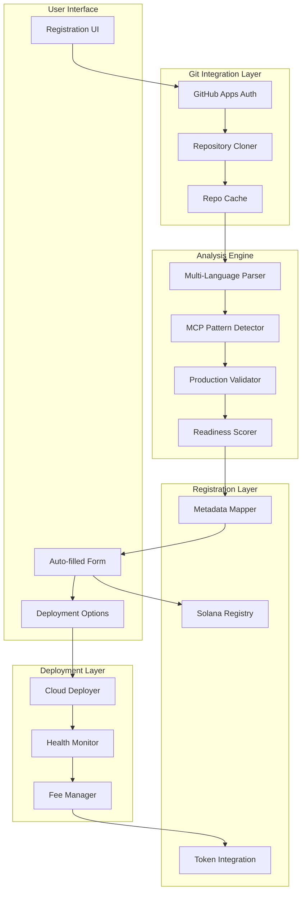
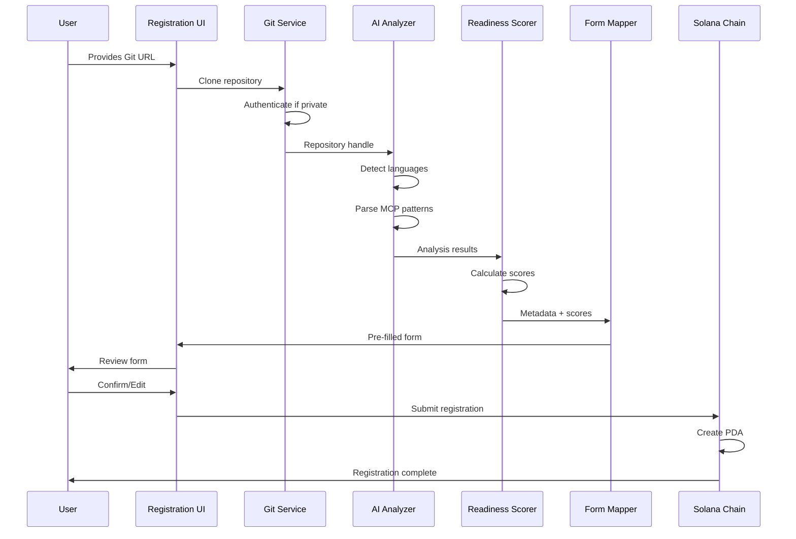
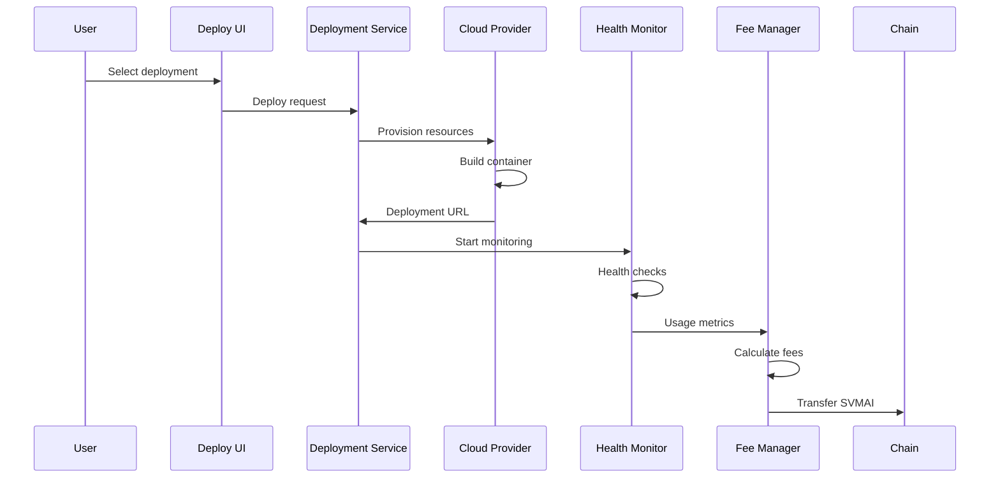

# Intelligent Git-Based Registration System Architecture

## Executive Summary

This document outlines the technical architecture for an intelligent Git-based registration system for the AEAMCP platform. The system enables automated MCP server/agent registration by analyzing Git repositories, extracting metadata, validating production readiness, and auto-populating registration forms.

## System Overview



## Core Components

### 1. Git Integration Service

#### Architecture
```typescript
interface GitIntegrationService {
  // GitHub Apps authentication
  authenticateGitHub(installationId: string): Promise<GitHubClient>;
  
  // Repository operations
  cloneRepository(url: string, auth?: GitHubAuth): Promise<RepoHandle>;
  validateRepository(url: string): Promise<ValidationResult>;
  
  // Caching layer
  getCachedRepo(url: string): Promise<RepoHandle | null>;
  cacheRepository(url: string, handle: RepoHandle): Promise<void>;
}

interface GitHubAuth {
  type: 'app' | 'token' | 'public';
  credentials?: {
    appId?: string;
    privateKey?: string;
    installationId?: string;
    token?: string;
  };
}

interface RepoHandle {
  id: string;
  url: string;
  branch: string;
  commitHash: string;
  localPath: string;
  metadata: {
    owner: string;
    name: string;
    description?: string;
    stars: number;
    lastCommit: Date;
  };
}
```

#### Implementation Details
- **GitHub Apps**: OAuth flow for private repository access
- **Temporary Storage**: Redis-backed cache with 1-hour TTL
- **Cloning Strategy**: Shallow clone with depth=1 for performance
- **Security**: Sandboxed execution environment for untrusted code

### 2. AI Code Analysis Engine

#### Multi-Language Parser Architecture
```typescript
interface CodeAnalyzer {
  analyzeRepository(repoPath: string): Promise<AnalysisResult>;
  detectLanguages(repoPath: string): Promise<Language[]>;
  extractMcpMetadata(repoPath: string, language: Language): Promise<McpMetadata>;
}

interface AnalysisResult {
  languages: Language[];
  mcpType: 'server' | 'agent' | 'both' | 'unknown';
  metadata: McpMetadata;
  capabilities: McpCapabilities;
  dependencies: Dependency[];
  securityIssues: SecurityIssue[];
  productionReadiness: ReadinessScore;
}

interface McpMetadata {
  name: string;
  version: string;
  description: string;
  author?: string;
  license?: string;
  documentation?: string;
  
  // MCP-specific
  tools: McpTool[];
  resources: McpResource[];
  prompts: McpPrompt[];
  
  // Configuration
  configSchema?: object;
  environmentVars?: string[];
  requiredServices?: string[];
}
```

#### Language-Specific Parsers

**Parser Manager**
```typescript
class MultiLanguageParserManager {
  private parsers: Map<Language, McpLanguageParser> = new Map([
    [Language.TypeScript, new TypeScriptMcpParser()],
    [Language.JavaScript, new JavaScriptMcpParser()],
    [Language.Python, new PythonMcpParser()],
    [Language.Rust, new RustMcpParser()],
    [Language.Go, new GoMcpParser()],
    [Language.Java, new JavaMcpParser()],
  ]);
  
  async analyzeRepository(repoPath: string): Promise<AnalysisResult> {
    const languages = await this.detectLanguages(repoPath);
    const results: McpMetadata[] = [];
    
    for (const lang of languages) {
      const parser = this.parsers.get(lang);
      if (parser) {
        try {
          const metadata = await parser.parse(repoPath);
          results.push(metadata);
        } catch (error) {
          console.warn(`Failed to parse ${lang} code:`, error);
        }
      }
    }
    
    return this.mergeResults(results);
  }
}
```

**TypeScript/JavaScript Parser**
```typescript
class TypeScriptMcpParser implements McpLanguageParser {
  async parse(projectPath: string): Promise<McpMetadata> {
    // 1. Parse package.json
    const packageJson = await this.parsePackageJson(projectPath);
    
    // 2. Detect MCP SDK usage
    const mcpImports = await this.findMcpImports(projectPath);
    
    // 3. Extract tool definitions
    const tools = await this.extractTools(projectPath);
    
    // 4. Extract resource definitions
    const resources = await this.extractResources(projectPath);
    
    // 5. Extract prompt definitions
    const prompts = await this.extractPrompts(projectPath);
    
    return this.buildMetadata(packageJson, tools, resources, prompts);
  }
  
  private async findMcpImports(projectPath: string): Promise<string[]> {
    // AST analysis for @modelcontextprotocol/sdk imports
    // Pattern matching for Server class instantiation
    // Tool/Resource/Prompt registration detection
    const patterns = [
      /import\s+.*from\s+['"]@modelcontextprotocol\/sdk['"]/,
      /require\(['"]@modelcontextprotocol\/sdk['"]\)/,
      /new\s+Server\(/,
      /server\.addTool\(/,
      /server\.addResource\(/,
      /server\.addPrompt\(/
    ];
    
    return this.searchPatterns(projectPath, patterns);
  }
  
  private async extractTools(projectPath: string): Promise<McpTool[]> {
    // Parse TypeScript/JavaScript AST
    // Look for server.addTool() calls
    // Extract tool name, description, input schema, handler
    const tools: McpTool[] = [];
    
    // Example pattern:
    // server.addTool({
    //   name: "get_weather",
    //   description: "Get weather for a location",
    //   inputSchema: { ... },
    //   handler: async (input) => { ... }
    // });
    
    return tools;
  }
}
```

**Python Parser**
```typescript
class PythonMcpParser implements McpLanguageParser {
  async parse(projectPath: string): Promise<McpMetadata> {
    // 1. Parse pyproject.toml / setup.py / requirements.txt
    const projectConfig = await this.parseProjectConfig(projectPath);
    
    // 2. Detect mcp_server imports
    const mcpImports = await this.findMcpImports(projectPath);
    
    // 3. Extract decorated functions
    const tools = await this.extractDecoratedTools(projectPath);
    const resources = await this.extractDecoratedResources(projectPath);
    const prompts = await this.extractDecoratedPrompts(projectPath);
    
    // 4. Parse docstrings for descriptions
    const docstrings = await this.parseDocstrings(projectPath);
    
    return this.buildMetadata(projectConfig, tools, resources, prompts, docstrings);
  }
  
  private async extractDecoratedTools(projectPath: string): Promise<McpTool[]> {
    // Parse Python AST for:
    // @mcp_server.tool(name="tool_name", description="...")
    // def tool_handler(params: ToolParams) -> ToolResult:
    //     """Docstring description"""
    //     ...
    
    const patterns = [
      /@mcp_server\.tool\(/,
      /@tool\(/,  // Common alias
      /async def .+\(.*\) -> .*:/
    ];
    
    return this.parsePythonDecorators(projectPath, patterns);
  }
  
  private async parseProjectConfig(projectPath: string): Promise<any> {
    // Priority order: pyproject.toml > setup.py > requirements.txt
    const configFiles = [
      'pyproject.toml',
      'setup.py',
      'setup.cfg',
      'requirements.txt'
    ];
    
    for (const file of configFiles) {
      const config = await this.tryParseConfig(projectPath, file);
      if (config) return config;
    }
    
    return {};
  }
}
```

**Rust Parser**
```typescript
class RustMcpParser implements McpLanguageParser {
  async parse(projectPath: string): Promise<McpMetadata> {
    // 1. Parse Cargo.toml
    const cargoToml = await this.parseCargoToml(projectPath);
    
    // 2. Detect mcp-server crate usage
    const mcpDependencies = await this.findMcpDependencies(cargoToml);
    
    // 3. Extract macro definitions
    const tools = await this.extractMcpToolMacros(projectPath);
    const resources = await this.extractMcpResourceMacros(projectPath);
    const prompts = await this.extractMcpPromptMacros(projectPath);
    
    // 4. Parse documentation comments
    const rustdocs = await this.parseRustdocComments(projectPath);
    
    return this.buildMetadata(cargoToml, tools, resources, prompts, rustdocs);
  }
  
  private async extractMcpToolMacros(projectPath: string): Promise<McpTool[]> {
    // Parse Rust source for:
    // mcp_tool! {
    //     name: "tool_name",
    //     description: "Tool description",
    //     handler: |input| { ... }
    // }
    // OR
    // #[mcp_tool(name = "tool_name")]
    // fn handle_tool(input: ToolInput) -> Result<ToolOutput> { ... }
    
    const patterns = [
      /mcp_tool!\s*{/,
      /#\[mcp_tool\(/,
      /impl\s+McpTool\s+for/
    ];
    
    return this.parseRustMacros(projectPath, patterns);
  }
  
  private async parseCargoToml(projectPath: string): Promise<any> {
    const cargoPath = path.join(projectPath, 'Cargo.toml');
    const content = await fs.readFile(cargoPath, 'utf-8');
    return toml.parse(content);
  }
}
```

**Go Parser**
```typescript
class GoMcpParser implements McpLanguageParser {
  async parse(projectPath: string): Promise<McpMetadata> {
    // 1. Parse go.mod for dependencies
    const goMod = await this.parseGoMod(projectPath);
    
    // 2. Detect MCP server imports
    const mcpImports = await this.findMcpImports(projectPath);
    
    // 3. Extract handler functions
    const tools = await this.extractToolHandlers(projectPath);
    const resources = await this.extractResourceHandlers(projectPath);
    const prompts = await this.extractPromptHandlers(projectPath);
    
    // 4. Parse godoc comments
    const docs = await this.parseGodocComments(projectPath);
    
    return this.buildMetadata(goMod, tools, resources, prompts, docs);
  }
  
  private async findMcpImports(projectPath: string): Promise<string[]> {
    // Pattern matching for:
    const patterns = [
      /import\s+"github\.com\/modelcontextprotocol\/go-sdk"/,
      /import\s+mcp\s+"github\.com\/modelcontextprotocol\/go-sdk"/,
      /mcp\.NewServer\(/,
      /server\.AddTool\(/,
      /server\.AddResource\(/,
      /server\.AddPrompt\(/
    ];
    
    return this.searchGoFiles(projectPath, patterns);
  }
  
  private async extractToolHandlers(projectPath: string): Promise<McpTool[]> {
    // Parse Go source for patterns like:
    // server.AddTool("weather", weatherHandler, &ToolSchema{
    //     Description: "Get weather information",
    //     InputSchema: map[string]interface{}{...},
    // })
    //
    // func weatherHandler(ctx context.Context, input map[string]interface{}) (interface{}, error) {
    //     // Implementation
    // }
    
    const tools: McpTool[] = [];
    const goFiles = await this.findGoFiles(projectPath);
    
    for (const file of goFiles) {
      const content = await fs.readFile(file, 'utf-8');
      const toolMatches = content.matchAll(/server\.AddTool\(\s*"([^"]+)"\s*,\s*(\w+)\s*,\s*[&]?ToolSchema{([^}]+)}/g);
      
      for (const match of toolMatches) {
        const [, name, handlerName, schemaContent] = match;
        const description = this.extractGoStringField(schemaContent, 'Description');
        
        tools.push({
          name,
          description,
          handlerFunction: handlerName,
          inputSchema: this.parseGoSchema(schemaContent),
        });
      }
    }
    
    return tools;
  }
  
  private async parseGoMod(projectPath: string): Promise<any> {
    const goModPath = path.join(projectPath, 'go.mod');
    const content = await fs.readFile(goModPath, 'utf-8');
    
    const module = content.match(/module\s+(.+)/)?.[1];
    const goVersion = content.match(/go\s+(\d+\.\d+)/)?.[1];
    const requires = [...content.matchAll(/require\s+(.+)\s+(.+)/g)]
      .map(([, pkg, version]) => ({ package: pkg, version }));
    
    return { module, goVersion, requires };
  }
  
  private async parseGodocComments(projectPath: string): Promise<Map<string, string>> {
    // Extract godoc comments for functions
    // // weatherHandler retrieves weather information for a location
    // func weatherHandler(...) { ... }
    
    const docs = new Map<string, string>();
    const goFiles = await this.findGoFiles(projectPath);
    
    for (const file of goFiles) {
      const content = await fs.readFile(file, 'utf-8');
      const docMatches = content.matchAll(/\/\/\s*(\w+)\s+(.+)\nfunc\s+\1\(/g);
      
      for (const [, funcName, description] of docMatches) {
        docs.set(funcName, description);
      }
    }
    
    return docs;
  }
}
```

**Java Parser**
```typescript
class JavaMcpParser implements McpLanguageParser {
  async parse(projectPath: string): Promise<McpMetadata> {
    // 1. Parse pom.xml or build.gradle
    const buildConfig = await this.parseBuildConfig(projectPath);
    
    // 2. Detect MCP annotations
    const mcpAnnotations = await this.findMcpAnnotations(projectPath);
    
    // 3. Extract annotated methods
    const tools = await this.extractAnnotatedTools(projectPath);
    const resources = await this.extractAnnotatedResources(projectPath);
    const prompts = await this.extractAnnotatedPrompts(projectPath);
    
    // 4. Parse Javadoc comments
    const javadocs = await this.parseJavadocs(projectPath);
    
    return this.buildMetadata(buildConfig, tools, resources, prompts, javadocs);
  }
  
  private async findMcpAnnotations(projectPath: string): Promise<AnnotationInfo[]> {
    const patterns = [
      /import\s+com\.modelcontextprotocol\.sdk\.\*/,
      /@McpTool\(/,
      /@McpResource\(/,
      /@McpPrompt\(/,
      /McpServer\.builder\(\)/,
      /@Component.*@McpServer/
    ];
    
    const annotations: AnnotationInfo[] = [];
    const javaFiles = await this.findJavaFiles(projectPath);
    
    for (const file of javaFiles) {
      const content = await fs.readFile(file, 'utf-8');
      for (const pattern of patterns) {
        if (pattern.test(content)) {
          annotations.push({
            file,
            type: this.getAnnotationType(pattern),
            content
          });
        }
      }
    }
    
    return annotations;
  }
  
  private async extractAnnotatedTools(projectPath: string): Promise<McpTool[]> {
    const tools: McpTool[] = [];
    const javaFiles = await this.findJavaFiles(projectPath);
    
    for (const file of javaFiles) {
      const content = await fs.readFile(file, 'utf-8');
      
      // Pattern 1: Annotation-based tools
      // @McpTool(name = "weather", description = "Get weather information")
      // public ToolResult getWeather(@McpParam("location") String location) { ... }
      const annotationPattern = /@McpTool\s*\(\s*name\s*=\s*"([^"]+)"(?:\s*,\s*description\s*=\s*"([^"]+)")?\s*\)\s*\n\s*public\s+(\w+)\s+(\w+)\s*\(([^)]*)\)/g;
      
      for (const match of content.matchAll(annotationPattern)) {
        const [, name, description, returnType, methodName, params] = match;
        tools.push({
          name,
          description: description || await this.extractJavadoc(content, methodName),
          methodName,
          returnType,
          parameters: this.parseJavaParameters(params),
        });
      }
      
      // Pattern 2: Builder pattern
      // McpServer.builder()
      //   .addTool("weather", this::getWeather)
      //   .withDescription("Get weather information")
      //   .withInputSchema(schema)
      //   .build();
      const builderPattern = /\.addTool\s*\(\s*"([^"]+)"\s*,\s*([^)]+)\)/g;
      
      for (const match of content.matchAll(builderPattern)) {
        const [, name, handler] = match;
        const methodRef = handler.trim().replace('this::', '');
        const description = await this.findBuilderDescription(content, name);
        
        tools.push({
          name,
          description,
          methodReference: methodRef,
        });
      }
    }
    
    return tools;
  }
  
  private async parseBuildConfig(projectPath: string): Promise<BuildConfig> {
    // Check for Maven (pom.xml)
    const pomPath = path.join(projectPath, 'pom.xml');
    if (await fs.pathExists(pomPath)) {
      return this.parsePomXml(pomPath);
    }
    
    // Check for Gradle (build.gradle or build.gradle.kts)
    const gradlePath = path.join(projectPath, 'build.gradle');
    const gradleKtsPath = path.join(projectPath, 'build.gradle.kts');
    
    if (await fs.pathExists(gradlePath)) {
      return this.parseGradle(gradlePath);
    }
    
    if (await fs.pathExists(gradleKtsPath)) {
      return this.parseGradleKts(gradleKtsPath);
    }
    
    // Fallback to scanning for JARs
    return this.scanForDependencies(projectPath);
  }
  
  private async parsePomXml(pomPath: string): Promise<BuildConfig> {
    const content = await fs.readFile(pomPath, 'utf-8');
    const parser = new XMLParser();
    const pom = parser.parse(content);
    
    return {
      type: 'maven',
      groupId: pom.project?.groupId,
      artifactId: pom.project?.artifactId,
      version: pom.project?.version,
      dependencies: this.extractMavenDependencies(pom),
      properties: pom.project?.properties,
    };
  }
  
  private async parseJavadocs(projectPath: string): Promise<Map<string, JavadocInfo>> {
    const javadocs = new Map<string, JavadocInfo>();
    const javaFiles = await this.findJavaFiles(projectPath);
    
    for (const file of javaFiles) {
      const content = await fs.readFile(file, 'utf-8');
      
      // Match Javadoc comments
      // /**
      //  * Get weather information for a location
      //  * @param location The location to get weather for
      //  * @return Weather information
      //  */
      const javadocPattern = /\/\*\*\s*\n((?:\s*\*[^\n]*\n)+)\s*\*\/\s*\n\s*(?:@\w+.*\n\s*)*(?:public|private|protected)\s+\w+\s+(\w+)/g;
      
      for (const match of content.matchAll(javadocPattern)) {
        const [, docContent, methodName] = match;
        const description = this.extractJavadocDescription(docContent);
        const params = this.extractJavadocParams(docContent);
        const returns = this.extractJavadocReturn(docContent);
        
        javadocs.set(methodName, {
          description,
          params,
          returns,
        });
      }
    }
    
    return javadocs;
  }
}
```

### 3. Production Readiness Checker

#### Scoring Algorithm
```typescript
interface ReadinessChecker {
  calculateScore(analysis: AnalysisResult): Promise<ReadinessScore>;
}

interface ReadinessScore {
  overall: number; // 0-100
  categories: {
    errorHandling: CategoryScore;
    security: CategoryScore;
    documentation: CategoryScore;
    testing: CategoryScore;
    configuration: CategoryScore;
    performance: CategoryScore;
  };
  recommendations: Recommendation[];
  isProductionReady: boolean; // overall >= 70
}

interface CategoryScore {
  score: number; // 0-100
  details: string[];
  passed: Check[];
  failed: Check[];
}

interface Check {
  name: string;
  description: string;
  severity: 'critical' | 'major' | 'minor';
  fix?: string;
}
```

#### Scoring Criteria

**Error Handling (20%)**
- Try-catch blocks around tool executions
- Graceful degradation
- Error logging
- Timeout handling

**Security (25%)**
- Input validation
- No hardcoded secrets
- Secure API key handling
- Rate limiting implementation
- CORS configuration

**Documentation (20%)**
- README exists and is comprehensive
- Tool/resource descriptions
- Configuration documentation
- API documentation
- Example usage

**Testing (15%)**
- Unit tests present
- Integration tests
- Test coverage > 60%
- CI/CD pipeline

**Configuration (10%)**
- Environment variable usage
- Configuration validation
- Default values
- Schema definition

**Performance (10%)**
- Async operations
- Resource cleanup
- Memory management
- Connection pooling

### 4. Auto-Form Population Service

#### Data Mapping
```typescript
interface FormMapper {
  mapToRegistrationForm(
    metadata: McpMetadata,
    readiness: ReadinessScore
  ): RegistrationFormData;
}

interface RegistrationFormData {
  // Basic Information
  serverId: string;
  name: string;
  version: string;
  description: string;
  
  // Technical Details
  serviceEndpoint?: string; // To be filled by user
  documentationUrl?: string;
  capabilities: {
    supportsTools: boolean;
    supportsResources: boolean;
    supportsPrompts: boolean;
  };
  
  // On-chain summaries
  toolDefinitions: McpToolDefinition[];
  resourceDefinitions: McpResourceDefinition[];
  promptDefinitions: McpPromptDefinition[];
  
  // Metadata
  tags: string[];
  productionReadinessScore: number;
  
  // Deployment options (user choice)
  deploymentPreference?: 'self-hosted' | 'cloud' | 'hybrid';
}
```

### 5. Cloud Deployment Service

#### Architecture
```typescript
interface CloudDeploymentService {
  // Deployment operations
  deployRepository(
    repoHandle: RepoHandle,
    config: DeploymentConfig
  ): Promise<DeploymentResult>;
  
  // Management
  getDeploymentStatus(deploymentId: string): Promise<DeploymentStatus>;
  updateDeployment(deploymentId: string, newVersion: string): Promise<void>;
  terminateDeployment(deploymentId: string): Promise<void>;
  
  // Monitoring
  getHealthMetrics(deploymentId: string): Promise<HealthMetrics>;
  getLogs(deploymentId: string, options?: LogOptions): Promise<LogEntry[]>;
}

interface DeploymentConfig {
  provider: 'aws' | 'gcp' | 'azure' | 'vercel' | 'railway';
  region: string;
  instanceType: string;
  environmentVars: Record<string, string>;
  
  // Scaling
  minInstances: number;
  maxInstances: number;
  autoScaling: boolean;
  
  // Fee configuration
  feeSharePercentage: 4.2069;
  feeRecipient: string; // Solana wallet
}

interface DeploymentResult {
  deploymentId: string;
  serviceUrl: string;
  healthCheckUrl: string;
  dashboardUrl: string;
  estimatedMonthlyCost: number;
}
```

#### Container Strategy
```yaml
# Dockerfile template for MCP servers
FROM node:18-alpine AS builder
WORKDIR /app
COPY package*.json ./
RUN npm ci --only=production

FROM node:18-alpine
WORKDIR /app
COPY --from=builder /app/node_modules ./node_modules
COPY . .

# Health check endpoint
HEALTHCHECK --interval=30s --timeout=3s --start-period=40s \
  CMD node healthcheck.js

EXPOSE 3000
CMD ["node", "server.js"]
```

## Data Flow Diagrams

### Registration Flow


### Deployment Flow


## API Specifications

### REST API Endpoints

#### Git Integration
```typescript
// Clone and analyze repository
POST /api/v1/git/analyze
{
  "url": "https://github.com/user/mcp-server",
  "branch": "main",
  "auth": {
    "type": "app",
    "installationId": "12345"
  }
}

Response:
{
  "repoId": "uuid",
  "analysis": {
    "mcpType": "server",
    "metadata": { ... },
    "readinessScore": 85,
    "recommendations": [ ... ]
  },
  "formData": { ... }
}

// Get analysis status
GET /api/v1/git/analysis/{repoId}

// List cached analyses
GET /api/v1/git/analyses?userId={userId}
```

#### Deployment Management
```typescript
// Deploy MCP server
POST /api/v1/deploy
{
  "repoId": "uuid",
  "serverId": "my-mcp-server",
  "config": {
    "provider": "vercel",
    "region": "us-east-1",
    "environmentVars": { ... }
  }
}

// Get deployment status
GET /api/v1/deploy/{deploymentId}

// Update deployment
PATCH /api/v1/deploy/{deploymentId}
{
  "version": "1.2.0",
  "environmentVars": { ... }
}

// Get deployment metrics
GET /api/v1/deploy/{deploymentId}/metrics
```

### WebSocket Events

```typescript
// Real-time analysis updates
ws.on('analysis:progress', (data) => {
  // { repoId, stage, progress, message }
});

// Deployment status
ws.on('deployment:status', (data) => {
  // { deploymentId, status, health, metrics }
});

// Fee updates
ws.on('fees:collected', (data) => {
  // { deploymentId, amount, timestamp }
});
```

## Database Schema Changes

### New Tables/Collections

#### GitAnalysisCache
```typescript
interface GitAnalysisCache {
  id: string;
  repoUrl: string;
  commitHash: string;
  analysisResult: AnalysisResult;
  formData: RegistrationFormData;
  createdAt: Date;
  expiresAt: Date;
  userId?: string;
}
```

#### Deployments
```typescript
interface Deployment {
  id: string;
  serverId: string;
  repoUrl: string;
  provider: string;
  serviceUrl: string;
  status: 'deploying' | 'active' | 'failed' | 'terminated';
  config: DeploymentConfig;
  metrics: {
    uptime: number;
    requests: number;
    errors: number;
    lastHealthCheck: Date;
  };
  fees: {
    collected: number;
    pending: number;
    lastCollection: Date;
  };
  createdAt: Date;
  updatedAt: Date;
}
```

### Solana Program Updates

#### Extended MCP Server State
```rust
pub struct McpServerRegistryEntryV2 {
    // ... existing fields ...
    
    // Git integration
    pub source_repo_url: Option<String>,
    pub repo_commit_hash: Option<[u8; 32]>,
    pub auto_deploy_enabled: bool,
    
    // Deployment info
    pub deployment_provider: Option<String>,
    pub deployment_url: Option<String>,
    pub deployment_health_status: u8, // 0: Unknown, 1: Healthy, 2: Degraded, 3: Down
    
    // Enhanced metrics
    pub code_quality_score: u16, // 0-10000
    pub last_deployment_update: i64,
    pub auto_update_enabled: bool,
}
```

## Security Considerations

### 1. Repository Access Security
- **GitHub Apps**: Use fine-grained permissions
- **Token Storage**: Encrypt tokens at rest using AES-256
- **Access Logs**: Audit trail for all repo accesses
- **Rate Limiting**: Respect GitHub API limits

### 2. Code Analysis Security
- **Sandboxing**: Run analysis in isolated containers
- **Resource Limits**: CPU/Memory/Time constraints
- **Static Analysis Only**: No code execution
- **Vulnerability Scanning**: Integrate with Dependabot/Snyk

### 3. Deployment Security
- **Secrets Management**: Use cloud provider secret stores
- **Network Isolation**: VPC/Security groups
- **TLS Everywhere**: Enforce HTTPS
- **Container Scanning**: Vulnerability checks before deployment

### 4. Fee Collection Security
- **Multi-sig Wallets**: For fee collection
- **Audit Trail**: All transactions logged
- **Rate Limiting**: Prevent fee manipulation
- **Escrow System**: Hold fees until verified

## Implementation Phases

### Phase 1: Core Git Integration (Weeks 1-3)
- [ ] GitHub Apps setup and authentication
- [ ] Repository cloning service
- [ ] Basic TypeScript/JavaScript parser
- [ ] Simple readiness scoring
- [ ] Manual form population

### Phase 2: Advanced Analysis (Weeks 4-6)
- [ ] Multi-language parsers (Python, Rust, Go, Java)
- [ ] Advanced pattern detection
- [ ] Comprehensive readiness scoring
- [ ] AI-powered recommendations
- [ ] Caching layer implementation

### Phase 3: Auto-Population (Weeks 7-8)
- [ ] Form mapping service
- [ ] UI integration
- [ ] Validation and error handling
- [ ] User feedback incorporation
- [ ] Testing with real repositories

### Phase 4: Deployment MVP (Weeks 9-11)
- [ ] Basic deployment to Vercel/Railway
- [ ] Health monitoring setup
- [ ] Fee collection integration
- [ ] Dashboard for deployments
- [ ] Documentation

### Phase 5: Production Features (Weeks 12-14)
- [ ] Multi-cloud deployment options
- [ ] Advanced monitoring and alerting
- [ ] Auto-scaling implementation
- [ ] Performance optimization
- [ ] Security hardening

### Phase 6: Polish & Launch (Weeks 15-16)
- [ ] UI/UX improvements
- [ ] Comprehensive testing
- [ ] Documentation completion
- [ ] Marketing preparation
- [ ] Soft launch with beta users

## Performance Considerations

### Caching Strategy
- **Repository Cache**: 1-hour TTL for analysis results
- **Metadata Cache**: 24-hour TTL for form data
- **CDN**: Static assets and documentation
- **Redis**: In-memory cache for hot data

### Scalability
- **Horizontal Scaling**: Stateless analysis workers
- **Queue System**: RabbitMQ/SQS for analysis jobs
- **Database Sharding**: By user/organization
- **Load Balancing**: Geographic distribution

### Optimization
- **Lazy Loading**: Analyze only requested files
- **Incremental Analysis**: Delta updates on commits
- **Parallel Processing**: Multi-core utilization
- **Stream Processing**: Large repository handling

## Monitoring & Observability

### Metrics
- Repository analysis time
- Readiness score distribution
- Deployment success rate
- Fee collection accuracy
- API response times
- Error rates by component

### Logging
- Structured logging (JSON)
- Centralized log aggregation
- Log retention policies
- Search and analytics

### Alerting
- Analysis failures
- Deployment issues
- Fee collection errors
- Security incidents
- Performance degradation

## Cost Estimation

### Infrastructure Costs (Monthly)
- **Git Storage**: $500 (S3/equivalent)
- **Analysis Compute**: $1,000 (Lambda/Cloud Run)
- **Database**: $300 (PostgreSQL + Redis)
- **Deployment Infrastructure**: $2,000 (Multi-cloud)
- **Monitoring**: $200 (DataDog/equivalent)
- **Total**: ~$4,000/month

### Revenue Model
- **Deployment Fees**: 4.2069% of service usage
- **Premium Features**: Advanced analytics
- **Enterprise Support**: SLA guarantees
- **Estimated Break-even**: 100 active deployments

## Success Metrics

### Technical KPIs
- Analysis accuracy: >95%
- Deployment success rate: >99%
- System uptime: 99.9%
- API latency: <200ms p95

### Business KPIs
- Time to registration: <5 minutes
- User satisfaction: >4.5/5
- Deployment adoption: >30%
- Fee collection rate: >98%

## Risk Mitigation

### Technical Risks
- **Parser Failures**: Fallback to manual entry
- **GitHub Downtime**: Cache and queue system
- **Deployment Failures**: Rollback mechanisms
- **Security Breaches**: Regular audits

### Business Risks
- **Low Adoption**: Free tier offering
- **Competition**: Unique features
- **Regulatory**: Compliance framework
- **Cost Overruns**: Usage-based pricing

## Conclusion

This architecture provides a robust, scalable solution for intelligent Git-based registration. The system automates the tedious parts of MCP server/agent registration while maintaining security and reliability. The phased implementation approach allows for iterative development and early user feedback.

### Next Steps
1. Review and approve architecture
2. Set up development environment
3. Begin Phase 1 implementation
4. Recruit beta testers
5. Establish monitoring infrastructure