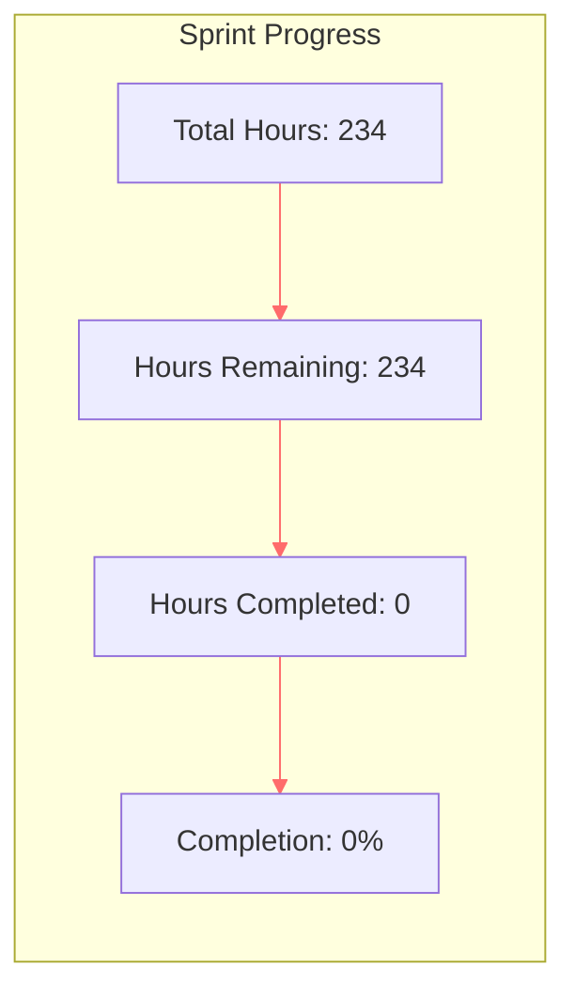

# Solana AI Registries SDK - Burndown Chart & Progress Tracker

## Project Overview
- **Total Tasks**: 59
- **Total Hours**: 234
- **Start Date**: _[Enter start date]_
- **Target End Date**: _[Based on 234 hours / available agent hours per day]_

## Live Burndown Chart



## Daily Progress Tracking

### Week 1
| Date | Hours Planned | Hours Actual | Tasks Completed | Hours Remaining | Velocity | Notes |
|------|---------------|--------------|-----------------|-----------------|----------|-------|
| Day 1 | 234 | 234 | - | 234 | 0 | Project kickoff |
| Day 2 | 226 | - | - | - | - | - |
| Day 3 | 218 | - | - | - | - | - |
| Day 4 | 210 | - | - | - | - | - |
| Day 5 | 202 | - | - | - | - | - |

### Week 2
| Date | Hours Planned | Hours Actual | Tasks Completed | Hours Remaining | Velocity | Notes |
|------|---------------|--------------|-----------------|-----------------|----------|-------|
| Day 6 | 194 | - | - | - | - | - |
| Day 7 | 186 | - | - | - | - | - |
| Day 8 | 178 | - | - | - | - | - |
| Day 9 | 170 | - | - | - | - | - |
| Day 10 | 162 | - | - | - | - | - |

### Week 3
| Date | Hours Planned | Hours Actual | Tasks Completed | Hours Remaining | Velocity | Notes |
|------|---------------|--------------|-----------------|-----------------|----------|-------|
| Day 11 | 154 | - | - | - | - | - |
| Day 12 | 146 | - | - | - | - | - |
| Day 13 | 138 | - | - | - | - | - |
| Day 14 | 130 | - | - | - | - | - |
| Day 15 | 122 | - | - | - | - | - |

### Week 4
| Date | Hours Planned | Hours Actual | Tasks Completed | Hours Remaining | Velocity | Notes |
|------|---------------|--------------|-----------------|-----------------|----------|-------|
| Day 16 | 114 | - | - | - | - | - |
| Day 17 | 106 | - | - | - | - | - |
| Day 18 | 98 | - | - | - | - | - |
| Day 19 | 90 | - | - | - | - | - |
| Day 20 | 82 | - | - | - | - | - |

### Week 5
| Date | Hours Planned | Hours Actual | Tasks Completed | Hours Remaining | Velocity | Notes |
|------|---------------|--------------|-----------------|-----------------|----------|-------|
| Day 21 | 74 | - | - | - | - | - |
| Day 22 | 66 | - | - | - | - | - |
| Day 23 | 58 | - | - | - | - | - |
| Day 24 | 50 | - | - | - | - | - |
| Day 25 | 42 | - | - | - | - | - |

### Week 6
| Date | Hours Planned | Hours Actual | Tasks Completed | Hours Remaining | Velocity | Notes |
|------|---------------|--------------|-----------------|-----------------|----------|-------|
| Day 26 | 34 | - | - | - | - | - |
| Day 27 | 26 | - | - | - | - | - |
| Day 28 | 18 | - | - | - | - | - |
| Day 29 | 10 | - | - | - | - | - |
| Day 30 | 0 | - | - | - | - | - |

## Phase-Based Progress

| Phase | Total Hours | Hours Completed | % Complete | Status |
|-------|-------------|-----------------|------------|---------|
| Phase 1: Foundation | 34 | 0 | 0% | Not Started |
| Phase 2: Core SDKs | 76 | 0 | 0% | Not Started |
| Phase 3: Extended SDKs | 40 | 0 | 0% | Not Started |
| Phase 4: Systems SDKs | 60 | 0 | 0% | Not Started |
| Phase 5: Documentation | 24 | 0 | 0% | Not Started |

## SDK Progress Matrix

| SDK | Total Tasks | Tasks Complete | Total Hours | Hours Complete | % Complete |
|-----|-------------|----------------|-------------|----------------|------------|
| Common Artifacts | 6 | 0 | 16 | 0 | 0% |
| Rust SDK | 12 | 0 | 48 | 0 | 0% |
| TypeScript SDK | 7 | 0 | 28 | 0 | 0% |
| Go SDK | 5 | 0 | 20 | 0 | 0% |
| Python SDK | 5 | 0 | 20 | 0 | 0% |
| C SDK | 5 | 0 | 32 | 0 | 0% |
| C++ SDK | 5 | 0 | 28 | 0 | 0% |
| CI/CD | 6 | 0 | 18 | 0 | 0% |
| Examples | 6 | 0 | 24 | 0 | 0% |

## Velocity Metrics

### Current Sprint (Updated: _[Date]_)
- **Average Daily Velocity**: 0 hours/day
- **Tasks per Day**: 0 tasks/day
- **Projected Completion**: _[Calculate based on velocity]_

### Historical Velocity
| Week | Hours Planned | Hours Actual | Variance | Weekly Velocity |
|------|---------------|--------------|----------|-----------------|
| Week 1 | 40 | - | - | - |
| Week 2 | 40 | - | - | - |
| Week 3 | 40 | - | - | - |
| Week 4 | 40 | - | - | - |
| Week 5 | 40 | - | - | - |
| Week 6 | 34 | - | - | - |

## Visual Burndown Chart Template

```mermaid
line chart
    title "SDK Development Burndown Chart"
    x-axis ["Day 1", "Day 5", "Day 10", "Day 15", "Day 20", "Day 25", "Day 30"]
    y-axis "Hours Remaining" 0 --> 250
    line "Ideal" [234, 194, 154, 114, 74, 34, 0]
    line "Actual" [234]
```

## Key Performance Indicators (KPIs)

| Metric | Target | Current | Status |
|--------|--------|---------|---------|
| Daily Velocity | 8 hrs/day | 0 | 🔴 Below Target |
| Task Completion Rate | 2 tasks/day | 0 | 🔴 Below Target |
| SDK Coverage | 100% | 0% | 🔴 Not Started |
| Test Coverage | >90% | 0% | 🔴 Not Started |
| Blocker Resolution Time | <24 hrs | N/A | ⚫ No Data |

## Update Instructions

### Daily Updates
1. Update "Hours Actual" with remaining hours
2. List completed Task IDs in "Tasks Completed"
3. Calculate velocity (previous - current hours)
4. Add any blockers or notes

### Weekly Updates
1. Update SDK Progress Matrix
2. Recalculate phase completion percentages
3. Update velocity metrics
4. Adjust projected completion date if needed

### How to Calculate
- **Velocity** = Hours Completed / Days Elapsed
- **Projected Completion** = Hours Remaining / Average Velocity
- **Variance** = Hours Planned - Hours Actual

## Risk Indicators

### 🟢 On Track (Green)
- Actual line within 5% of ideal burndown
- No critical blockers
- Velocity stable or increasing

### 🟡 At Risk (Yellow)
- Actual line 5-15% behind ideal
- Some blockers affecting progress
- Velocity declining

### 🔴 Critical (Red)
- Actual line >15% behind ideal
- Multiple critical blockers
- Velocity significantly below target

## Notes Section

### Blockers Log
| Date | Blocker | Impact | Resolution | Resolved Date |
|------|---------|--------|------------|---------------|
| - | - | - | - | - |

### Lessons Learned
- _[Add lessons as project progresses]_

### Adjustments Made
- _[Document any scope or timeline changes]_

---

**Last Updated**: 2025-01-07  
**Next Review**: End of Day 1  
**Update Frequency**: Daily at EOD