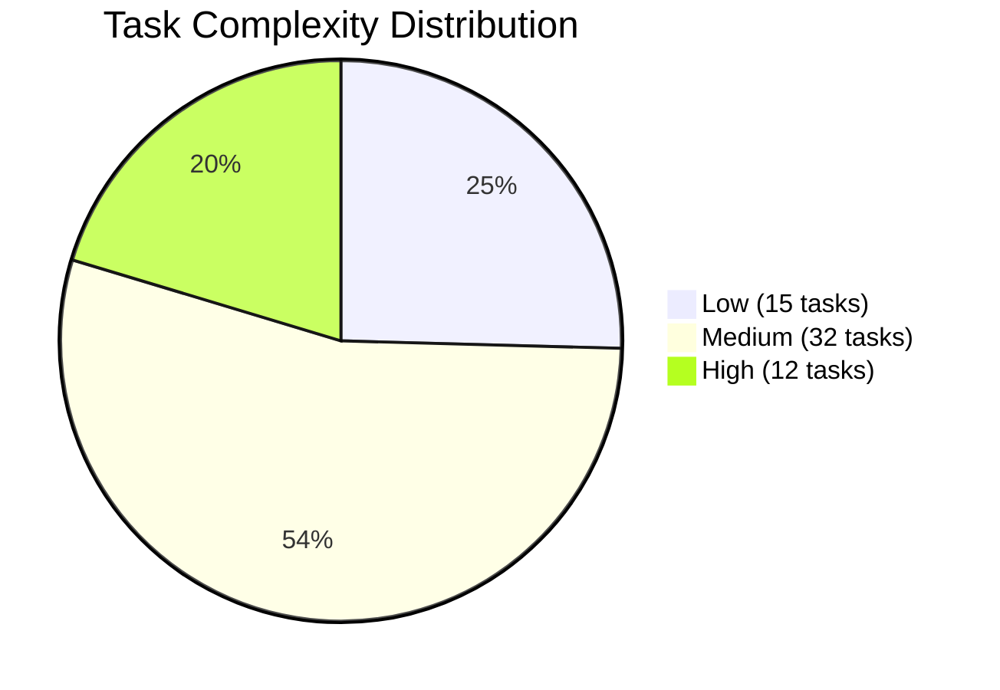
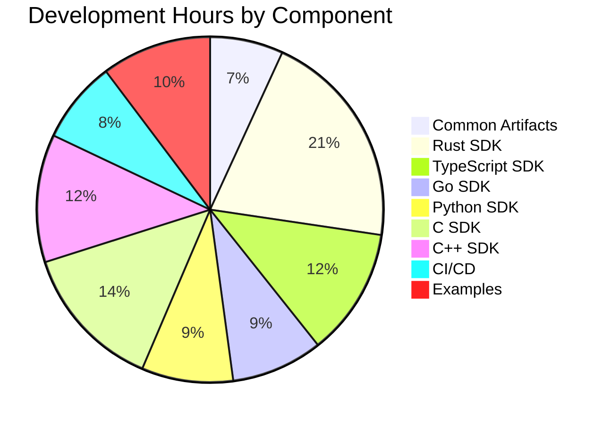

# Solana AI Registries SDK - Execution Summary

## 📊 Project Overview

**Total Effort**: ~234 developer hours  
**Total Tasks**: 59 atomic tasks  
**Languages**: 6 (Rust, TypeScript, Go, Python, C, C++)  
**Deliverables**: 6 SDKs + CI/CD + Examples

## 🎯 Quick Reference

### Documentation Structure

```
docs/
├── SDK_ROADMAP_DETAILED.md         # Master technical specification
├── SDK_EXECUTION_PLAN_FULL.md      # Complete task breakdown
├── SDK_RESOURCE_PLANNING.md        # Time/complexity estimates (NEW)
├── SDK_EXECUTION_SUMMARY.md        # This file - quick reference
└── sdk_refs/                       # Detailed references per SDK
    ├── README.md                   # Index of all references
    ├── common_artifacts_references.md
    ├── rust_sdk_references.md
    ├── typescript_sdk_references.md
    ├── go_sdk_references.md
    ├── python_sdk_references.md
    ├── c_sdk_references.md
    ├── cpp_sdk_references.md
    ├── cicd_references.md
    └── examples_references.md
```

### Execution Phases

```mermaid
gantt
    title SDK Development Phases
    dateFormat X
    axisFormat %s

    section Phase 1
    Common Artifacts     :active, p1_common, 0, 16
    CI/CD Setup         :active, p1_cicd, 0, 18

    section Phase 2
    Rust SDK            :p2_rust, 16, 48
    TypeScript SDK      :p2_ts, 16, 28

    section Phase 3
    Go SDK              :p3_go, 64, 20
    Python SDK          :p3_py, 64, 20

    section Phase 4
    C SDK               :p4_c, 84, 32
    C++ SDK             :p4_cpp, 116, 28

    section Phase 5
    Examples            :p5_ex, 144, 24
```



### Task Distribution by Complexity



### Time Distribution by SDK



## 🚀 Quick Start for Agents

### 1. Choose Your Task

1. Review [`SDK_RESOURCE_PLANNING.md`](./SDK_RESOURCE_PLANNING.md) for time/complexity
2. Pick a task matching your skills from [`sdk_refs/`](./sdk_refs/)
3. Check prerequisites in the reference documentation

### 2. Understand Requirements

Each task reference includes:
- ✅ Objective acceptance criteria
- 📚 Links to relevant documentation
- 🔗 References to existing code
- 📋 External resources

### 3. Implementation Checklist

- [ ] Read the task's reference documentation
- [ ] Review linked code examples
- [ ] Implement according to acceptance criteria
- [ ] Write/run tests as specified
- [ ] Document your code
- [ ] Verify against acceptance criteria

## 📈 Priority Matrix

### Critical Path (Must Complete First)
1. **Common Artifacts** - All SDKs depend on these
2. **Rust SDK** - Reference implementation
3. **TypeScript SDK** - Largest user base

### High Priority
- Payment implementations (all SDKs) - Complex, security-critical
- CI/CD workflows - Enables continuous delivery

### Medium Priority
- Go, Python SDKs - Important ecosystems
- Basic examples - Demonstrates usage

### Lower Priority
- C, C++ SDKs - Specialized use cases
- Advanced examples - Nice to have

## 🛠️ Technology Stack

### Core Dependencies
- **Solana**: v1.14+ (mainnet compatible)
- **Anchor**: v0.29+ (for IDL compatibility)
- **SVMAI Token**: Custom SPL token for payments

### Language-Specific
- **Rust**: tokio, anchor-client, cargo
- **TypeScript**: @solana/web3.js, @coral-xyz/anchor
- **Go**: gagliardetto/solana-go
- **Python**: solana-py, pytest
- **C**: libsodium, custom RPC client
- **C++**: C++17/20, libsodium

## 🔍 Success Metrics

### Per SDK
- ✅ All acceptance criteria met
- ✅ >90% test coverage
- ✅ Integration tests pass on devnet
- ✅ Published to package manager
- ✅ Example applications run successfully

### Overall Project
- ✅ All 6 SDKs functional
- ✅ Consistent API across languages
- ✅ CI/CD automation complete
- ✅ Documentation comprehensive
- ✅ Community adoption metrics

## 💡 Tips for Success

### For Individual Agents
1. **Start Simple**: Pick low-complexity tasks first
2. **Test Early**: Run tests frequently during development
3. **Ask Questions**: Use reference links when unclear
4. **Document Well**: Future agents will thank you

### For Team Coordination
1. **Claim Tasks**: Avoid duplicate work
2. **Share Blockers**: Communicate issues early
3. **Cross-Review**: SDKs should maintain consistency
4. **Update Status**: Keep progress visible

## 📞 Resources & Support

- **Technical Specs**: [`SDK_ROADMAP_DETAILED.md`](./SDK_ROADMAP_DETAILED.md)
- **Full Task List**: [`SDK_EXECUTION_PLAN_FULL.md`](./SDK_EXECUTION_PLAN_FULL.md)
- **Time Estimates**: [`SDK_RESOURCE_PLANNING.md`](./SDK_RESOURCE_PLANNING.md)
- **Detailed References**: [`sdk_refs/`](./sdk_refs/)
- **Protocol Docs**: [`IMPLEMENTATION_STATUS.md`](./IMPLEMENTATION_STATUS.md)

---

**Ready to build?** Pick a task and let's create amazing SDKs for the Solana AI ecosystem! 🚀