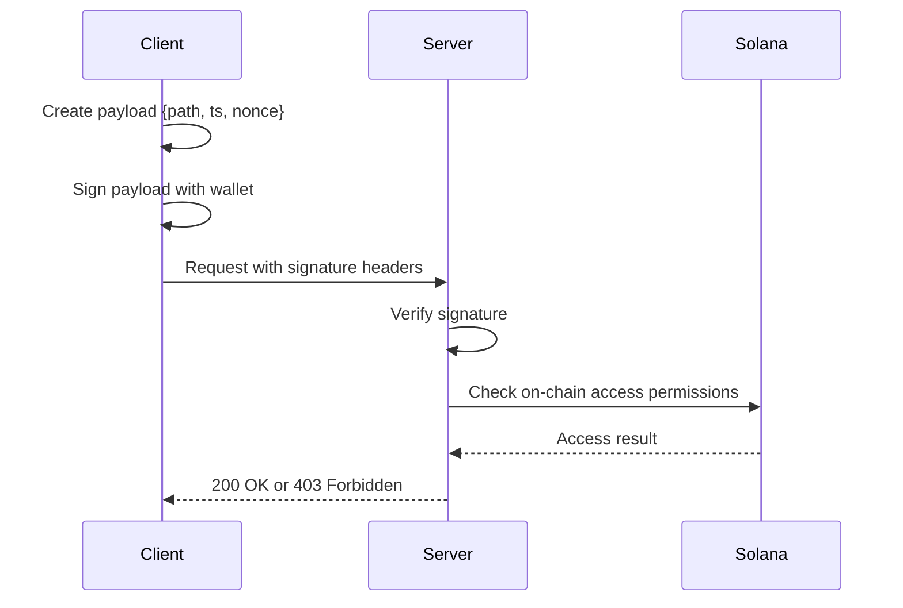

# Solana Wallet Signature Authentication

This document explains how to implement and use Solana wallet signature-based authentication with the AEAMCP protocol.

## Overview

The AEAMCP protocol now supports stateless access control using Solana wallet signatures. This allows:

- **Stateless Authentication**: No cookies or sessions required
- **Decentralized Access Control**: Permissions stored on-chain
- **Wallet-based Identity**: Uses Solana wallet signatures for authentication
- **Replay Protection**: Prevents signature reuse attacks
- **Access Transfer**: Support for lending/borrowing access rights

## How It Works



## Implementation Guide

### 1. Frontend Integration

#### Required Headers

Every authenticated request must include these headers:

```javascript
{
  'x-solana-signature': 'base64-encoded-signature',
  'x-solana-pubkey': 'base64-encoded-public-key', 
  'x-solana-timestamp': 'unix-timestamp',
  'x-solana-nonce': 'unique-nonce'
}
```

#### Payload Structure

The canonical payload that gets signed:

```typescript
interface SolanaAuthPayload {
  path: string;           // API endpoint being accessed
  ts: number;            // Unix timestamp (seconds)
  nonce: string;         // Unique nonce for replay protection
  data?: object;         // Optional request body data
}
```

#### Example Implementation

```javascript
import { Connection, PublicKey } from '@solana/web3.js';

// 1. Create payload
const payload = {
  path: '/api/v1/protected/profile',
  ts: Math.floor(Date.now() / 1000),
  nonce: generateNonce(), // Base64 random string
  data: requestBody // Include for POST/PUT requests
};

// 2. Create canonical message
const message = JSON.stringify(payload, Object.keys(payload).sort());

// 3. Sign with wallet
const messageBytes = new TextEncoder().encode(message);
const signature = await wallet.signMessage(messageBytes);

// 4. Create headers
const headers = {
  'x-solana-signature': Buffer.from(signature).toString('base64'),
  'x-solana-pubkey': Buffer.from(wallet.publicKey.toBytes()).toString('base64'),
  'x-solana-timestamp': payload.ts.toString(),
  'x-solana-nonce': payload.nonce,
  'content-type': 'application/json'
};

// 5. Make request
const response = await fetch('/api/v1/protected/profile', {
  method: 'GET',
  headers
});
```

### 2. Backend Integration

#### Middleware Setup

```typescript
import { createSolanaAuthMiddleware, requireSolanaAuth } from './middleware/solana-auth.middleware';
import { SolanaAuthService } from './services/solana-auth.service';

// Initialize service
const solanaAuth = new SolanaAuthService({
  rpcEndpoint: 'https://api.devnet.solana.com',
  registryProgramId: 'YourRegistryProgramId',
  maxSignatureAge: 300, // 5 minutes
  accessCacheTtl: 60,   // 1 minute cache
}, cacheService);

// Apply to routes
app.use('/api/protected', createSolanaAuthMiddleware(solanaAuth));
app.use('/api/protected', requireSolanaAuth);
```

#### Optional Authentication

For routes that work with or without wallet auth:

```typescript
import { optionalSolanaAuth, hasValidSolanaAuth } from './middleware/solana-auth.middleware';

app.use('/api/data', optionalSolanaAuth(solanaAuth));

app.get('/api/data/public', (req, res) => {
  const isAuthenticated = hasValidSolanaAuth(req);
  const walletAddress = req.solanaAuth?.walletAddress;
  
  res.json({
    data: getPublicData(),
    isAuthenticated,
    walletAddress,
    premiumFeatures: isAuthenticated ? getPremiumData() : null
  });
});
```

### 3. On-Chain Access Control

#### Registry Structure

Access permissions are stored on-chain using Program Derived Addresses (PDAs):

```rust
// PDA seeds: ["access_control_v1", wallet_pubkey, resource]
[
  Buffer.from('access_control_v1'),
  walletPublicKey.toBuffer(),
  Buffer.from(resource_path)
]
```

#### Access Check Flow

1. Server derives PDA for `(wallet, resource)` combination
2. Queries Solana RPC to check if account exists
3. Account existence = access granted
4. Results cached for performance

#### Example On-Chain Program

```rust
use anchor_lang::prelude::*;

#[program]
pub mod access_control {
    use super::*;
    
    pub fn grant_access(
        ctx: Context<GrantAccess>,
        resource: String,
    ) -> Result<()> {
        let access_entry = &mut ctx.accounts.access_entry;
        access_entry.wallet = ctx.accounts.wallet.key();
        access_entry.resource = resource;
        access_entry.granted_at = Clock::get()?.unix_timestamp;
        Ok(())
    }
}

#[derive(Accounts)]
#[instruction(resource: String)]
pub struct GrantAccess<'info> {
    #[account(
        init,
        payer = payer,
        space = 8 + 32 + 64 + 8,
        seeds = [b"access_control_v1", wallet.key().as_ref(), resource.as_bytes()],
        bump
    )]
    pub access_entry: Account<'info, AccessEntry>,
    
    pub wallet: Signer<'info>,
    
    #[account(mut)]
    pub payer: Signer<'info>,
    
    pub system_program: Program<'info, System>,
}

#[account]
pub struct AccessEntry {
    pub wallet: Pubkey,
    pub resource: String,
    pub granted_at: i64,
}
```

## Environment Configuration

Add these environment variables:

```bash
# Solana Configuration
SOLANA_RPC_ENDPOINT=https://api.devnet.solana.com
SOLANA_REGISTRY_PROGRAM_ID=YourRegistryProgramId
SOLANA_MAX_SIGNATURE_AGE=300
SOLANA_ACCESS_CACHE_TTL=60
SOLANA_ENABLE_SIGNATURE_VERIFICATION=true

# For development - disable signature verification
NODE_ENV=development
SOLANA_ENABLE_SIGNATURE_VERIFICATION=false
```

## Security Considerations

### 1. Replay Protection

- Each nonce can only be used once per wallet
- Nonces are cached with TTL > max signature age
- Prevents signature replay attacks

### 2. Timestamp Validation

- Signatures expire after `maxSignatureAge` seconds
- Allows some clock skew (30 seconds future)
- Prevents old signature reuse

### 3. Signature Verification

- Uses Ed25519 cryptographic verification
- Verifies signature matches payload and public key
- Can be disabled for development

### 4. Access Control Caching

- On-chain checks are expensive
- Results cached with configurable TTL
- Cache invalidation on access changes

## Testing

### 1. Development Mode

Disable signature verification for testing:

```bash
NODE_ENV=development
SOLANA_ENABLE_SIGNATURE_VERIFICATION=false
```

### 2. Mock Wallet

```javascript
// Mock wallet for testing
const mockWallet = {
  publicKey: new PublicKey('11111111111111111111111111111112'),
  signMessage: async (message) => {
    // Return dummy signature for testing
    return new Uint8Array(64).fill(1);
  }
};
```

### 3. Integration Tests

```javascript
describe('Solana Authentication', () => {
  it('should authenticate valid wallet signature', async () => {
    const payload = createAuthPayload('/api/protected');
    const signature = await wallet.signMessage(payload);
    
    const response = await request(app)
      .get('/api/protected')
      .set(createAuthHeaders(signature, wallet.publicKey, payload.ts, payload.nonce))
      .expect(200);
  });
  
  it('should reject expired signatures', async () => {
    const payload = createAuthPayload('/api/protected');
    payload.ts = Math.floor(Date.now() / 1000) - 400; // 400 seconds ago
    
    const response = await request(app)
      .get('/api/protected')
      .set(createAuthHeaders(signature, wallet.publicKey, payload.ts, payload.nonce))
      .expect(403);
  });
});
```

## Client Libraries

### React Hook

```typescript
import { useWallet } from '@solana/wallet-adapter-react';
import { createAuthPayload, createSignatureMessage } from './utils/solana-auth';

export function useSolanaAuth() {
  const { wallet, signMessage } = useWallet();

  const authenticatedFetch = async (url: string, options: RequestInit = {}) => {
    if (!wallet || !signMessage) {
      throw new Error('Wallet not connected');
    }

    const payload = createAuthPayload(url, options.body ? JSON.parse(options.body as string) : undefined);
    const message = createSignatureMessage(payload);
    const signature = await signMessage(new TextEncoder().encode(message));

    const headers = {
      ...options.headers,
      'x-solana-signature': Buffer.from(signature).toString('base64'),
      'x-solana-pubkey': Buffer.from(wallet.adapter.publicKey!.toBytes()).toString('base64'),
      'x-solana-timestamp': payload.ts.toString(),
      'x-solana-nonce': payload.nonce,
    };

    return fetch(url, { ...options, headers });
  };

  return { authenticatedFetch };
}
```

## Error Handling

### Error Types

```typescript
enum SolanaAuthErrorType {
  MISSING_HEADERS = 'MISSING_HEADERS',
  INVALID_SIGNATURE = 'INVALID_SIGNATURE', 
  SIGNATURE_EXPIRED = 'SIGNATURE_EXPIRED',
  REPLAY_ATTACK = 'REPLAY_ATTACK',
  ACCESS_DENIED = 'ACCESS_DENIED',
  ONCHAIN_CHECK_FAILED = 'ONCHAIN_CHECK_FAILED'
}
```

### Error Response Format

```json
{
  "error": "Signature timestamp is too old",
  "code": "SIGNATURE_EXPIRED",
  "details": {
    "maxAge": 300,
    "actualAge": 350
  }
}
```

## Best Practices

1. **Always use HTTPS** in production
2. **Implement proper nonce generation** using crypto-secure random
3. **Cache access control results** to reduce on-chain calls
4. **Monitor signature verification performance**
5. **Use rate limiting** for signature endpoints
6. **Implement proper error handling** for all failure modes
7. **Regular security audits** of signature verification logic

## Migration Guide

For existing applications:

1. Add Solana dependencies to package.json
2. Initialize SolanaAuthService in your app
3. Update CORS configuration for new headers
4. Apply middleware to protected routes
5. Update frontend to include signature headers
6. Deploy on-chain access control program
7. Test thoroughly before production deployment