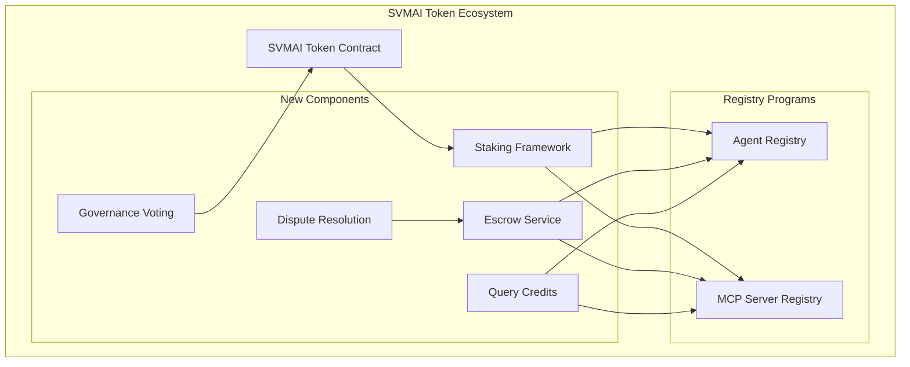
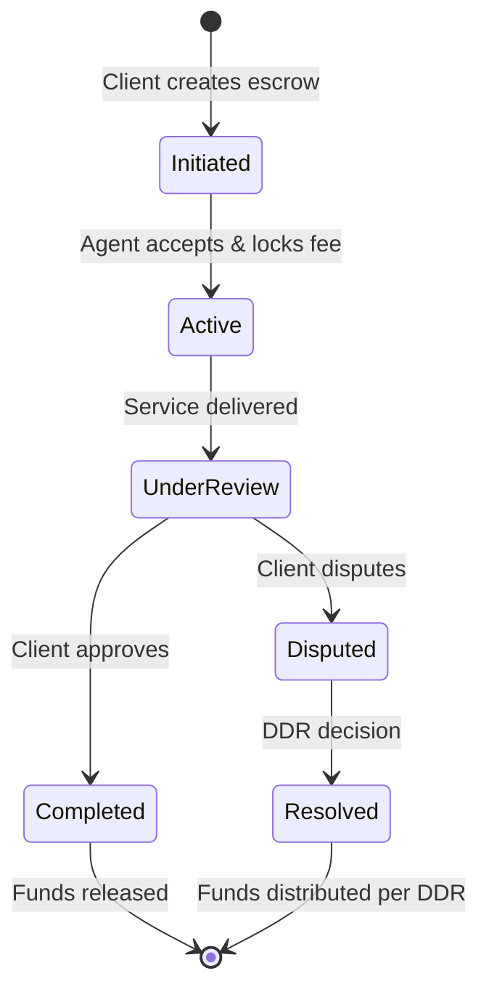
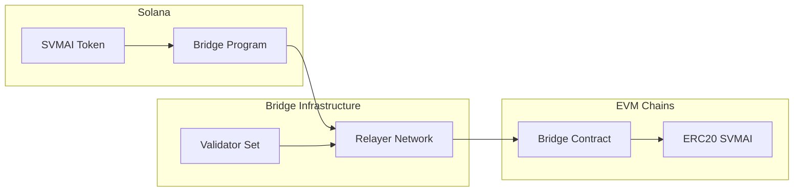

# SVMAI Token Integration Technical Specification

## Executive Summary

This document provides a comprehensive technical specification for integrating the SVMAI token (Contract: `Cpzvdx6pppc9TNArsGsqgShCsKC9NCCjA2gtzHvUpump`) into the Solana AI Registries ecosystem. The integration will enable token-based governance, staking mechanisms, service escrow, and economic incentives across both the Agent Registry and MCP Server Registry.

## Table of Contents

1. [Current System Architecture](#current-system-architecture)
2. [Token Integration Architecture](#token-integration-architecture)
3. [Registry Modification Requirements](#registry-modification-requirements)
4. [Service Escrow Implementation](#service-escrow-implementation)
5. [Staking Mechanisms](#staking-mechanisms)
6. [Dispute Resolution System](#dispute-resolution-system)
7. [Governance Integration](#governance-integration)
8. [Cross-Chain Bridge Architecture](#cross-chain-bridge-architecture)
9. [Smart Contract Components](#smart-contract-components)
10. [Risk Assessment](#risk-assessment)
11. [Implementation Roadmap](#implementation-roadmap)

## 1. Current System Architecture

### 1.1 Existing Components

#### Agent Registry (programs/agent-registry/)
- **Program ID**: `AgentReg11111111111111111111111111111111111`
- **State Structure**: `AgentRegistryEntryV1` (lines 15-68 in state.rs)
- **Key Features**:
  - PDA-based storage for agent metadata
  - Version control and reentrancy guards
  - Support for AEA and A2A paradigms
  - No current token integration

#### MCP Server Registry (programs/mcp-server-registry/)
- **State Structure**: `McpServerRegistryEntryV1` (lines 19-64 in state.rs)
- **Key Features**:
  - Tool, resource, and prompt definitions
  - Capability flags and versioning
  - No current token integration

#### SVMAI Token
- **Contract Address**: `Cpzvdx6pppc9TNArsGsqgShCsKC9NCCjA2gtzHvUpump`
- **Decimals**: 6
- **Total Supply**: 1,000,000,000 (fully circulated)
- **Current Integration**: Frontend display only (frontend/lib/token.ts)

### 1.2 Architecture Gaps

1. No on-chain token staking mechanisms
2. No registration fee collection
3. No dispute resolution framework
4. No governance voting infrastructure
5. No cross-chain bridge support

## 2. Token Integration Architecture

### 2.1 Core Integration Points



### 2.2 Token Utility Matrix

| Utility | Agent Registry | MCP Server Registry | Implementation Priority |
|---------|---------------|---------------------|------------------------|
| Registration Fees | ✓ Required | ✓ Required | High |
| Quality Staking | ✓ Agent reputation | ✓ Server verification | High |
| Service Escrow | ✓ Agent services | ✓ Tool usage | Medium |
| Dispute Resolution | ✓ Service disputes | ✓ Usage disputes | Medium |
| Query Credits | ✓ Advanced search | ✓ Advanced search | Low |
| Governance Voting | ✓ Registry params | ✓ Registry params | Low |

## 3. Registry Modification Requirements

### 3.1 Agent Registry Modifications

#### New State Fields (add to AgentRegistryEntryV1)
```rust
// Token staking fields
pub staked_amount: u64,  // Amount of SVMAI tokens staked
pub staking_timestamp: i64,  // When tokens were staked
pub stake_locked_until: i64,  // Lock period end
pub reputation_score: u64,  // Accumulated reputation

// Economic fields
pub total_earnings: u64,  // Total SVMAI earned
pub active_escrows: u8,  // Number of active service escrows
pub dispute_count: u16,  // Total disputes
pub successful_services: u32,  // Completed services

// Fee structure
pub base_service_fee: u64,  // Minimum SVMAI for services
pub priority_multiplier: u8,  // Fee multiplier for priority
```

#### New Instructions
```rust
pub enum AgentRegistryInstruction {
    // Existing instructions...
    
    // Token integration
    StakeTokens {
        amount: u64,
        lock_period: i64,
    },
    UnstakeTokens {
        amount: u64,
    },
    CollectRegistrationFee {
        fee_amount: u64,
    },
    UpdateServiceFees {
        base_fee: u64,
        priority_multiplier: u8,
    },
}
```

### 3.2 MCP Server Registry Modifications

#### New State Fields (add to McpServerRegistryEntryV1)
```rust
// Token staking fields
pub verification_stake: u64,  // SVMAI staked for verification
pub staking_timestamp: i64,
pub stake_locked_until: i64,
pub quality_score: u64,  // Server quality metric

// Usage tracking
pub total_tool_calls: u64,
pub total_resource_accesses: u64,
pub total_prompt_uses: u64,
pub total_fees_collected: u64,

// Fee structure per capability
pub tool_fee_structure: ToolFeeStructure,
pub resource_fee_structure: ResourceFeeStructure,
pub prompt_fee_structure: PromptFeeStructure,
```

#### New Instructions
```rust
pub enum McpServerRegistryInstruction {
    // Existing instructions...
    
    // Token integration
    StakeForVerification {
        amount: u64,
        lock_period: i64,
    },
    SetUsageFees {
        tool_fees: ToolFeeStructure,
        resource_fees: ResourceFeeStructure,
        prompt_fees: PromptFeeStructure,
    },
    CollectUsageFees {
        fee_type: FeeType,
        amount: u64,
    },
}
```

## 4. Service Escrow Implementation

### 4.1 Escrow State Structure

Based on the tokenomics analysis (frontend/public/docs/svmai-tokenomics.md), implement:

```rust
#[derive(BorshSerialize, BorshDeserialize)]
pub struct ServiceEscrow {
    // Core fields
    pub escrow_id: [u8; 32],
    pub client: Pubkey,
    pub agent: Pubkey,
    pub client_stake: u64,
    pub agent_fee: u64,
    
    // Service details
    pub service_hash: [u8; 32],  // Hash of service agreement
    pub deliverables_uri: String,
    pub deadline: i64,
    
    // Status tracking
    pub status: EscrowStatus,
    pub created_at: i64,
    pub updated_at: i64,
    
    // Dispute fields
    pub dispute_initiated: bool,
    pub dispute_stake: u64,
    pub dispute_evidence_uri: Option<String>,
}

#[derive(BorshSerialize, BorshDeserialize)]
pub enum EscrowStatus {
    Active,
    Completed,
    Disputed,
    Resolved,
    Cancelled,
}
```

### 4.2 Escrow Lifecycle



### 4.3 Critical Recommendations

From tokenomics analysis (lines 406-430 in svmai-tokenomics.md):

1. **Abandon "Client Reclaims All" Rule**: The default dispute outcome where clients get both their stake AND agent fees creates unacceptable moral hazard
2. **Require Dispute Staking**: Clients must stake additional SVMAI when initiating disputes
3. **Implement Nuanced Resolutions**: Support partial payments, not just binary outcomes

## 5. Staking Mechanisms

### 5.1 Agent Staking Tiers

| Tier | Min Stake (SVMAI) | Lock Period | Benefits |
|------|-------------------|-------------|----------|
| Bronze | 1,000 | 30 days | Basic listing |
| Silver | 10,000 | 90 days | Priority in search |
| Gold | 50,000 | 180 days | Featured placement |
| Platinum | 100,000 | 365 days | Governance rights |

### 5.2 MCP Server Verification Stakes

| Server Type | Min Stake | Purpose |
|-------------|-----------|---------|
| Basic | 500 | Spam prevention |
| Verified | 5,000 | Quality signal |
| Premium | 25,000 | Enhanced features |

### 5.3 Staking Rewards Formula

```
Annual Yield = Base_Rate + (Quality_Score * Performance_Multiplier)
Where:
- Base_Rate: 8% (SVMAI_ANNUAL_YIELD_MIN)
- Max_Rate: 12% (SVMAI_ANNUAL_YIELD_MAX)
- Quality_Score: 0-1 based on service metrics
- Performance_Multiplier: 4%
```

## 6. Dispute Resolution System

### 6.1 Decentralized Dispute Resolution (DDR) Architecture

Based on comprehensive analysis (lines 115-194 in svmai-tokenomics.md):

```rust
#[derive(BorshSerialize, BorshDeserialize)]
pub struct DisputeCase {
    pub dispute_id: [u8; 32],
    pub escrow_id: [u8; 32],
    pub initiator: Pubkey,
    pub respondent: Pubkey,
    
    // Stakes
    pub dispute_stake: u64,  // Client's additional stake
    pub juror_pool: u64,  // Total juror stakes
    
    // Evidence
    pub evidence_hash: [u8; 32],
    pub evidence_uri: String,
    
    // Jury
    pub jurors: Vec<Juror>,
    pub votes: Vec<Vote>,
    pub appeal_count: u8,
    
    // Outcome
    pub resolution: Option<Resolution>,
    pub resolved_at: Option<i64>,
}

#[derive(BorshSerialize, BorshDeserialize)]
pub struct Juror {
    pub address: Pubkey,
    pub stake: u64,
    pub reputation: u64,
    pub specialization: Vec<String>,
}
```

### 6.2 DDR Process Flow

1. **Dispute Initiation**
   - Client stakes additional SVMAI (min 10% of service value)
   - Evidence submission period (48 hours)
   
2. **Juror Selection**
   - Random selection weighted by stake
   - Minimum 3 jurors, scales with dispute value
   - Specialization matching for complex cases
   
3. **Voting Mechanism**
   - Commit-reveal scheme to prevent influence
   - Schelling point incentives
   - Coherent voters rewarded, incoherent penalized
   
4. **Resolution Options**
   - Full payment to agent
   - Full refund to client (stake only)
   - Partial payment (percentage-based)
   - Penalty for bad faith actor

### 6.3 Appeal Process

- Requires 2x original dispute stake
- Larger juror pool (2n+1 where n is previous pool size)
- Maximum 3 appeal rounds

## 7. Governance Integration

### 7.1 Voting Power Calculation

```
Voting Power = Staked_Amount * Time_Multiplier * Reputation_Factor
Where:
- Time_Multiplier: 1 + (lock_days / 365)
- Reputation_Factor: 0.5 to 2.0 based on platform activity
```

### 7.2 Governance Parameters

| Parameter | Initial Value | Governance Controlled |
|-----------|---------------|----------------------|
| Registration Fee (Agent) | 100 SVMAI | Yes |
| Registration Fee (Server) | 50 SVMAI | Yes |
| Min Dispute Stake | 10% | Yes |
| Juror Min Stake | 1,000 SVMAI | Yes |
| Query Credit Rate | 1 SVMAI = 100 credits | Yes |

### 7.3 Proposal Types

1. **Fee Adjustments**: Modify platform fees
2. **Parameter Changes**: Update staking requirements
3. **Feature Additions**: Vote on new capabilities
4. **Treasury Allocation**: Distribute platform revenue

## 8. Cross-Chain Bridge Architecture

### 8.1 Target Chains

As specified in documentation:
- Ethereum (primary)
- Polygon
- BSC (Binance Smart Chain)
- Arbitrum

### 8.2 Bridge Design



### 8.3 Security Measures

1. **Multi-signature validation**: 5-of-9 validator consensus
2. **Time-locked withdrawals**: 24-hour delay for large amounts
3. **Rate limiting**: Max 10% of supply bridgeable per day
4. **Emergency pause**: DAO-controlled circuit breaker

## 9. Smart Contract Components

### 9.1 New Program Modules

```
programs/
├── token-integration/
│   ├── src/
│   │   ├── lib.rs
│   │   ├── staking.rs
│   │   ├── escrow.rs
│   │   ├── dispute.rs
│   │   └── governance.rs
│   └── Cargo.toml
├── bridge/
│   ├── src/
│   │   ├── lib.rs
│   │   ├── lock.rs
│   │   ├── mint.rs
│   │   └── validator.rs
│   └── Cargo.toml
```

### 9.2 Key Security Patterns

From escrow analysis (lines 65-77 in svmai-tokenomics.md):

1. **Checks-Effects-Interactions**: Prevent reentrancy
2. **Access Control**: Role-based permissions
3. **SafeERC20 Pattern**: Secure token transfers
4. **Overflow Protection**: SafeMath or Solidity 0.8+
5. **Emergency Stop**: Circuit breaker mechanism
6. **Time Constraints**: Enforce deadlines

### 9.3 Upgrade Strategy

- Proxy pattern for upgradability
- Timelock on upgrades (7-day delay)
- Multi-sig approval required
- Backward compatibility requirements

## 10. Risk Assessment

### 10.1 Technical Risks

| Risk | Severity | Mitigation |
|------|----------|------------|
| Smart contract vulnerability | Critical | Multiple audits, bug bounty |
| Bridge hack | Critical | Multi-sig, rate limits |
| DDR manipulation | High | Stake requirements, appeals |
| State bloat | Medium | Efficient data structures |
| Network congestion | Medium | Priority fee mechanism |

### 10.2 Economic Risks

| Risk | Severity | Mitigation |
|------|----------|------------|
| Token price volatility | High | Stablecoin option for fees |
| Insufficient staking | Medium | Dynamic reward rates |
| Dispute spam | Medium | Escalating stake requirements |
| Liquidity fragmentation | Medium | Concentrated liquidity incentives |

### 10.3 Operational Risks

| Risk | Severity | Mitigation |
|------|----------|------------|
| Governance attacks | High | Time delays, quorum requirements |
| Regulatory changes | High | Compliance framework, legal review |
| User experience complexity | Medium | Progressive disclosure, tutorials |
| Cross-chain coordination | Medium | Robust monitoring, fallbacks |

## 11. Implementation Roadmap

### Phase 1: Core Token Integration (Months 1-3)
- [ ] Implement registration fee collection
- [ ] Basic staking mechanism
- [ ] Token balance checks
- [ ] Frontend integration updates

### Phase 2: Escrow System (Months 4-6)
- [ ] Service escrow smart contracts
- [ ] Basic approval/dispute flow
- [ ] Agent fee management
- [ ] Client stake handling

### Phase 3: DDR Implementation (Months 7-9)
- [ ] Juror staking system
- [ ] Voting mechanism
- [ ] Evidence submission
- [ ] Resolution enforcement

### Phase 4: Advanced Features (Months 10-12)
- [ ] Query credit system
- [ ] Governance voting
- [ ] Cross-chain bridge (Ethereum first)
- [ ] Analytics dashboard

### Phase 5: Ecosystem Expansion (Months 13-18)
- [ ] Additional chain bridges
- [ ] Advanced DDR features
- [ ] Treasury management
- [ ] Partner integrations

## Conclusion

This technical specification provides a comprehensive blueprint for integrating the SVMAI token into the Solana AI Registries ecosystem. The implementation prioritizes security, fairness, and sustainability while addressing the critical issues identified in the tokenomics analysis, particularly around dispute resolution and stakeholder incentive alignment.

The phased approach allows for iterative development and testing, with high-priority features like registration fees and staking implemented first, followed by more complex systems like DDR and cross-chain bridges.

## References

1. aeamcp.pdf - Core protocol design (lines 1-1957)
2. svmai-token.md - Token utility overview (lines 1-164)
3. svmai-tokenomics.md - Detailed escrow analysis (lines 1-535)
4. solana-ai-registries-implementation-plan.md
5. Agent Registry source code (programs/agent-registry/)
6. MCP Server Registry source code (programs/mcp-server-registry/)
7. Frontend token integration (frontend/lib/token.ts)