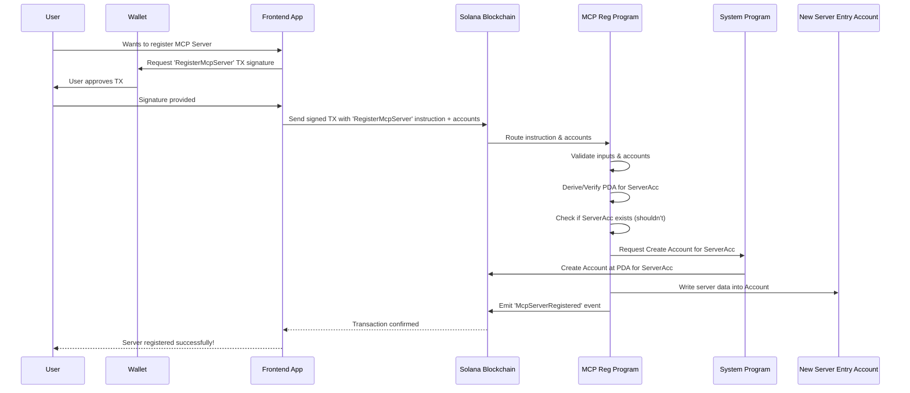

# Chapter 3: MCP Server Registry Program

Welcome back to the `aeamcp` tutorial! In the previous chapters, we learned about [Chapter 1: Registry Entry Accounts](01_registry_entry_accounts_.md) (the data containers for agents and servers) and [Chapter 2: Agent Registry Program](02_agent_registry_program_.md) (the smart contract that manages the agent accounts).

Now, we turn our attention to the other half of the registry: the **MCP Server Registry Program**.

## What is the MCP Server Registry Program?

Just as the Agent Registry Program is the smart contract specifically for managing AI Agent information, the **MCP Server Registry Program** is the dedicated smart contract on the Solana blockchain for managing **MCP Server Registry Entry** accounts.

Remember from Chapter 1 that MCP servers are the entities that provide AI tools, resources, and prompts. This program is the official, decentralized system for listing, updating, and discovering these servers.

Think of it as the "Yellow Pages" or "Google Maps" specifically for AI services available via the Model Context Protocol (MCP) within the AEAMCP ecosystem. If you want to find an MCP server that offers image generation tools, you'd interact with the data managed by this program.

Its core purpose is to:

1.  **Allow Server Owners to Register:** Provide a way for someone running an MCP server to list their service on the blockchain.
2.  **Store Server Information:** Create and update the dedicated `McpServerRegistryEntryV1` accounts that hold the server's key details (name, endpoint, capabilities, etc.).
3.  **Define and Enforce Rules:** Ensure that server registration and updates follow specific rules (e.g., data formats, who can make changes, potential requirements like staking).
4.  **Enable Discovery:** Make server information easily readable from the blockchain so other applications (like user interfaces or AI agents looking for tools) can find registered servers.

## Key Operations

Like the Agent Registry Program, the MCP Server Registry Program understands various **instructions** – requests that can be sent to it in a transaction. These instructions correspond to the actions needed to manage server entries.

Here are some examples of instructions handled by the MCP Server Registry Program:

*   **`RegisterMcpServer` / `RegisterMcpServerWithToken`**: Create a new `McpServerRegistryEntryV1` account and populate it with the server's initial details. (One version includes paying a registration fee in tokens).
*   **`UpdateMcpServerDetails`**: Modify information like the server's name, endpoint, capabilities flags, or the list of on-chain defined tools/resources/prompts.
*   **`UpdateMcpServerStatus`**: Change the server's status (e.g., from Pending to Active, or to Inactive).
*   **`DeregisterMcpServer`**: Mark the server's entry as Deregistered.
*   **`StakeForVerification`**: Allow server owners to stake tokens (more on [Chapter 7: A2AMPL (SVMAI) Token](07_a2ampl__svmai__token_.md)) to increase the server's verification tier and reputation.
*   **`ConfigureUsageFees`**: Set the fees the server charges for using its tools, resources, or prompts.
*   **`RecordUsageAndCollectFee`**: Used by integrated systems to record that a server provided a service and facilitate fee collection.
*   **`UpdateQualityMetrics`**: Allow authorized oracles/monitoring services to report performance metrics like uptime, response time, and error rate, which affects the server's quality score.
*   **`WithdrawPendingFees`**: Allow the server owner to withdraw accumulated fees.

Our main focus for understanding the basics will be the **Registration** process, similar to how we looked at agent registration in Chapter 2.

## How to Register an MCP Server

Suppose you've built an MCP server that provides a cool set of AI tools. You want to make it discoverable on the AEAMCP network. You need to register it with the MCP Server Registry Program.

From your perspective as the server owner, you'll likely use a frontend application (a website or app) that guides you through the process. This app will help you prepare the necessary information about your server (server ID, name, endpoint, what kind of capabilities it offers, maybe some key on-chain definitions for discoverability).

Once you've provided the details, the app will construct a Solana **transaction** containing a `RegisterMcpServer` or `RegisterMcpServerWithToken` instruction. This transaction will also include a list of **accounts** the program needs to interact with. You will then use your Solana wallet to sign this transaction.

## Inside the Program: Server Registration Process

When the Solana network processes your signed transaction, it delivers the `RegisterMcpServer` instruction and the list of accounts to the MCP Server Registry Program.

Here's a simplified sequence of what the program does:

1.  **Receive & Decode:** The program receives the transaction data, unpacks the instruction (`RegisterMcpServer`), and gets the list of account addresses and their information (`AccountInfo`).
    *   *See `McpServerRegistryInstruction::try_from_slice` in `processor.rs`.*
2.  **Identify Accounts:** It identifies the specific accounts it needs from the list provided in the transaction (like your wallet, the account for the new server entry, the System Program account).
    *   *See `next_account_info` calls in `process_register_mcp_server` in `processor.rs`.*
3.  **Validate Inputs:** It checks the data you provided (server ID, name, endpoint, etc.) to ensure they meet the program's requirements (e.g., not too long, valid format).
    *   *See `validate_register_mcp_server` call in `processor.rs`.*
4.  **Verify Signers:** It verifies that the required accounts have signed the transaction (at minimum, the account designated as the `owner_authority` and the `payer`).
    *   *See `owner_authority_info.is_signer` and `payer_info.is_signer` checks in `processor.rs`.*
5.  **Derive & Verify PDA:** It calculates the expected address for the new server entry account. This address is a special type called a [Chapter 4: Program Derived Address (PDAs)](04_program_derived_addresses__pdas__.md), deterministically generated from the `server_id`, your `owner_authority` public key, and the program's ID. The program verifies that the account address provided in the transaction matches this calculated PDA. This is a critical security step!
    *   *See `get_mcp_server_pda_secure` call in `processor.rs`.*
6.  **Check Existence:** It checks if an account already exists at the expected PDA. If it does, it means a server with this ID is already registered by this owner, and the registration fails.
    *   *(Implicit check because `system_instruction::create_account` will fail if the account already exists).*
7.  **Create Account:** If the PDA is valid and the account doesn't exist, the program asks the Solana System Program (another built-in program) to create a new account at that PDA address. It specifies the size needed to store the `McpServerRegistryEntryV1` data and sets itself (the MCP Server Registry Program) as the *owner* of this new account. The payer account provides the necessary lamports for rent exemption.
    *   *See `invoke(&system_instruction::create_account(...))` in `processor.rs`.*
8.  **Write Data:** The program then populates the newly created account with the server details you provided, using the defined `McpServerRegistryEntryV1` structure. It also sets the initial status (usually Pending) and timestamps.
    *   *See `McpServerRegistryEntryV1::new(...)` and `mcp_server_entry.serialize(...)` in `processor.rs`.*
9.  **Handle Token Payment (if applicable):** If the instruction was `RegisterMcpServerWithToken`, the program performs an additional step: it uses the Solana Program Library (SPL) Token program to transfer the required registration fee from the server owner's specified token account to the program's designated registration vault account. (More on tokens in [Chapter 7: A2AMPL (SVMAI) Token](07_a2ampl__svmai__token_.md)).
    *   *See `transfer_tokens_with_account_info` call in `process_register_mcp_server_with_token` in `processor.rs`.*
10. **Emit Event:** To signal that the server was successfully registered and to make it easy for applications to track new registrations, the program emits an event ([Chapter 8: Program Events](08_program_events_.md)).
    *   *See the `msg!` call for the event in `processor.rs`.*
11. **Finish:** The program completes its execution, and the transaction is finalized on the blockchain. The new `McpServerRegistryEntryV1` account now holds your server's official on-chain record.

Here's a simplified diagram of the registration flow:


*This diagram illustrates the steps involved when a server owner registers their service through the MCP Server Registry Program.*

*(Note: The `RegisterMcpServerWithToken` flow would include an additional step involving the SPL Token Program to handle the fee transfer).*

## Exploring the Code (Simplified)

Let's peek at simplified code snippets from the `mcp-server-registry` program, similar to what we did for the agent program.

The program's entry point (`lib.rs`) routes instructions:

```rust
// from programs/mcp-server-registry/src/lib.rs
entrypoint!(process_instruction);

pub fn process_instruction(
    program_id: &Pubkey,
    accounts: &[AccountInfo],
    instruction_data: &[u8],
) -> ProgramResult {
    msg!("MCP Server Registry program entrypoint"); // Log start
    // Unpack instruction and call the processor function
    processor::process_instruction(program_id, accounts, instruction_data)
}
```
*This code shows that the main entry point simply calls the `process_instruction` function in the `processor` module.*

The `processor.rs` file contains the logic for handling different instructions:

```rust
// from programs/mcp-server-registry/src/processor.rs
pub fn process_instruction(
    program_id: &Pubkey,
    accounts: &[AccountInfo],
    instruction_data: &[u8],
) -> ProgramResult {
    // Try to deserialize the instruction data into an enum
    let instruction = McpServerRegistryInstruction::try_from_slice(instruction_data)
        .map_err(|_| ProgramError::InvalidInstructionData)?;

    // Match the instruction type and call the specific handler function
    match instruction {
        McpServerRegistryInstruction::RegisterMcpServer { ... } => {
            process_register_mcp_server(program_id, accounts, ...)
        }
        McpServerRegistryInstruction::UpdateMcpServerDetails { details } => {
            process_update_mcp_server_details(program_id, accounts, details)
        }
        // ... other instructions like UpdateStatus, Deregister, Stake, Fees, etc.
        _ => return Err(ProgramError::InvalidInstructionData), // Handle unknown
    }
}
// ... functions for each instruction follow ...
```
*This snippet shows how the program figures out which specific task (like Register or Update) it needs to perform.*

Inside `process_register_mcp_server`, the program gets the accounts it needs:

```rust
// from programs/mcp-server-registry/src/processor.rs (inside process_register_mcp_server)
let accounts_iter = &mut accounts.iter();
// Get the accounts involved in this instruction
let mcp_server_entry_info = next_account_info(accounts_iter)?; // The account to create for the server data
let owner_authority_info = next_account_info(accounts_iter)?; // The server owner's wallet
let payer_info = next_account_info(accounts_iter)?; // The account paying transaction fees/rent
let system_program_info = next_account_info(accounts_iter)?; // The System Program account
```
*This code shows the program accessing the different accounts that were included in the transaction.*

It then requests the creation of the account:

```rust
// from programs/mcp-server-registry/src/processor.rs (inside process_register_mcp_server)
// Calculate the required space for the server entry data
let space = McpServerRegistryEntryV1::SPACE;
// Get current rent information to determine required lamports
let rent = Rent::get()?;
let lamports = rent.minimum_balance(space);

// Invoke the System Program to create the account
invoke(
    &system_instruction::create_account(
        payer_info.key, // The public key of the account paying for rent
        mcp_server_entry_info.key, // The public key of the new account (the PDA)
        lamports, // The amount of lamports to transfer for rent exemption
        space as u64, // The size of the new account's data space
        program_id, // The program ID that will own the new account
    ),
    &[
        payer_info.clone(), // Pass necessary account infos to the System Program
        mcp_server_entry_info.clone(),
        system_program_info.clone(),
    ],
)?;
```
*This snippet shows the program calling out to the Solana System Program to create a new data account on the blockchain for the server entry.*

Finally, it writes the initial server data into the new account:

```rust
// from programs/mcp-server-registry/src/processor.rs (inside process_register_mcp_server)
// Get the current timestamp from sysvar (not shown getting clock_info for simplicity)
let timestamp = get_current_timestamp()?; 
// Create the server entry structure in memory with the initial data
let mcp_server_entry = McpServerRegistryEntryV1::new(
    bump, // The bump seed determined earlier for the PDA
    *owner_authority_info.key, // The owner's public key
    server_id.clone(), // Server ID from instruction
    name.clone(), // Name from instruction
    server_version.clone(), // Version from instruction
    service_endpoint.clone(), // Endpoint from instruction
    // ... other fields from instruction ...
    timestamp, // Current time for registration/last update
);

// Get mutable access to the new account's data
let mut data = mcp_server_entry_info.try_borrow_mut_data()?;
// Serialize the Rust structure and write it into the account's data space
mcp_server_entry.serialize(&mut &mut data[..])?;
```
*This code shows the program preparing the server's information according to the `McpServerRegistryEntryV1` structure and then saving it into the data account.*

These snippets highlight that the MCP Server Registry Program's function is to act as the controller. It processes valid instructions, verifies permissions, interacts with other core Solana programs (like the System Program or SPL Token Program), and manages the data specifically within the `McpServerRegistryEntryV1` accounts.

## Comparison

Here's how the two main registry programs stack up:

| Feature             | Agent Registry Program                 | MCP Server Registry Program              |
| :------------------ | :------------------------------------- | :--------------------------------------- |
| **Role**            | Manages **Agent** Registry Entries     | Manages **MCP Server** Registry Entries  |
| **Data Accounts**   | Owns/controls `AgentRegistryEntryV1`   | Owns/controls `McpServerRegistryEntryV1` |
| **Key Instructions**| RegisterAgent, UpdateAgentDetails, etc.| RegisterMcpServer, UpdateServerDetails, StakeForVerification, RecordUsageAndCollectFee, etc. |
| **Entities Managed**| Individual AI Agents                   | Servers providing AI Tools, Resources, Prompts |
| **Focus**           | Agent identity, skills, endpoints      | Server identity, endpoint, offered capabilities (tools, resources, prompts) |

They are distinct programs, each managing their specific type of registry entry account, but they work together to form the complete AEAMCP decentralized registry.

## Conclusion

The MCP Server Registry Program is a crucial smart contract in the `aeamcp` architecture. It provides the decentralized mechanism for MCP server owners to list their services on the Solana blockchain, defining the rules for registering, updating, and managing the associated `McpServerRegistryEntryV1` data accounts. By understanding how this program works, we see how the ecosystem keeps track of available AI services provided by servers.

In the next chapter, we'll look at the technical concept that makes it possible for programs like these to securely own and manage specific accounts on Solana without needing a private key: **Program Derived Addresses (PDAs)**.

[Program Derived Addresses (PDAs)](04_program_derived_addresses__pdas__.md)

---
