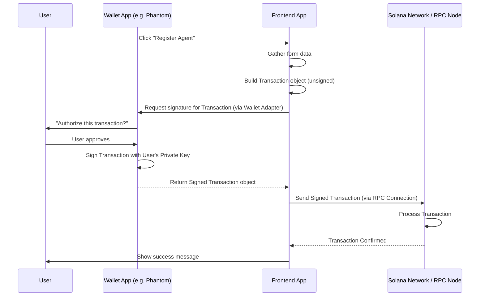

# Chapter 6: Solana Wallet Integration

Welcome back to the `aeamcp` tutorial! In our journey so far, we've learned about the on-chain building blocks: [Chapter 1: Registry Entry Accounts](01_registry_entry_accounts_.md) hold the data, [Chapter 2: Agent Registry Program](02_agent_registry_program_.md) and [Chapter 3: MCP Server Registry Program](03_mcp_server_registry_program_.md) are the smart contracts that manage this data using [Chapter 4: Program Derived Addresses (PDAs)](04_program_derived_addresses__pdas__.md), and the [Chapter 5: Registry RPC Service (Frontend)](05_registry_rpc_service__frontend_.md) helps our frontend application *read* this data from the blockchain.

Reading data is one thing, but what if you want to *write* data? What if you are an AI agent developer and want to **register your agent** on the blockchain? Or you run an MCP server and want to add your service to the registry? This requires interacting with the smart contracts, which means sending **transactions** to the Solana network.

This is where **Solana Wallet Integration** comes in. It's the essential component that allows the web application to connect to a user's Solana wallet, enabling them to sign and authorize these crucial transactions.

## Why Do We Need a Wallet?

On Solana (and most blockchains), your **wallet** is your digital identity and your control center.

*   **Identity:** Your wallet holds your unique public key, which acts as your address on the blockchain. This is how the registry programs know who you are (e.g., who the `owner_authority` of a registered agent is).
*   **Authorization:** To perform any action that changes the blockchain state (like registering an agent, updating its details, or sending tokens for a registration fee), you need to **sign a transaction** with the private key associated with your public key. Your wallet securely manages this private key and handles the signing process without ever exposing the key itself to the web application.
*   **Fees:** Transactions on Solana require a small fee (paid in SOL) to compensate validators for processing the transaction. Your wallet holds the SOL needed to pay these **network fees**.

Without a connected wallet, the `aeamcp` frontend can only *read* data from the registry. With a connected wallet, it becomes a powerful tool for interacting with the registry programs and participating in the ecosystem.

Our central use case for this chapter is understanding how the frontend enables a user to **register a new AI agent**, which requires signing a transaction.

## The Solana Wallet Adapter

Different Solana wallets exist (Phantom, Solflare, Ledger, etc.). They all manage keys and sign transactions, but they might use slightly different methods to connect to web applications.

To avoid building custom integration code for every single wallet type, developers use the **Solana Wallet Adapter**. This is a standard library that provides a unified interface for web applications to connect to and interact with various wallets.

Think of the Wallet Adapter as a universal translator. Your web app speaks one language (the Adapter's API), and the Adapter translates it into the specific language needed for Phantom, Solflare, or any other supported wallet.

## Key Components of the Wallet Adapter in `aeamcp`

The `aeamcp` frontend uses the `@solana/wallet-adapter-react` library, which provides React components and hooks to simplify wallet integration. The main components you'll see are:

1.  **`ConnectionProvider`**: This component provides the Solana RPC connection object to the rest of the application. Remember from [Chapter 5](05_registry_rpc_service__frontend_.md) that you need to connect to an RPC endpoint to interact with Solana. This component sets up that connection context.
2.  **`SolanaWalletProvider`**: This component manages the state of the connected wallet. It keeps track of which wallet is connected, the user's public key, and provides functions for signing.
3.  **`WalletModalProvider`**: This component provides a standard, pre-built user interface (a modal dialog) that pops up when the user clicks a "Connect Wallet" button. It lists available wallets and guides the user through the connection process.
4.  **`useWallet` hook**: This is the primary way components in your application access the wallet state and signing functions. You call `useWallet()` inside a React component to get information like `publicKey`, `connected`, `signing`, `signTransaction`, etc.

Let's look at where these are used in the `aeamcp` frontend code.

First, the `WalletProvider` component (`frontend/components/common/WalletProvider.tsx`) wraps the entire application layout to make the wallet context available everywhere:

```typescript
// from frontend/components/common/WalletProvider.tsx
import React, { useMemo } from 'react';
import { ConnectionProvider, WalletProvider as SolanaWalletProvider } from '@solana/wallet-adapter-react';
import { WalletAdapterNetwork } from '@solana/wallet-adapter-base';
import { WalletModalProvider } from '@solana/wallet-adapter-react-ui';
// Import specific wallet adapters you want to support
import { PhantomWalletAdapter, SolflareWalletAdapter, TorusWalletAdapter, LedgerWalletAdapter } from '@solana/wallet-adapter-wallets';
import { clusterApiUrl } from '@solana/web3.js';
import '@solana/wallet-adapter-react-ui/styles.css';

export default function WalletProvider({ children }: { children: React.ReactNode; }) {
  // Choose the Solana network (e.g., Devnet)
  const network = WalletAdapterNetwork.Devnet;
  // Get the RPC endpoint URL for the chosen network
  const endpoint = useMemo(() => clusterApiUrl(network), [network]);

  // Define the list of wallets your app supports
  const wallets = useMemo(
    () => [
      new PhantomWalletAdapter(),
      new SolflareWalletAdapter({ network }),
      new TorusWalletAdapter(),
      new LedgerWalletAdapter(),
    ],
    [network]
  );

  return (
    // 1. Provides the RPC connection
    <ConnectionProvider endpoint={endpoint}>
      {/* 2. Manages wallet state and signing */}
      <SolanaWalletProvider wallets={wallets} autoConnect>
        {/* 3. Provides the wallet selection modal UI */}
        <WalletModalProvider>
          {/* Your application components go here */}
          {children}
        </WalletModalProvider>
      </SolanaWalletProvider>
    </ConnectionProvider>
  );
}
```
*This code shows how the `WalletProvider` component sets up the necessary contexts for wallet integration by wrapping its children with `ConnectionProvider`, `SolanaWalletProvider`, and `WalletModalProvider`. It also specifies which network to connect to (Devnet) and which wallets are supported.*

This `WalletProvider` is then used in the main application layout (`frontend/app/layout.tsx`):

```typescript
// from frontend/app/layout.tsx
// ... imports ...
import WalletProvider from '@/components/common/WalletProvider';
// ... other imports ...

export default function RootLayout({
  children,
}: {
  children: React.ReactNode;
}) {
  return (
    <html lang="en">
      {/* ... head ... */}
      <body>
        {/* ... other providers ... */}
        {/* Wallet integration starts here, wrapping the main content */}
        <WalletProvider>
          {/* Everything inside WalletProvider can use wallet hooks */}
          {/* ... Navigation, main content (children), footer ... */}
          <div className="flex flex-col min-h-screen">
            <Navigation />
            <main className="flex-1">
              {children} {/* This is where pages like register/page.tsx render */}
            </main>
            {/* ... footer ... */}
          </div>
          {/* WalletModalProvider places the modal UI here */}
          {/* ... Toaster, OnboardingManager, etc. ... */}
        </WalletModalProvider>
        {/* ... service worker script ... */}
      </body>
    </html>
  );
}
```
*This snippet from the root layout shows that the entire application content (`children`) is wrapped by the `WalletProvider`, making wallet functionality available throughout the app.*

The `WalletButton` component (`components/common/WalletButton.tsx`) is a simple example of using the `useWallet` hook and the built-in `WalletMultiButton` component provided by the adapter UI library:

```typescript
// from components/common/WalletButton.tsx
'use client';

import { useWallet } from '@solana/wallet-adapter-react';
import { WalletMultiButton } from '@solana/wallet-adapter-react-ui';
import { truncateAddress } from '@/lib/solana/utils';

export default function WalletButton() {
  // Use the hook to get wallet state
  const { publicKey, connected } = useWallet();

  return (
    <div className="flex items-center gap-2">
      {/* This button handles connecting/disconnecting and shows status */}
      <WalletMultiButton className="!bg-gradient-to-r !from-[#14F195] !to-[#9945FF] !rounded-lg !px-4 !py-2 !text-white !font-medium hover:!opacity-90 transition-opacity" />
      {/* Display the connected wallet's public key (truncated) */}
      {connected && publicKey && (
        <span className="text-sm text-gray-600 dark:text-gray-400">
          {truncateAddress(publicKey.toString())}
        </span>
      )}
    </div>
  );
}
```
*This code shows how `useWallet` is used to check if a wallet is `connected` and get the user's `publicKey`. The `WalletMultiButton` is a ready-made UI element that triggers the wallet connection flow when clicked.*

## Sending Transactions: Registering an Agent

Now, let's revisit our use case: registering an AI agent. This action requires sending a transaction to the Agent Registry Program ([Chapter 2](02_agent_registry_program_.md)).

The relevant code for this is in `frontend/app/agents/register/page.tsx`.

Here's the essential flow from the frontend's perspective, involving the wallet:

1.  **User fills out the form:** The user enters all the agent details (ID, name, endpoints, etc.).
2.  **User clicks "Register":** The frontend application gathers the form data.
3.  **Check Wallet Connection:** The app first checks if a wallet is connected using `useWallet()`. If not, it prompts the user to connect.
4.  **Check Token Balance:** The registration requires a fee in SVMAI tokens ([Chapter 7](07_a2ampl__svmai__token_.md)). The app might check the user's token balance (using the `tokenRegistryService`, which reads data like the Registry RPC Service) to ensure they have enough.
5.  **Prepare the Transaction:** The frontend calls a helper function (in `tokenRegistryService` in this case, as it involves a token transfer) to construct the necessary Solana **Transaction** object. This transaction will contain an instruction for the Agent Registry Program (`RegisterAgent` or `RegisterAgentWithToken`) and potentially an instruction for the SPL Token program to handle the fee. This transaction object contains all the details and required account addresses (including the PDA for the new agent entry!) but it is *not yet signed*.
6.  **Request Wallet Signature:** The app uses the `signTransaction` function obtained from the `useWallet()` hook, passing the prepared transaction object.
7.  **User Approves in Wallet:** The connected wallet application (Phantom, Solflare, etc.) receives the transaction, displays the details to the user (what program it's interacting with, what action is requested, what accounts are involved, the fee), and asks for approval.
8.  **Wallet Signs & Returns:** If the user approves, the wallet securely signs the transaction using the user's private key and returns the *signed* transaction object to the web application.
9.  **Send Signed Transaction to Network:** The frontend receives the signed transaction and sends it to a Solana RPC node ([Chapter 5](05_registry_rpc_service__frontend_.md)) using `connection.sendRawTransaction`.
10. **Confirm Transaction:** The frontend waits for the transaction to be processed and confirmed by the Solana network using `connection.confirmTransaction`.
11. **Success/Error:** If confirmed successfully, the agent is registered on-chain! The frontend shows a success message. If there's an error (e.g., transaction rejected by the program, network error), the frontend shows an error.

Here are simplified snippets from `frontend/app/agents/register/page.tsx` showing these steps:

```typescript
// from frontend/app/agents/register/page.tsx
'use client';

import { useWallet } from '@solana/wallet-adapter-react';
import { Transaction } from '@solana/web3.js';
import { toast } from 'react-hot-toast';
import { tokenRegistryService, AgentRegistrationData } from '@/lib/solana/token-registry';
// ... other imports and component state ...

export default function RegisterAgentPage() {
  // Get the wallet state and signing function
  const { publicKey, connected, signTransaction } = useWallet();
  // ... state and form handling ...

  const handleSubmit = async () => {
    // 3. Check Wallet Connection & Signing availability
    if (!connected || !publicKey || !signTransaction) {
      toast.error('Please connect your wallet first');
      return;
    }

    // ... form validation and token balance check (step 4) ...

    setLoading(true);
    try {
      // Prepare agent registration data from form
      const agentRegistrationData: AgentRegistrationData = { /* ... form data mapped here ... */ };

      // 5. Call a service to prepare the transaction
      // This function BUILDS the transaction object but does NOT sign it
      const transaction = await tokenRegistryService.registerAgentWithToken(agentRegistrationData, publicKey);

      // 6. Request the wallet to sign the transaction
      // This sends the transaction to Phantom/Solflare/etc.
      const signedTransaction = await signTransaction(transaction);

      // 9. Send the signed transaction to the Solana network
      // tokenRegistryService.connection is the RPC connection
      const signature = await tokenRegistryService.connection.sendRawTransaction(signedTransaction.serialize());

      // 10. Confirm the transaction was processed
      await tokenRegistryService.connection.confirmTransaction(signature, 'confirmed');

      // 11. Success!
      toast.success(`Agent registered successfully!`);
      // ... refresh balance, navigate ...

    } catch (error: any) {
      // 11. Handle errors
      console.error('Registration error:', error);
      if (error.message.includes('User rejected the request')) {
        toast.error('Transaction rejected by user.');
      } else {
        toast.error(`Failed to register agent: ${error.message || 'Unknown error'}`);
      }
    } finally {
      setLoading(false);
    }
  };

  // ... render methods and JSX ...
}
```
*This simplified code shows the core steps in the `handleSubmit` function: getting wallet properties via `useWallet`, preparing the transaction object using a service, sending the transaction to the wallet for signing via `signTransaction`, and finally sending the signed transaction to the network via `connection.sendRawTransaction` and waiting for `confirmTransaction`.*

Here is a simplified sequence diagram focusing on the transaction signing and sending process:


*This diagram shows how the wallet acts as an intermediary, receiving the unsigned transaction from the frontend, getting user approval, signing it, and returning it to the frontend to be sent to the network.*

## What Wallet Integration DOESN'T Do

It's important to note what the wallet integration layer *doesn't* do:

*   **It doesn't build the transaction logic:** The wallet adapter is for *signing and connecting*. The complex logic of *what* transaction to build (which program to call, which instruction, which accounts, which data) is the responsibility of the frontend application's logic or dedicated services like `tokenRegistryService`.
*   **It doesn't hold your private key:** Your private key stays securely within your wallet application or hardware device. The web app never sees it. `signTransaction` is a function call that sends the data *to* the wallet for signing.
*   **It doesn't send the transaction to the network itself:** While the adapter provides the connection object, the actual sending is typically done by the frontend using the `connection.sendRawTransaction` method provided by the `@solana/web3.js` library, using the RPC connection configured earlier.

Wallet integration provides the bridge, but the frontend application is responsible for constructing the payload and dispatching the signed result.

## Summary Table: Wallet Needed?

Let's clarify when a wallet connection is typically required:

| Action                         | Requires Wallet Connection? | Why?                                       |
| :----------------------------- | :-------------------------- | :----------------------------------------- |
| View list of Agents/Servers    | No                          | Only reads public on-chain data            |
| View details of a specific entry | No                          | Only reads public on-chain data            |
| Register a new Agent/Server    | Yes                         | Needs owner's public key & signature for TX |
| Update an existing entry       | Yes                         | Needs owner's signature for TX             |
| Deregister an entry            | Yes                         | Needs owner's signature for TX             |
| Stake/Unstake tokens           | Yes                         | Needs owner's signature for token transfer TX |
| Pay transaction fees (gas)     | Yes                         | Needs SOL from the owner's wallet          |

## Conclusion

Solana wallet integration is the gateway for users to actively participate in the `aeamcp` ecosystem. By connecting their wallets via the standard Wallet Adapter, users provide their on-chain identity and gain the ability to sign transactions, authorizing actions like registering agents or servers. This process, while seemingly simple from a user perspective, involves coordination between the frontend application, the Wallet Adapter, the user's wallet software, and the Solana network to securely sign and broadcast transactions.

Now that we understand how users connect and authorize transactions, let's look closer at the specific token used within the `aeamcp` ecosystem, which is required for registration fees: the **A2AMPL (SVMAI) Token**.

[A2AMPL (SVMAI) Token](07_a2ampl__svmai__token_.md)

---
