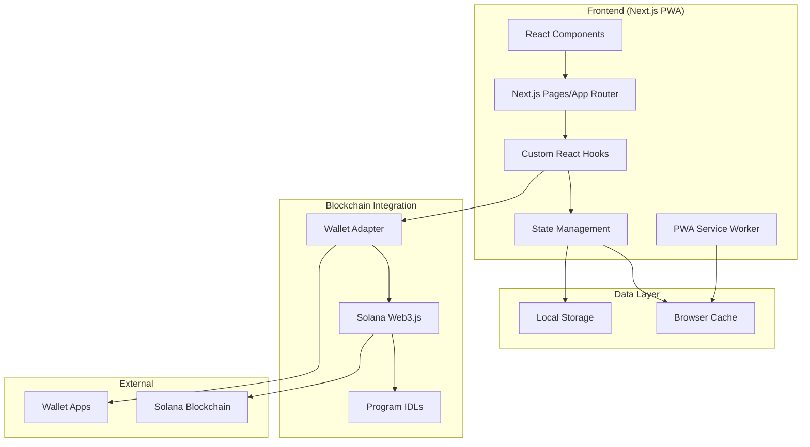
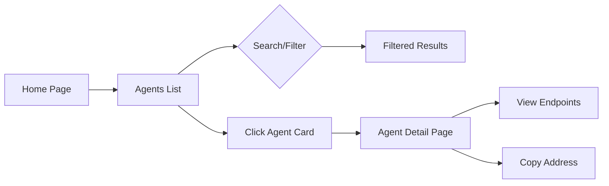
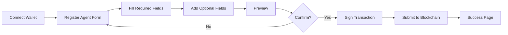

# 🎯 AEAMCP Frontend MVP - Architecture Plan

## Overview

A Progressive Web App (PWA) built with Next.js 14+ that provides a user-friendly interface for discovering and registering AI agents and MCP servers on the Solana blockchain. The MVP will focus on core functionality with a path for future enhancements.

## 🏗️ Technical Architecture



## 📋 Core Features

### 1. **Browse & Search**
- List all registered agents and MCP servers
- Search by name, description, tags
- Filter by status (Active, Inactive, etc.)
- Sort by registration date, name
- Pagination for large datasets

### 2. **Detailed Views**
- Agent detail page showing all metadata
- MCP server detail page with tools/resources
- Copy-able addresses and endpoints
- External links to documentation

### 3. **Registration Forms**
- Agent registration with all required fields
- MCP server registration form
- Form validation matching on-chain requirements
- Preview before submission

### 4. **Wallet Integration**
- Connect wallet (Phantom, Solflare, etc.)
- Display connected wallet address
- Sign transactions for registration
- Ownership verification for updates

### 5. **PWA Features**
- Installable as native app
- Responsive design for all devices
- Fast loading with Next.js optimizations
- Basic offline support (cached listings)

## 🎨 Design System

### Visual Design
- **Color Palette**: 
  - Primary: Solana gradient (#14F195 to #9945FF)
  - Background: Light gray (#F8F9FA) / Dark (#0A0B0D)
  - Text: High contrast for accessibility
  
- **Typography**:
  - Headers: Inter or similar modern sans-serif
  - Body: System fonts for performance
  
- **Components**:
  - Card-based layouts for entries
  - Clean forms with clear labels
  - Subtle animations and transitions
  - Toast notifications for feedback

### UI Components Structure
```
components/
├── common/
│   ├── Layout/
│   ├── Navigation/
│   ├── WalletButton/
│   └── LoadingStates/
├── agents/
│   ├── AgentCard/
│   ├── AgentList/
│   ├── AgentDetail/
│   └── AgentForm/
├── servers/
│   ├── ServerCard/
│   ├── ServerList/
│   ├── ServerDetail/
│   └── ServerForm/
└── shared/
    ├── SearchBar/
    ├── Filters/
    └── Pagination/
```

## 🔧 Technical Implementation

### Tech Stack
- **Framework**: Next.js 14+ (App Router)
- **UI Library**: React 18+
- **Styling**: Tailwind CSS + CSS Modules
- **State Management**: Zustand or Context API
- **Blockchain**: @solana/web3.js, @solana/wallet-adapter
- **Forms**: React Hook Form + Zod validation
- **PWA**: next-pwa
- **Icons**: Lucide React
- **Notifications**: React Hot Toast

### Project Structure
```
frontend/
├── app/
│   ├── layout.tsx
│   ├── page.tsx
│   ├── agents/
│   │   ├── page.tsx
│   │   ├── [id]/page.tsx
│   │   └── register/page.tsx
│   ├── servers/
│   │   ├── page.tsx
│   │   ├── [id]/page.tsx
│   │   └── register/page.tsx
│   └── api/
├── components/
├── hooks/
│   ├── useAgentRegistry.ts
│   ├── useMcpRegistry.ts
│   └── useWallet.ts
├── lib/
│   ├── solana/
│   │   ├── connection.ts
│   │   ├── programs.ts
│   │   └── utils.ts
│   └── constants.ts
├── styles/
├── public/
│   ├── manifest.json
│   └── icons/
└── types/
```

### Key Implementation Details

1. **Blockchain Connection**
```typescript
// lib/solana/connection.ts
export const connection = new Connection(
  process.env.NEXT_PUBLIC_RPC_URL || 'https://api.devnet.solana.com'
);

// Programs initialization with IDLs
export const agentProgram = new Program(
  agentRegistryIDL,
  AGENT_REGISTRY_PROGRAM_ID,
  provider
);
```

2. **Data Fetching Strategy**
- Use React Query for caching and synchronization
- Fetch all accounts on initial load
- Real-time updates via WebSocket subscriptions
- Optimistic updates for better UX

3. **PWA Configuration**
```javascript
// next.config.js
const withPWA = require('next-pwa')({
  dest: 'public',
  register: true,
  skipWaiting: true,
  disable: process.env.NODE_ENV === 'development'
});
```

## 📱 User Flows

### Browse Agents Flow


### Register Agent Flow


## 🚀 Development Phases

### Phase 1: Foundation (Week 1)
- [ ] Next.js project setup with TypeScript
- [ ] PWA configuration
- [ ] Tailwind CSS setup
- [ ] Basic layout and navigation
- [ ] Wallet adapter integration

### Phase 2: Read Operations (Week 2)
- [ ] Fetch and display agents list
- [ ] Fetch and display MCP servers list
- [ ] Implement search functionality
- [ ] Add filtering and sorting
- [ ] Create detail pages

### Phase 3: Write Operations (Week 3)
- [ ] Agent registration form
- [ ] MCP server registration form
- [ ] Form validation
- [ ] Transaction handling
- [ ] Success/error states

### Phase 4: Polish & Deploy (Week 4)
- [ ] Loading states and skeletons
- [ ] Error boundaries
- [ ] SEO optimization
- [ ] Performance optimization
- [ ] Deployment to Vercel/Netlify

## 🔮 Future Enhancements

1. **Indexer Integration**
   - Add GraphQL API for complex queries
   - Implement full-text search
   - Historical data and analytics

2. **Advanced Features**
   - Update/deregister owned entries
   - Bulk operations
   - Export functionality
   - Favorites/watchlist

3. **Enhanced PWA**
   - Full offline mode with sync
   - Push notifications for updates
   - Background sync

4. **Social Features**
   - User profiles
   - Reviews and ratings
   - Comments and discussions

## 📊 Performance Targets

- **Lighthouse Score**: 90+ across all metrics
- **First Contentful Paint**: < 1.5s
- **Time to Interactive**: < 3s
- **Bundle Size**: < 200KB (initial)

## 🔒 Security Considerations

1. **Input Validation**: Client and server-side validation
2. **XSS Prevention**: Sanitize all user inputs
3. **CSP Headers**: Strict content security policy
4. **Wallet Security**: Never store private keys
5. **RPC Rate Limiting**: Implement request throttling

## 📝 Testing Strategy

- **Unit Tests**: Jest + React Testing Library
- **Integration Tests**: Cypress for E2E flows
- **Visual Regression**: Chromatic or Percy
- **Performance**: Web Vitals monitoring

## 🛠️ Development Environment Setup

### Prerequisites
- Node.js 18+ and npm/yarn/pnpm
- Git
- VS Code with recommended extensions
- Phantom or Solflare wallet for testing

### Initial Setup Commands
```bash
# Create Next.js app
npx create-next-app@latest frontend --typescript --tailwind --app

# Install dependencies
cd frontend
npm install @solana/web3.js @solana/wallet-adapter-react @solana/wallet-adapter-react-ui @solana/wallet-adapter-wallets
npm install next-pwa react-hook-form zod @hookform/resolvers
npm install @tanstack/react-query lucide-react react-hot-toast
npm install -D @types/node

# Copy IDL files
cp ../idl/*.json ./src/lib/idl/
```

## 📚 Resources

- [Next.js Documentation](https://nextjs.org/docs)
- [Solana Web3.js Guide](https://docs.solana.com/developing/clients/javascript-api)
- [Wallet Adapter Docs](https://github.com/solana-labs/wallet-adapter)
- [PWA Best Practices](https://web.dev/progressive-web-apps/)