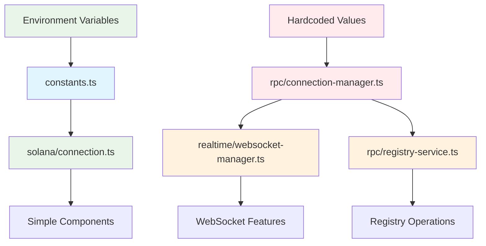
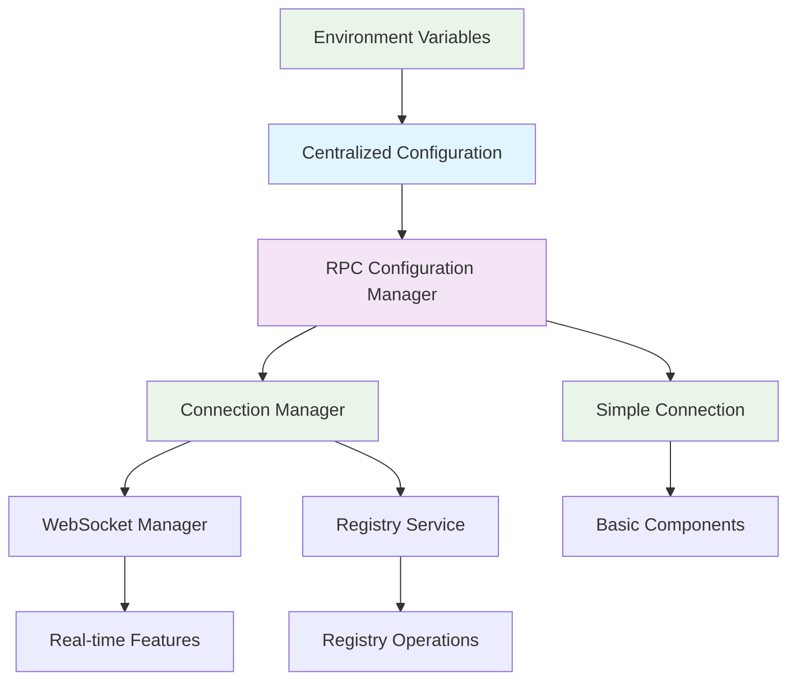

# RPC Configuration Audit Report

## Executive Summary

The frontend codebase currently has **multiple sources of truth** for Solana RPC URL configurations, creating maintenance challenges and potential deployment issues. This audit identifies all RPC configurations and provides a roadmap for consolidation.

## Current State Analysis

### ✅ Proper Configuration (Single Source of Truth)

#### 1. `frontend/lib/constants.ts`
```typescript
export const RPC_ENDPOINT = process.env.NEXT_PUBLIC_RPC_ENDPOINT || 'https://api.devnet.solana.com';
```
- **Status**: ✅ Correct - Uses environment variables with fallback
- **Used by**: `frontend/lib/solana/connection.ts`
- **Environment Support**: Yes

#### 2. `frontend/lib/solana/connection.ts`
```typescript
import { RPC_ENDPOINT } from '@/lib/constants';
const connection = new Connection(RPC_ENDPOINT, config);
```
- **Status**: ✅ Correct - Imports from constants
- **Usage**: Basic connection creation
- **Environment Support**: Inherited from constants

### ❌ Problematic Configuration (Multiple Sources of Truth)

#### 3. `frontend/lib/rpc/connection-manager.ts`
```typescript
rpcConnectionManager.addEndpoint({
  url: 'solana-devnet.drpc.org',  // ❌ HARDCODED!
  priority: 1,
  maxConnections: 5,
  // ...
});
```
- **Status**: ❌ Problem - Hardcoded endpoint
- **Issue**: Ignores environment variables
- **Impact**: Advanced connection features use different endpoint than basic connections

#### 4. `frontend/lib/realtime/websocket-manager.ts`
```typescript
// Uses rpcConnectionManager.getConnection() which relies on hardcoded endpoints
this.connection = await rpcConnectionManager.getConnection({
  commitment: 'confirmed',
  useCache: false
});
```
- **Status**: ⚠️ Indirect Problem - Depends on connection-manager's hardcoded endpoints
- **Issue**: WebSocket connections use different RPC than HTTP connections

## Architecture Flow Analysis



## Files Affected

### Direct RPC Configuration Files
- `frontend/lib/constants.ts` - ✅ Centralized config
- `frontend/lib/rpc/connection-manager.ts` - ❌ Hardcoded endpoints
- `frontend/lib/solana/connection.ts` - ✅ Uses constants

### Files Using RPC Connections
- `frontend/lib/realtime/websocket-manager.ts` - Uses connection-manager
- `frontend/lib/rpc/registry-service.ts` - Uses connection-manager
- `frontend/lib/hooks/useRegistry.ts` - Uses registry-service
- `frontend/lib/transactions/transaction-manager.ts` - Likely uses connections
- `frontend/lib/transactions/transaction-hooks.ts` - Likely uses connections

### Component Files (Indirect Usage)
- `frontend/app/agents/page.tsx` - Uses registry hooks
- `frontend/app/servers/page.tsx` - Uses registry hooks
- Various other components using registry data

## Environment Variable Dependencies

### Current Environment Variables
```bash
# Primary RPC endpoint override
NEXT_PUBLIC_RPC_ENDPOINT=https://api.devnet.solana.com

# Network selection
NEXT_PUBLIC_SOLANA_NETWORK=devnet

# Program IDs
NEXT_PUBLIC_AGENT_PROGRAM_ID=BruRLHGfNaf6C5HKUqFu6md5ePJNELafm1vZdhctPkpr
NEXT_PUBLIC_MCP_PROGRAM_ID=BCBVehUHR3yhbDbvhV3QHS3s27k3LTbpX5CrXQ2sR2SR
```

### Missing Environment Variables (Should be added)
```bash
# RPC timeout configuration
NEXT_PUBLIC_RPC_TIMEOUT=30000

# Maximum retry attempts
NEXT_PUBLIC_RPC_MAX_RETRIES=3

# Connection pool size
NEXT_PUBLIC_RPC_MAX_CONNECTIONS=5

# Health check interval
NEXT_PUBLIC_RPC_HEALTH_CHECK_INTERVAL=30000
```

## Impact Analysis

### Issues Caused by Multiple Sources of Truth

1. **Development Environment Issues**
   - Different parts of app connect to different networks
   - Environment variable changes don't affect all components
   - Inconsistent behavior between features

2. **Production Deployment Risks**
   - Hardcoded devnet endpoints in production
   - Cannot easily switch networks without code changes
   - Configuration drift between environments

3. **Maintenance Overhead**
   - Multiple places to update RPC endpoints
   - Risk of missing updates during network changes
   - Difficult to debug connection issues

4. **Feature Inconsistencies**
   - Basic connections use environment-configured endpoints
   - Advanced features (connection pooling, failover) use hardcoded endpoints
   - WebSocket and HTTP connections may use different endpoints

## Recommended Solution Architecture



## Implementation Priority

### Phase 1: Foundation (Critical)
1. Expand centralized configuration in `constants.ts`
2. Create `RPCConfigurationManager` class
3. Document current architecture

### Phase 2: Core Implementation (Essential)
4. Update `connection-manager.ts` to use centralized config
5. Add comprehensive endpoint lists for all networks
6. Remove all hardcoded endpoints

### Phase 3: Quality Assurance (Important)
7. Add comprehensive tests
8. Update documentation
9. Validate configuration integrity

### Phase 4: Enhancement (Nice-to-have)
10. Add RPC health monitoring dashboard
11. Performance optimization
12. Advanced configuration features

## Success Criteria

- [ ] Single source of truth for all RPC configurations
- [ ] Zero hardcoded RPC URLs in codebase
- [ ] Environment-based configuration working across all features
- [ ] Consistent endpoint usage between all components
- [ ] Comprehensive test coverage
- [ ] Complete documentation

## Risk Assessment

### High Risk
- Breaking changes to existing connection management
- Potential service disruption during migration
- Configuration validation failures

### Medium Risk
- Performance impact during transition
- Compatibility issues with existing code
- Environment variable management complexity

### Low Risk
- Documentation updates
- Test implementation
- Monitoring dashboard implementation

## Next Steps

1. **Immediate (This Sprint)**
   - Implement centralized configuration expansion
   - Create RPC Configuration Manager
   - Update connection-manager to use centralized config

2. **Short Term (Next Sprint)**
   - Add comprehensive testing
   - Update documentation
   - Validate all network configurations

3. **Long Term (Future Sprints)**
   - Add monitoring dashboard
   - Performance optimization
   - Advanced configuration features

---

*Generated on: 2025-05-27*
*Last Updated: 2025-05-27*
