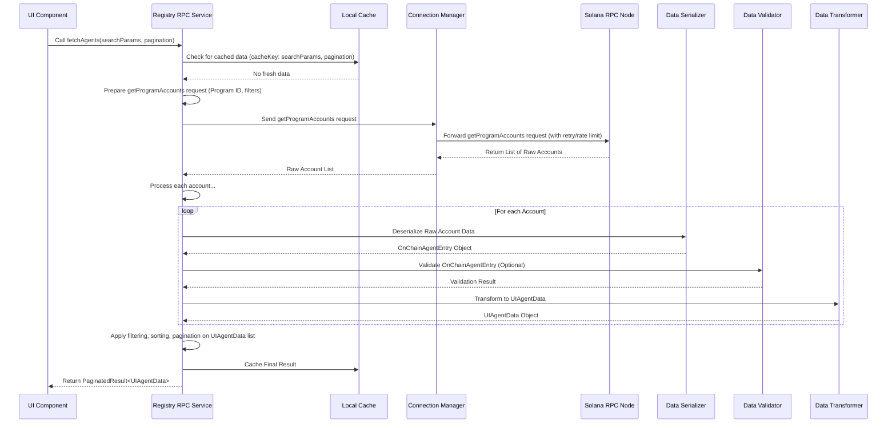

# Chapter 5: Registry RPC Service (Frontend)

Welcome back! In the previous chapters, we explored the core components on the Solana blockchain that make up the `aeamcp` registry: [Chapter 1: Registry Entry Accounts](01_registry_entry_accounts_.md) (where the data lives), [Chapter 2: Agent Registry Program](02_agent_registry_program_.md) and [Chapter 3: MCP Server Registry Program](03_mcp_server_registry_program_.md) (the smart contracts that manage the data), and [Chapter 4: Program Derived Addresses (PDAs)](04_program_derived_addresses__pdas__.md) (how the programs securely own the data accounts).

Now, let's shift our focus to how applications that *use* the registry – like a website or a mobile app (what we call the **frontend**) – interact with all this information on the blockchain.

## The Problem: Talking to the Blockchain

Imagine you're building a website to display the list of registered AI agents. You know the data is stored in `AgentRegistryEntryV1` accounts owned by the Agent Registry Program on Solana. How do you get that data from the blockchain and show it to a user?

Directly communicating with the Solana blockchain from a frontend application involves several technical steps:

1.  **Connecting to an RPC Node:** You need to find and connect to a Solana RPC (Remote Procedure Call) endpoint. These are servers that listen for requests to read data or send transactions to the blockchain.
2.  **Making RPC Calls:** You need to format specific requests, like `getProgramAccounts` to fetch a list of accounts owned by a program, or `getAccountInfo` to fetch details for a single account (like a PDA).
3.  **Handling Raw Data:** The response from the RPC node is often raw bytes. You need to understand how to deserialize this data according to the program's account structure (`AgentRegistryEntryV1`, `McpServerRegistryEntryV1`).
4.  **Dealing with Errors:** RPC nodes can be slow, overloaded, or fail. Your application needs robust error handling, retry logic, and possibly fallbacks.
5.  **Processing and Formatting:** The raw on-chain data might not be in the perfect format for displaying in a user interface. You need to transform it (e.g., convert timestamps, format public keys, interpret status codes).
6.  **Filtering and Sorting:** While RPC calls offer some basic filtering (`memcmp`, `dataSize`), complex filtering (e.g., by multiple tags, specific skills) and sorting usually need to be done *after* fetching the data.
7.  **Validation:** For critical applications, you might need to validate the integrity and security of the data received from the blockchain.

Doing all of this for every piece of data you need to fetch can make your frontend code complicated and repetitive.

## The Solution: The Registry RPC Service

This is where the **Registry RPC Service** comes in. It's a layer of code within the frontend application designed specifically to handle the complexities of interacting with the `aeamcp` registry programs on Solana.

Think of it as a dedicated assistant for your frontend, specializing in blockchain communication related to agents and servers. It provides a clean, easy-to-use interface so your UI components don't have to worry about the low-level details.

Its main goals are to:

1.  **Abstract RPC Calls:** Hide the technical details of connecting to RPC nodes and formatting requests.
2.  **Handle Data Processing:** Automatically deserialize, validate, and transform raw on-chain data into friendly formats for the UI.
3.  **Implement Robustness:** Manage network issues, retries, and potentially use caching or fallbacks to ensure a smoother user experience.
4.  **Provide Convenience:** Offer simple functions like `fetchAgents`, `fetchMcpServer`, etc., that return ready-to-use data.

Let's look at our central use case: **Fetching a list of registered AI agents to display on a website.**

## Using the Registry RPC Service (Frontend Perspective)

Instead of directly calling Solana RPC methods, your UI component will call a function provided by the `registryRPCService`.

For example, if you're using a framework like React with hooks (like `@tanstack/react-query` which is used in this project), you might use a custom hook like `useAgents` (found in `frontend/lib/hooks/useRegistry.ts`).

Here's a simplified idea of how a React component might use this hook:

```typescript
// Inside a React component (simplified)
import { useAgents } from '@/lib/hooks/useRegistry';

function AgentListPage() {
  // Call the hook provided by the service wrapper
  const { data, loading, error, refetch } = useAgents(
    // Optional: Pass search/filter parameters
    { status: ['Active'], sortBy: 'name' },
    // Optional: Pass pagination options
    { limit: 10, offset: 0 }
  );

  if (loading.isLoading) {
    return <div>{loading.message || 'Loading agents...'}</div>;
  }

  if (error.hasError) {
    return <div>Error fetching agents: {error.message}</div>;
  }

  // 'data' is now a PaginatedResult containing UIAgentData objects
  const agents = data?.data || [];
  const totalAgents = data?.total || 0;

  return (
    <div>
      <h1>Registered Agents ({totalAgents})</h1>
      <ul>
        {agents.map(agent => (
          // 'agent' is a ready-to-use UIAgentData object
          <li key={agent.id}>
            {agent.name} (Status: {agent.status}, Version: {agent.version})
            {/* Display other agent. fields like description, endpoint, skills, etc. */}
          </li>
        ))}
      </ul>
      {/* Add pagination controls using data?.hasMore, data?.nextOffset etc. */}
    </div>
  );
}
```
*This code shows how a UI component uses a hook (`useAgents`) which internally calls the Registry RPC Service. The component receives data (`data`), loading status (`loading`), and error information (`error`) in an easy-to-use format.*

Notice that the component doesn't need to know about RPC nodes, `getProgramAccounts`, deserialization, or the raw `OnChainAgentEntry` structure. It just calls `useAgents` with some desired parameters and gets back `UIAgentData` objects, which are designed for display.

Similarly, there are hooks and service methods for fetching single agents (`useAgent`, `fetchAgent`), lists of MCP servers (`useMcpServers`, `fetchMcpServers`), and single MCP servers (`useMcpServer`, `fetchMcpServer`).

## Inside the Registry RPC Service: How it Works

Let's peel back the curtain and see what happens inside the `RegistryRPCService` when `fetchAgents` is called.

Here's a simplified walkthrough of the key steps:

1.  **Receive Request:** The `fetchAgents` function receives the search, pagination, and options from the caller.
2.  **Cache Check:** It first checks if the requested data (based on search/pagination parameters) is already in its local cache and is still considered "fresh" (not too old). If yes, it returns the cached data immediately.
3.  **Prepare RPC Call:** If the data isn't in the cache or is stale, the service prepares an RPC call. For fetching a list of agents, this means preparing a request to the Solana RPC node using the `getProgramAccounts` method, specifying the **Agent Registry Program ID** and adding basic filters (like the account discriminator to ensure it only gets `AgentRegistryEntryV1` accounts).
4.  **Send via Connection Manager:** The prepared request is sent via an internal `rpcConnectionManager`. This manager handles selecting the best RPC endpoint, adding rate limiting, retrying failed requests, and potentially deduplicating identical requests made simultaneously.
5.  **Receive Raw Accounts:** The RPC node responds with a list of raw account data entries (public key and raw data buffer) owned by the program that match the filters.
6.  **Process Each Account:** The service then loops through each received account:
    *   **Deserialize:** It uses a `registrySerializer` (from `frontend/lib/solana/serialization.ts`) to convert the raw byte buffer into the structured `OnChainAgentEntry` TypeScript object. This process requires knowing the layout of the account data defined in the program's IDL.
    *   **Validate (Optional):** If requested (via options.validateData), it passes the deserialized `OnChainAgentEntry` object through various validators (`schemaValidator`, `contentSecurityValidator`, `cryptographicValidator` from `frontend/lib/security/`). These check if the data conforms to expected structure, contains safe content, and potentially has cryptographic proofs of integrity. If validation fails, the account might be skipped or marked as invalid.
    *   **Transform:** If the data is successfully deserialized and validated, it uses a `DataTransformer` (from `frontend/lib/transformers.ts`) to convert the `OnChainAgentEntry` (raw on-chain types, e.g., timestamps as `bigint`, status as `number`) into a `UIAgentData` object (UI-friendly types, e.g., timestamps as `string`, status as human-readable `string`, parsed capabilities).
7.  **Filter and Sort:** After processing all received accounts into `UIAgentData` objects, the service applies any additional filtering and sorting logic based on the original search parameters that couldn't be handled by the RPC filters alone.
8.  **Paginate:** The filtered and sorted list is then paginated according to the pagination options (`limit`, `offset`) to return only the requested slice of data, along with total counts and pagination metadata (`hasMore`, `nextOffset`).
9.  **Cache Result:** The final paginated result is stored in the service's local cache for a short period.
10. **Return Data:** The processed, filtered, sorted, and paginated data is returned to the caller (e.g., the `useAgents` hook).

If any critical error occurs during steps 3-8 (e.g., RPC timeout, deserialization error on a majority of accounts), the service might attempt to return stale data from the cache as a fallback before finally returning a default empty result and an error.

Here is a simplified sequence diagram illustrating the `fetchAgents` process:


*This diagram shows the flow of fetching agent data. The UI component asks the service, which handles talking to the blockchain (via the Connection Manager and RPC Node), processing the raw data, and optionally using a local cache.*

For fetching a single agent (`fetchAgent`), the process is similar but uses `getAccountInfo` instead of `getProgramAccounts` and first calculates the specific PDA for the agent using the agent ID and program ID (referencing [Chapter 4: Program Derived Addresses (PDAs)](04_program_derived_addresses__pdas__.md)).

## Code Snippets Explained

Let's look at small parts of the actual code files mentioned.

First, the call from the hook in `frontend/lib/hooks/useRegistry.ts`:

```typescript
// from frontend/lib/hooks/useRegistry.ts
// ... inside useAgents hook ...
const queryResult = useQuery({
  queryKey: cacheKey, // Unique key for caching based on inputs
  queryFn: async (): Promise<PaginatedResult<UIAgentData>> => {
    // THIS is the call to our service!
    const result = await registryRPCService.fetchAgents(
      searchParams, // Pass search/filter parameters
      pagination,   // Pass pagination parameters
      { validateData: opts.validateData } // Pass options like validation
    );
    
    // The result includes the data and metadata about the fetch source/confidence
    setFreshness({ /* ... set freshness based on result.source ... */ });
    
    return result.data; // Return just the data part to React Query
  },
  // ... React Query config (staleTime, gcTime, etc.) ...
});
// ... rest of the hook ...
```
*This snippet from the `useAgents` hook shows how it simply calls the `fetchAgents` method on the `registryRPCService` instance, passing parameters and receiving the processed data.*

Next, a simplified look inside `registryRPCService.fetchAgents` in `frontend/lib/rpc/registry-service.ts`:

```typescript
// from frontend/lib/rpc/registry-service.ts
// ... inside RegistryRPCService class ...
async fetchAgents(
  searchParams = {},
  pagination = {},
  options = {}
) {
  // ... Operation config setup (cache key, default data, etc.) ...

  // Use the executeWithFallback helper that handles cache and errors
  return this.executeWithFallback(operation, async () => {
    // --- THIS IS THE CORE LOGIC FOR FETCHING FROM BLOCKCHAIN ---

    // 1. Fetch raw accounts from the blockchain via Connection Manager
    const accounts = await this.fetchProgramAccounts(
      AGENT_REGISTRY_PROGRAM_ID, // Specify the program ID
      this.buildAgentFilters(searchParams), // Build basic RPC filters
      options // Pass options
    );

    const validAgents = [];
    // 2. Loop through each raw account received
    for (const account of accounts) {
      // 3. Process the account (deserialize, validate, transform)
      const result = await this.processAgentAccount(account, options);
      if (result.success && result.data) {
        validAgents.push(result.data); // Collect successfully processed UI data
      } else if (result.error) {
         // Handle or log errors for specific accounts
         console.error("Failed to process agent account:", result.error.message);
      }
    }

    // 4. Apply additional filtering, sorting, and pagination
    const filteredAgents = this.filterAndSortAgents(validAgents, searchParams);
    const paginatedResult = this.paginateResults(filteredAgents, pagination);

    // Return the result with source/confidence info
    return {
      data: paginatedResult,
      source: 'blockchain',
      confidence: 100 // Simplified confidence
    };
  });
}

// --- Helper method to process a single account ---
private async processAgentAccount(
  account, // { pubkey, account: AccountInfo<Buffer> }
  options
) {
   // 1. Deserialize data using the serializer
   const deserializationResult = registrySerializer.safeDeserializeAgent(account.account.data);
   if (!deserializationResult.success) { /* ... handle deserialization error ... */ }
   const onChainData = deserializationResult.data;

   // 2. Validate data if options.validateData is true
   if (options.validateData) {
     const validation = await this.validateAgentData(onChainData);
     if (!validation.valid) { /* ... handle validation error ... */ }
   }

   // 3. Transform on-chain data to UI data
   const uiData = DataTransformer.transformAgentEntry(onChainData);

   return { success: true, data: uiData, source: 'blockchain' }; // Indicate success
}
// ... other methods like fetchAccountInfo, buildAgentFilters, etc. ...
```
*This simplified code from the `RegistryRPCService` shows the core logic: fetching raw accounts, looping through them to deserialize, validate (if enabled), and transform into the UI format, and finally applying in-memory filtering/sorting/pagination.*

And here's a snippet showing `fetchAccountInfo` using PDA calculation:

```typescript
// from frontend/lib/rpc/registry-service.ts
// ... inside RegistryRPCService class ...
private async fetchAccountInfo(
  pubkey: PublicKey, // The public key of the account to fetch (often a PDA)
  options
): Promise<AccountInfo<Buffer> | null> {
  const rpcOptions = { ...options, priority: RequestPriority.HIGH };

  // Use the Connection Manager's executeWithRetry for robustness
  return rpcConnectionManager.executeWithRetry(
    async (connection: Connection) => {
      // THIS is the actual RPC call
      return connection.getAccountInfo(pubkey, {
        commitment: options.commitment || 'confirmed'
      });
    },
    rpcOptions
  );
}

// ... inside fetchAgent function ...
async fetchAgent(agentId, options = {}) {
    // ... setup operation ...
    return this.executeWithFallback(operation, async () => {
        // Calculate the PDA for the specific agent (referencing Chapter 4!)
        const [agentPDA] = PublicKey.findProgramAddressSync(
          [Buffer.from('agent'), Buffer.from(agentId)], // Seeds: "agent" prefix, agentId bytes
          AGENT_REGISTRY_PROGRAM_ID // The program ID
        );

        // Fetch the single account using the calculated PDA
        const accountInfo = await this.fetchAccountInfo(agentPDA, options);
        if (!accountInfo) {
            return { data: null, source: 'blockchain', confidence: 100 }; // Account not found
        }

        // Process the single account (deserialize, validate, transform)
        const result = await this.processAgentAccount({
          pubkey: agentPDA,
          account: accountInfo
        }, options);

        if (result.success && result.data) {
          return { data: result.data, source: 'blockchain', confidence: 100 };
        } else {
          // Throw error if processing failed for the single account
          throw new Error(result.error?.message || 'Failed to process agent account');
        }
    });
}
// ...
```
*This snippet shows how `fetchAccountInfo` uses the `rpcConnectionManager` for the basic `getAccountInfo` RPC call, and how `fetchAgent` first calculates the correct PDA for the agent before calling `fetchAccountInfo`.*

These snippets show how the `RegistryRPCService` wraps the fundamental Solana interactions (`getProgramAccounts`, `getAccountInfo`) provided by the `rpcConnectionManager` and orchestrates the entire data retrieval and processing pipeline (deserialization, validation, transformation, filtering, sorting, pagination, caching, fallbacks).

## Key Components within the Service

The `RegistryRPCService` relies on several other internal helper components:

*   **`rpcConnectionManager` (`frontend/lib/rpc/connection-manager.ts`):** Manages the actual connection(s) to Solana RPC endpoints. It handles selecting endpoints, implementing retry logic for transient network errors, and potentially managing request rate limits to avoid being blocked by the RPC provider.
*   **`registrySerializer` (`frontend/lib/solana/serialization.ts`):** Contains the logic to convert raw byte data from blockchain accounts into structured JavaScript/TypeScript objects (`OnChainAgentEntry`, `OnChainMcpServerEntry`) based on the program's IDL definitions, and vice-versa (though serialization for sending transactions is handled elsewhere). It includes safety checks for deserialization.
*   **`DataTransformer` (`frontend/lib/transformers.ts`):** Responsible for mapping the raw on-chain data structures (`OnChain...Entry`) into the UI-friendly data structures (`UI...Data`). This includes formatting, calculating derived values (like `trustScore`), and restructuring data for easier display.
*   **Validators (`frontend/lib/security/*.ts`):** A suite of components (`schemaValidator`, `contentSecurityValidator`, `cryptographicValidator`) that perform checks on the fetched data to ensure it is well-formed, safe to display (e.g., no malicious scripts in text fields), and potentially cryptographically verifiable.
*   **Internal Cache:** A simple in-memory cache (`Map` in `registry-service.ts`) that stores recent query results for a short time. This helps the application feel faster by serving immediate responses for frequently accessed data, reducing the load on RPC nodes.
*   **Fallback Logic (`executeWithFallback`):** A pattern implemented within the service to handle errors gracefully. It first attempts the primary operation (fetching from the blockchain). If that fails after retries (handled by `rpcConnectionManager`), it tries secondary options like returning potentially stale data from the cache, and finally falls back to returning a default empty result, always accompanied by error information.

## Comparison: Raw RPC vs. Registry RPC Service

| Feature           | Raw RPC Interaction (without Service)             | Registry RPC Service                     |
| :---------------- | :------------------------------------------------ | :--------------------------------------- |
| **Complexity**    | High: Requires direct RPC calls, error handling, deserialization, etc. | Low: Provides simple function calls (`fetchAgents`) |
| **Data Format**   | Raw bytes, requires manual deserialization        | UI-friendly objects (`UIAgentData`), pre-transformed |
| **Error Handling**| Must be implemented manually for each call        | Built-in retries, fallbacks, structured error objects |
| **Performance**   | Direct calls, no caching by default             | Uses caching, manages multiple RPC endpoints |
| **Data Validation**| Must be implemented manually                    | Optional, built-in validation checks (schema, content, crypto) |
| **Filtering/Sorting**| Limited RPC filters, manual post-processing required | Handles post-processing for complex criteria |
| **Transaction Prep**| Manual instruction building (covered in later chapters) | Can provide helper functions for TX prep |

The Registry RPC Service effectively moves the complex, repetitive blockchain interaction logic out of the UI components and into a dedicated layer, making the frontend application cleaner, more reliable, and easier to develop.

## Conclusion

The Registry RPC Service is a vital abstraction layer in the `aeamcp` frontend. It acts as a sophisticated intermediary, simplifying the process of fetching data from the on-chain agent and MCP server registries. By handling RPC communication details, data deserialization, validation, transformation, caching, and error handling, it provides the rest of the frontend application with a clean, reliable, and user-friendly way to access and display the decentralized registry information.

Now that we understand how the frontend can read data from the blockchain using this service, the next step is to understand how it can *send* data – specifically, how a user can register a new agent or server, which requires signing transactions with their wallet. In the next chapter, we'll explore **Solana Wallet Integration**.

[Solana Wallet Integration](06_solana_wallet_integration_.md)

---
