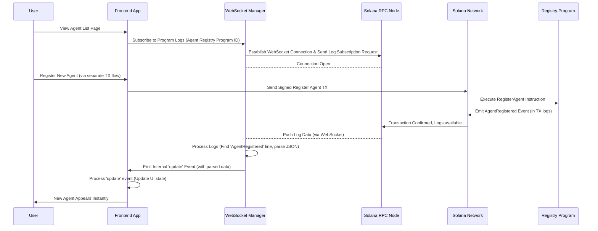

# Chapter 8: Program Events

Welcome back to the `aeamcp` tutorial! We've covered a lot of ground: [Chapter 1: Registry Entry Accounts](01_registry_entry_accounts_.md) (the data), [Chapter 2: Agent Registry Program](02_agent_registry_program_.md) and [Chapter 3: MCP Server Registry Program](03_mcp_server_registry_program_.md) (the smart contracts that manage the data using [Chapter 4: Program Derived Addresses (PDAs)](04_program_derived_addresses__pdas__.md)), how our frontend application [Chapter 5: Registry RPC Service (Frontend)](05_registry_rpc_service__frontend_.md) reads this data, and how [Chapter 6: Solana Wallet Integration](06_solana_wallet_integration_.md) allows users to sign transactions to write data (like registering an agent, which may involve paying a fee with the [Chapter 7: A2AMPL (SVMAI) Token](07_a2ampl__svmai__token_.md)).

Now, imagine you're browsing the `aeamcp` website, looking at the list of registered agents. A new agent gets registered by someone else. How does your browser know about this new agent instantly without you having to refresh the page?

## The Problem: Constantly Checking for Updates

One way your application *could* try to stay updated is by constantly asking the Solana network, "Are there any new agents yet? Are there any changes to this server's status?" This is called **polling**.

Polling works, but it's inefficient:

*   It creates a lot of unnecessary traffic on the network and the RPC nodes.
*   Your application spends most of its time asking "Is it ready?" rather than doing something useful.
*   There's always a delay between when the change happens on-chain and when your application's next poll discovers it. You don't get *instant* updates.

Think of it like trying to find out if you got a text message by constantly unlocking your phone and checking the messaging app every few seconds, versus just waiting for the notification sound.

## The Solution: Program Events

Solana programs, like our Agent Registry and MCP Server Registry programs, have a built-in mechanism to broadcast that something significant has happened during a transaction's execution. These broadcasts are called **Program Events**.

When a transaction is processed by the Solana network and includes an instruction that executes a program, the program can choose to **emit** events. These events are not stored in separate accounts; instead, they are recorded directly within the **transaction logs** associated with that transaction.

Think of program events like this:

*   **Program:** The broadcaster (like a radio station).
*   **Events:** Specific messages the program sends out (e.g., "New Agent Registered!", "Server Status Changed!").
*   **Transaction Logs:** The recording studio where all the messages (events, program outputs, etc.) from that specific transaction are saved.
*   **Listeners:** Off-chain services, indexers, and frontend applications that can "tune in" to the transaction logs broadcast to receive these specific messages in real-time.

This allows applications to get instant notifications ("Hey, a new agent was just registered!") without having to constantly re-read accounts on the blockchain. They just need to listen for the specific events they care about.

## What Events Do the AEAMCP Programs Emit?

The `aeamcp` registry programs emit events for key actions:

*   **Agent Registry Program:**
    *   `AgentRegistered`: Emitted when a new agent entry is successfully created ([Chapter 2](02_agent_registry_program_.md)). This event contains the full data of the newly registered agent.
    *   `AgentUpdated`: Emitted when an existing agent entry's details are modified. This event includes the agent's ID and lists the specific fields that were changed.
    *   `AgentStatusChanged`: Emitted when an agent's status is changed (e.g., Active, Inactive, Deregistered). Includes the agent ID and the new status.
    *   `AgentDeregistered`: Emitted when an agent entry is marked as deregistered. Includes the agent ID and timestamp.
    *   (There are also events for token-related actions like `TokensStaked`, `ServiceCompleted`, etc., as seen in `programs/agent-registry/src/events.rs`, but the registration/update/status events are the core ones for the registry state changes).
*   **MCP Server Registry Program:**
    *   `McpServerRegistered`: Emitted when a new MCP server entry is successfully created ([Chapter 3](03_mcp_server_registry_program_.md)). Contains the full data of the new server.
    *   `McpServerUpdated`: Emitted when an existing server entry's details are modified. Includes the server ID and lists changed fields.
    *   `McpServerStatusChanged`: Emitted when a server's status changes. Includes the server ID and new status.
    *   `McpServerDeregistered`: Emitted when a server entry is marked as deregistered. Includes the server ID and timestamp.

You can find the definitions of these events in the program's Rust code (e.g., `programs/agent-registry/src/lib.rs` and `programs/mcp-server-registry/src/lib.rs` where `#[event]` is used, or `programs/*/src/events.rs` which might contain older definitions or helper functions).

Let's look at how these events are defined and emitted in the core `solana-ai-registries` program (`programs/solana-ai-registries/src/lib.rs`), which houses both registries:

```rust
// from programs/solana-ai-registries/src/lib.rs

// --- Events --- // <--- This marks the section for event definitions

/// Event emitted when an agent is registered
#[event] // This attribute tells Anchor to treat this struct as an event
pub struct AgentRegistered {
    // Fields included in the event data
    pub registry_version: u8,
    pub owner_authority: Pubkey,
    pub agent_id: String,
    // ... many other fields duplicating the AgentRegistryEntryV1 struct ...
    pub tags: Vec<String>,
}

/// Event emitted when agent details are updated
#[event]
pub struct AgentUpdated {
    pub agent_id: String,
    pub changed_fields: Vec<String>, // List of field names that changed
    pub last_update_timestamp: i64,
}

// ... Other Agent Events (AgentStatusChanged, AgentDeregistered) ...

/// Event emitted when an MCP server is registered
#[event] // This attribute tells Anchor to treat this struct as an event
pub struct McpServerRegistered {
    // Fields included in the event data
    pub registry_version: u8,
    pub owner_authority: Pubkey,
    pub server_id: String,
    // ... many other fields duplicating the McpServerRegistryEntryV1 struct ...
    pub tags: Vec<String>,
}

// ... Other MCP Server Events (McpServerUpdated, McpServerStatusChanged, McpServerDeregistered) ...

// --- Program Instructions --- // <--- This marks the section for instruction handlers

#[program]
pub mod solana_ai_registries {
    use super::*;

    pub fn register_agent(
        ctx: Context<RegisterAgent>,
        // ... instruction parameters ...
    ) -> Result<()> {
        // ... validation and account data writing logic ...

        // EMIT the event after successful registration
        emit!(AgentRegistered { // This macro emits the event defined above
            registry_version: agent_entry.registry_version,
            owner_authority: agent_entry.owner_authority,
            agent_id: agent_entry.agent_id.clone(),
            name: agent_entry.name.clone(),
            // ... pass data from the agent_entry account ...
            tags: agent_entry.tags.clone(),
        });
        Ok(())
    }

    pub fn update_agent_details(ctx: Context<UpdateAgent>, details: AgentUpdateDetailsInput) -> Result<()> {
        let agent_entry = &mut ctx.accounts.agent_entry;
        let mut changed_fields: Vec<String> = Vec::new();

        // ... logic to update fields based on `details` input ...
        // populate `changed_fields` list ...

        if changed_fields.is_empty() { return Ok(()); } // Don't emit if nothing changed

        agent_entry.last_update_timestamp = Clock::get()?.unix_timestamp;
        emit!(AgentUpdated { // Emit the update event
            agent_id: agent_entry.agent_id.clone(),
            changed_fields: changed_fields,
            last_update_timestamp: agent_entry.last_update_timestamp,
        });
        Ok(())
    }

    // ... Similar `emit!()` calls exist in other instruction handlers ...
    // (e.g., register_mcp_server, update_mcp_server_details, update_agent_status, etc.)
}
```
*This simplified code shows how events are defined using `#[event]` structs and how they are emitted within the instruction handler functions using the `emit!` macro. The data included in the event is specified when calling `emit!`.*

## How to Listen to Events (Frontend)

To receive these real-time broadcasts, off-chain applications and services need to connect to a Solana RPC node via a **WebSocket** connection. Unlike standard RPC calls (like `getAccountInfo` or `getProgramAccounts` used by the [Chapter 5: Registry RPC Service (Frontend)](05_registry_rpc_service__frontend_.md)), which use HTTP, WebSockets provide a persistent, two-way connection that allows the server (the RPC node) to push updates to the client (your application) as they happen.

The `@solana/web3.js` library, used by our frontend, supports WebSocket subscriptions. You can subscribe to various things, including `programAccountChange` (less efficient for many accounts) or, more commonly for events, `logs`.

The `aeamcp` frontend uses a dedicated component, the `WebSocketManager` (`frontend/lib/realtime/websocket-manager.ts`), to handle these WebSocket connections and subscriptions robustly (managing reconnections, etc.).

Let's revisit our use case: **A user is viewing a page listing registered agents and wants to see new registrations appear instantly.**

Here's how the frontend handles this using the `WebSocketManager`:

1.  **Subscribe to Logs:** When the agent list page loads, it tells the `WebSocketManager` to subscribe to transaction logs specifically mentioning the **Agent Registry Program ID**.
2.  **Receive Raw Logs:** When any transaction involving the Agent Registry Program is processed on Solana, the RPC node sends the transaction's logs over the WebSocket connection to the `WebSocketManager`. These logs contain various messages, including the `Program log: EventName { ... }` entries emitted by the program.
3.  **Process Logs:** The `WebSocketManager` receives these raw log strings. It needs to parse them to find the specific lines that represent emitted events (starting with `Program log:` followed by the event structure).
4.  **Emit Structured Updates:** For each recognized event log, the `WebSocketManager` extracts the event name and data. It then emits its *own* internal event (e.g., using `EventEmitter`) like `update:logs` or a more specific custom event. The data payload for this internal event includes the parsed event information.
5.  **Frontend Listens:** The agent list component (or a service it relies on) subscribes to the `WebSocketManager`'s internal event stream.
6.  **Handle Event Data:** When the agent list component receives an event like `AgentRegistered`, it extracts the detailed agent data contained within the event payload.
7.  **Update UI:** The component updates its internal state with the new agent data. Since the `AgentRegistered` event includes *all* the necessary details, the component might be able to add the new agent to the list directly using just the event data. For `AgentUpdated` events, it would identify the existing agent by ID and apply the changes based on the `changed_fields` list.
8.  **Maintain Connection:** The `WebSocketManager` handles keeping the connection alive and automatically attempting to reconnect if it drops, ensuring continuous real-time updates.

Here's a simplified look at how the `WebSocketManager` might subscribe to logs:

```typescript
// from frontend/lib/realtime/websocket-manager.ts (simplified)

import { webSocketManager } from './websocket-manager';
import { AGENT_REGISTRY_PROGRAM_ID } from '@/lib/constants';

// Example usage in a service or hook
export const subscribeToRegistryEvents = (callback: (event: any) => void) => {
  // Subscribe to logs mentioning the Agent Registry Program ID
  const agentRegSubscriptionId = webSocketManager.subscribeToLogs(
    { mentions: [AGENT_REGISTRY_PROGRAM_ID.toBase58()] },
    (logs, context) => {
      // This callback receives RAW log data whenever the program logs something
      console.log('Raw Program Logs:', logs);
      // ... Internal WebSocketManager logic to parse logs and find events ...
      // It then calls the event listeners...
    }
  );

  // Listen to the internal 'update' event emitted by WebSocketManager
  const updateListener = (update: RealtimeUpdateEvent) => {
    if (update.type === 'logs' && update.data?.logs?.logs) {
        // ... Logic here to parse update.data.logs.logs to find specific events like "Program log: AgentRegistered { ... }"
        // For Anchor events, the log line looks something like `Program log: AgentRegistered {"registry_version":1,"owner_authority":"...","agent_id":"...", ...}`
        // The manager would find this line, parse the JSON, and structure it.

        // Let's assume the WebSocketManager has already parsed the event
        // and the 'update' event data structure includes parsed event info
        if (update.data?.parsedEvent?.name === 'AgentRegistered') {
             console.log('Received AgentRegistered event:', update.data.parsedEvent.data);
             callback(update.data.parsedEvent.data); // Pass the structured event data to our listener
        }
        // ... handle other events like AgentUpdated, McpServerRegistered, etc. ...
    }
  };

  webSocketManager.on('update', updateListener);

  // Return a function to unsubscribe later
  return () => {
    webSocketManager.unsubscribe(agentRegSubscriptionId);
    webSocketManager.off('update', updateListener);
  };
};

// Example usage in a React component hook (conceptual)
import { useEffect, useState } from 'react';
import { subscribeToRegistryEvents } from '@/lib/realtime/websocket-listeners'; // Assume this is where the subscribe function lives
import { UIAgentData } from '@/lib/types/ui-types';
import { DataTransformer } from '@/lib/transformers'; // To transform event data if needed

function useNewAgentListener() {
    const [newAgent, setNewAgent] = useState<UIAgentData | null>(null);

    useEffect(() => {
        const unsubscribe = subscribeToRegistryEvents((eventData) => {
            // This callback receives the parsed AgentRegistered event data
            console.log("Hook received new agent event data:", eventData);
            // Transform the raw event data (which is like OnChainAgentEntry) to UI format
            const uiAgent = DataTransformer.transformAgentEntry(eventData);
            setNewAgent(uiAgent); // Update state to trigger UI re-render
        });

        return () => {
            unsubscribe(); // Clean up subscription when component unmounts
        };
    }, []); // Only subscribe/unsubscribe once

    return newAgent; // Return the latest new agent data
}

// ... In the Agent List Component ...
function AgentListPage() {
    const initialAgents = useAgents(...); // Fetch initial list using RPC Service
    const newAgent = useNewAgentListener(); // Listen for new agents via WebSocket

    // Logic to integrate newAgent into the displayed list...
    // Maybe add newAgent to the list if it's not null and not already there.
    // ... render initialAgents and potentially the newAgent ...
}
```
*This simplified code shows how a frontend component or service can use the `webSocketManager` to subscribe to logs related to the Agent Registry Program. It then listens for internal `update` events from the manager, parses them to identify specific program events like `AgentRegistered`, and uses the event data to update the UI. The `useEffect` hook ensures the subscription is managed correctly with the component lifecycle.*

Here's a simplified sequence diagram illustrating the event flow:


*This diagram shows how events flow from the program's execution on Solana, through the RPC node's WebSocket, the frontend's WebSocket Manager, and finally to the UI component, enabling real-time updates.*

## Why Use Events?

*   **Efficiency:** Clients (frontends, indexers) don't need to constantly poll. They only receive data when something changes.
*   **Real-time:** Updates are pushed instantly as transactions are confirmed.
*   **Targeted:** You can subscribe to events from specific programs or even events mentioning specific accounts (if the RPC node supports it).
*   **Audit Trail:** Event logs provide a clear history of significant actions taken by the program.
*   **Decoupling:** The program doesn't need to know *who* is listening; it just emits the event. Off-chain services can pick them up independently.

Events are particularly important for building robust off-chain infrastructure, such as:

*   **Indexers:** Services that scan all transactions on Solana, specifically looking for events from programs like the `aeamcp` registries. When they see an `AgentRegistered` event, they can pull the full data and store it in a searchable database, powering fast lookups for the frontend's Registry RPC Service ([Chapter 5](05_registry_rpc_service__frontend_.md)).
*   **Monitoring Tools:** Alerting systems that watch for specific events (e.g., an agent changing status to 'Inactive').
*   **Analytics Platforms:** Aggregating event data to understand usage patterns.

While the frontend uses events for real-time UI updates, the primary beneficiaries of a rich event system are often these backend indexing and monitoring services that provide scalable data access for the user-facing application.

## Comparison: Polling vs. Events

| Feature           | Polling (Registry RPC Service `fetch*`)       | Events (WebSocket Manager `subscribeToLogs`) |
| :---------------- | :-------------------------------------------- | :------------------------------------------- |
| **Update Mechanism**| Client repeatedly requests data (`getProgramAccounts`, `getAccountInfo`) | Server pushes data to client (WebSocket)   |
| **Freshness**     | Updates discovered on the next poll interval  | Near real-time as transaction confirms       |
| **Efficiency**    | Less efficient, constant requests             | More efficient, data only sent when changes occur |
| **Network Load**  | Higher, especially with frequent polling      | Lower for ongoing monitoring                 |
| **Implementation**| Simpler for one-off reads or infrequent updates | Requires WebSocket management, log parsing   |
| **Use Case**      | Initial data load, refreshing data on demand | Real-time UI updates, background indexing, monitoring |

It's important to note that these are complementary. The frontend uses the Registry RPC Service ([Chapter 5](05_registry_rpc_service__frontend_.md)) for the *initial load* and potentially refreshing the main list, but it uses the `WebSocketManager` and events for *real-time updates* on changes that happen *after* the initial load.

## Conclusion

Program Events are the Solana ecosystem's way of providing real-time notifications about significant state changes on the blockchain. By emitting events like `AgentRegistered` or `McpServerStatusChanged`, the `aeamcp` registry programs allow frontend applications and off-chain services to subscribe and react instantly, building a dynamic and efficient user experience without relying on constant polling. The `WebSocketManager` component in the frontend abstracts the complexity of managing WebSocket connections and processing raw transaction logs to deliver structured event data to the application.

This concludes our foundational journey through the `aeamcp` project's core concepts, from the on-chain data structures and programs to the frontend interactions enabling reading and writing data, and the event system providing real-time updates.

---
