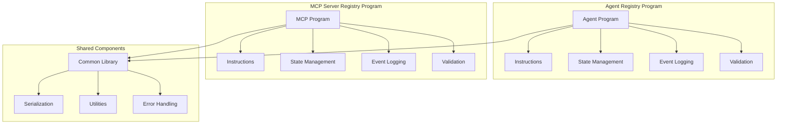

# Solana AI Registries Native Implementation Plan

## Executive Summary

This document outlines a comprehensive plan for implementing the Solana AI Registries protocol as native Solana programs (without Anchor framework) with 100% test coverage. The implementation will consist of two separate programs: Agent Registry and MCP Server Registry, developed in parallel with shared components.

## 🏗️ Architecture Overview

### Program Structure


### Key Design Decisions

1. **Two Separate Programs**: Better modularity, independent deployment/upgrades, cleaner separation of concerns
2. **Structured Program Logs**: JSON-formatted logs for event emission, enabling off-chain indexing
3. **Full Test Suite**: Unit tests + integration tests with local validator for 100% coverage
4. **Parallel Development**: Both registries developed simultaneously with shared components

## 📁 Project Structure

```
solana-ai-registries/
├── programs/
│   ├── agent-registry/
│   │   ├── src/
│   │   │   ├── lib.rs
│   │   │   ├── instruction.rs
│   │   │   ├── processor.rs
│   │   │   ├── state.rs
│   │   │   ├── error.rs
│   │   │   ├── events.rs
│   │   │   └── validation.rs
│   │   ├── tests/
│   │   │   ├── unit/
│   │   │   └── integration/
│   │   └── Cargo.toml
│   │
│   ├── mcp-server-registry/
│   │   ├── src/
│   │   │   ├── lib.rs
│   │   │   ├── instruction.rs
│   │   │   ├── processor.rs
│   │   │   ├── state.rs
│   │   │   ├── error.rs
│   │   │   ├── events.rs
│   │   │   └── validation.rs
│   │   ├── tests/
│   │   │   ├── unit/
│   │   │   └── integration/
│   │   └── Cargo.toml
│   │
│   └── common/
│       ├── src/
│       │   ├── lib.rs
│       │   ├── constants.rs
│       │   ├── utils.rs
│       │   └── serialization.rs
│       └── Cargo.toml
│
├── client/
│   ├── src/
│   │   ├── agent_registry.rs
│   │   ├── mcp_server_registry.rs
│   │   └── lib.rs
│   └── Cargo.toml
│
├── tests/
│   ├── fixtures/
│   ├── helpers/
│   └── scenarios/
│
├── scripts/
│   ├── deploy.sh
│   ├── test.sh
│   └── coverage.sh
│
└── docs/
    ├── architecture.md
    ├── testing-strategy.md
    └── deployment-guide.md
```

## 🔧 Implementation Components

### 1. State Management (Native Borsh Serialization)

```rust
// Example for Agent Registry Entry
#[derive(BorshSerialize, BorshDeserialize, Debug, Clone)]
pub struct AgentRegistryEntryV1 {
    pub bump: u8,
    pub registry_version: u8,
    pub owner_authority: Pubkey,
    pub agent_id: String,
    pub name: String,
    pub description: String,
    pub agent_version: String,
    pub provider_name: Option<String>,
    pub provider_url: Option<String>,
    pub documentation_url: Option<String>,
    pub service_endpoints: Vec<ServiceEndpoint>,
    pub capabilities_flags: u64,
    pub supported_input_modes: Vec<String>,
    pub supported_output_modes: Vec<String>,
    pub skills: Vec<AgentSkill>,
    pub security_info_uri: Option<String>,
    pub aea_address: Option<String>,
    pub economic_intent_summary: Option<String>,
    pub supported_aea_protocols_hash: Option<[u8; 32]>,
    pub status: u8,
    pub registration_timestamp: i64,
    pub last_update_timestamp: i64,
    pub extended_metadata_uri: Option<String>,
    pub tags: Vec<String>,
}
```

### 2. Instruction Processing (Without Anchor)

```rust
// Native instruction enum
#[derive(BorshSerialize, BorshDeserialize, Debug)]
pub enum AgentRegistryInstruction {
    RegisterAgent {
        agent_id: String,
        name: String,
        description: String,
        agent_version: String,
        provider_name: Option<String>,
        provider_url: Option<String>,
        documentation_url: Option<String>,
        service_endpoints: Vec<ServiceEndpointInput>,
        capabilities_flags: u64,
        supported_input_modes: Vec<String>,
        supported_output_modes: Vec<String>,
        skills: Vec<AgentSkillInput>,
        security_info_uri: Option<String>,
        aea_address: Option<String>,
        economic_intent_summary: Option<String>,
        supported_aea_protocols_hash: Option<[u8; 32]>,
        extended_metadata_uri: Option<String>,
        tags: Vec<String>,
    },
    UpdateAgentDetails {
        details: AgentUpdateDetailsInput,
    },
    UpdateAgentStatus {
        new_status: u8,
    },
    DeregisterAgent,
}

// Processor entry point
pub fn process_instruction(
    program_id: &Pubkey,
    accounts: &[AccountInfo],
    instruction_data: &[u8],
) -> ProgramResult {
    let instruction = AgentRegistryInstruction::try_from_slice(instruction_data)?;
    
    match instruction {
        AgentRegistryInstruction::RegisterAgent { .. } => {
            process_register_agent(program_id, accounts, instruction)
        }
        AgentRegistryInstruction::UpdateAgentDetails { details } => {
            process_update_agent_details(program_id, accounts, details)
        }
        AgentRegistryInstruction::UpdateAgentStatus { new_status } => {
            process_update_agent_status(program_id, accounts, new_status)
        }
        AgentRegistryInstruction::DeregisterAgent => {
            process_deregister_agent(program_id, accounts)
        }
    }
}
```

### 3. Event Logging System

```rust
use serde_json::json;
use solana_program::msg;

// Event types
#[derive(Debug)]
pub enum EventType {
    AgentRegistered,
    AgentUpdated,
    AgentStatusChanged,
    AgentDeregistered,
}

// Structured event logging
pub fn emit_agent_registered_event(
    agent_id: &str,
    owner: &Pubkey,
    name: &str,
    description: &str,
    version: &str,
    service_endpoints: &[ServiceEndpoint],
    capabilities_flags: u64,
    skills: &[AgentSkill],
    status: u8,
    timestamp: i64,
    extended_metadata_uri: &Option<String>,
    tags: &[String],
) {
    let event = json!({
        "event_type": "AgentRegistered",
        "version": 1,
        "data": {
            "agent_id": agent_id,
            "owner_authority": owner.to_string(),
            "name": name,
            "description": description,
            "agent_version": version,
            "service_endpoints": service_endpoints.iter().map(|ep| {
                json!({
                    "protocol": ep.protocol,
                    "url": ep.url,
                    "is_default": ep.is_default,
                })
            }).collect::<Vec<_>>(),
            "capabilities_flags": capabilities_flags,
            "skills": skills.iter().map(|skill| {
                json!({
                    "id": skill.id,
                    "name": skill.name,
                    "description_hash": skill.description_hash.map(|h| bs58::encode(h).into_string()),
                    "tags": skill.tags,
                })
            }).collect::<Vec<_>>(),
            "status": status,
            "registration_timestamp": timestamp,
            "extended_metadata_uri": extended_metadata_uri,
            "tags": tags,
        },
        "timestamp": timestamp,
    });
    
    msg!("EVENT:{}", event.to_string());
}
```

### 4. PDA Management

```rust
use solana_program::{pubkey::Pubkey, program_error::ProgramError};

pub const AGENT_REGISTRY_SEED: &[u8] = b"agent_reg_v1";
pub const MCP_SERVER_REGISTRY_SEED: &[u8] = b"mcp_srv_reg_v1";

pub fn get_agent_pda(agent_id: &str, program_id: &Pubkey) -> (Pubkey, u8) {
    Pubkey::find_program_address(
        &[
            AGENT_REGISTRY_SEED,
            agent_id.as_bytes(),
        ],
        program_id,
    )
}

pub fn get_mcp_server_pda(server_id: &str, program_id: &Pubkey) -> (Pubkey, u8) {
    Pubkey::find_program_address(
        &[
            MCP_SERVER_REGISTRY_SEED,
            server_id.as_bytes(),
        ],
        program_id,
    )
}

pub fn verify_pda(
    expected_pda: &Pubkey,
    seeds: &[&[u8]],
    bump: u8,
    program_id: &Pubkey,
) -> Result<(), ProgramError> {
    let pda = Pubkey::create_program_address(
        &[seeds, &[&[bump]]].concat(),
        program_id,
    )?;
    
    if pda != *expected_pda {
        return Err(ProgramError::InvalidSeeds);
    }
    
    Ok(())
}
```

### 5. Validation Module

```rust
use crate::constants::*;
use crate::error::RegistryError;

pub fn validate_agent_id(agent_id: &str) -> Result<(), RegistryError> {
    if agent_id.is_empty() {
        return Err(RegistryError::InvalidAgentIdLength);
    }
    if agent_id.len() > MAX_AGENT_ID_LEN {
        return Err(RegistryError::InvalidAgentIdLength);
    }
    Ok(())
}

pub fn validate_string_field(
    value: &str,
    max_len: usize,
    allow_empty: bool,
    error: RegistryError,
) -> Result<(), RegistryError> {
    if !allow_empty && value.is_empty() {
        return Err(error);
    }
    if value.len() > max_len {
        return Err(error);
    }
    Ok(())
}

pub fn validate_optional_string_field(
    value: &Option<String>,
    max_len: usize,
    error: RegistryError,
) -> Result<(), RegistryError> {
    if let Some(val) = value {
        if val.len() > max_len {
            return Err(error);
        }
    }
    Ok(())
}

pub fn validate_service_endpoints(
    endpoints: &[ServiceEndpointInput],
) -> Result<(), RegistryError> {
    if endpoints.len() > MAX_SERVICE_ENDPOINTS {
        return Err(RegistryError::TooManyServiceEndpoints);
    }
    
    let mut default_count = 0;
    for endpoint in endpoints {
        validate_string_field(
            &endpoint.protocol,
            MAX_ENDPOINT_PROTOCOL_LEN,
            false,
            RegistryError::InvalidEndpointProtocolLength,
        )?;
        validate_string_field(
            &endpoint.url,
            MAX_ENDPOINT_URL_LEN,
            false,
            RegistryError::InvalidEndpointUrlLength,
        )?;
        if endpoint.is_default {
            default_count += 1;
        }
    }
    
    if default_count > 1 {
        return Err(RegistryError::MultipleDefaultEndpoints);
    }
    if !endpoints.is_empty() && default_count == 0 {
        return Err(RegistryError::MissingDefaultEndpoint);
    }
    
    Ok(())
}
```

## 🧪 Testing Strategy

### 1. Unit Tests Structure

```rust
#[cfg(test)]
mod tests {
    use super::*;
    use solana_program::clock::Clock;
    use solana_program_test::*;

    #[test]
    fn test_validate_agent_id() {
        // Valid agent ID
        assert!(validate_agent_id("agent-123").is_ok());
        
        // Empty agent ID
        assert_eq!(
            validate_agent_id(""),
            Err(RegistryError::InvalidAgentIdLength)
        );
        
        // Too long agent ID
        let long_id = "a".repeat(MAX_AGENT_ID_LEN + 1);
        assert_eq!(
            validate_agent_id(&long_id),
            Err(RegistryError::InvalidAgentIdLength)
        );
    }

    #[test]
    fn test_pda_derivation() {
        let program_id = Pubkey::new_unique();
        let agent_id = "test-agent";
        
        let (pda, bump) = get_agent_pda(agent_id, &program_id);
        
        // Verify PDA can be recreated
        let recreated_pda = Pubkey::create_program_address(
            &[
                AGENT_REGISTRY_SEED,
                agent_id.as_bytes(),
                &[bump],
            ],
            &program_id,
        ).unwrap();
        
        assert_eq!(pda, recreated_pda);
    }

    #[test]
    fn test_serialization() {
        let agent = AgentRegistryEntryV1 {
            bump: 255,
            registry_version: 1,
            owner_authority: Pubkey::new_unique(),
            agent_id: "test-agent".to_string(),
            name: "Test Agent".to_string(),
            description: "A test agent".to_string(),
            agent_version: "1.0.0".to_string(),
            provider_name: Some("Test Provider".to_string()),
            provider_url: None,
            documentation_url: None,
            service_endpoints: vec![],
            capabilities_flags: 0,
            supported_input_modes: vec![],
            supported_output_modes: vec![],
            skills: vec![],
            security_info_uri: None,
            aea_address: None,
            economic_intent_summary: None,
            supported_aea_protocols_hash: None,
            status: 0,
            registration_timestamp: 1234567890,
            last_update_timestamp: 1234567890,
            extended_metadata_uri: None,
            tags: vec!["test".to_string()],
        };
        
        // Serialize
        let serialized = agent.try_to_vec().unwrap();
        
        // Deserialize
        let deserialized = AgentRegistryEntryV1::try_from_slice(&serialized).unwrap();
        
        assert_eq!(agent.agent_id, deserialized.agent_id);
        assert_eq!(agent.name, deserialized.name);
    }
}
```

### 2. Integration Tests

```rust
#[tokio::test]
async fn test_agent_registration_flow() {
    let program_test = ProgramTest::new(
        "agent_registry",
        agent_registry::id(),
        processor!(agent_registry::process_instruction),
    );
    
    let (mut banks_client, payer, recent_blockhash) = program_test.start().await;
    
    // Create test data
    let agent_id = "test-agent-001";
    let owner = Keypair::new();
    
    // Airdrop SOL to owner
    let signature = banks_client.process_transaction(
        Transaction::new_signed_with_payer(
            &[system_instruction::transfer(
                &payer.pubkey(),
                &owner.pubkey(),
                1_000_000_000,
            )],
            Some(&payer.pubkey()),
            &[&payer],
            recent_blockhash,
        ),
    ).await.unwrap();
    
    // Create register agent instruction
    let (agent_pda, bump) = get_agent_pda(agent_id, &agent_registry::id());
    
    let register_ix = create_register_agent_instruction(
        &agent_registry::id(),
        &owner.pubkey(),
        &agent_pda,
        agent_id.to_string(),
        "Test Agent".to_string(),
        "A test agent for integration testing".to_string(),
        "1.0.0".to_string(),
        Some("Test Provider".to_string()),
        None,
        None,
        vec![ServiceEndpointInput {
            protocol: "http".to_string(),
            url: "https://example.com".to_string(),
            is_default: true,
        }],
        0,
        vec!["text/plain".to_string()],
        vec!["text/plain".to_string()],
        vec![],
        None,
        None,
        None,
        None,
        None,
        vec!["test".to_string()],
    );
    
    // Send transaction
    let mut transaction = Transaction::new_with_payer(
        &[register_ix],
        Some(&payer.pubkey()),
    );
    transaction.sign(&[&payer, &owner], recent_blockhash);
    
    banks_client.process_transaction(transaction).await.unwrap();
    
    // Verify agent was created
    let agent_account = banks_client
        .get_account(agent_pda)
        .await
        .unwrap()
        .expect("Agent account should exist");
    
    let agent_data = AgentRegistryEntryV1::try_from_slice(&agent_account.data).unwrap();
    
    assert_eq!(agent_data.agent_id, agent_id);
    assert_eq!(agent_data.name, "Test Agent");
    assert_eq!(agent_data.owner_authority, owner.pubkey());
    assert_eq!(agent_data.status, AgentStatus::Pending as u8);
}

#[tokio::test]
async fn test_update_agent_details() {
    // Setup similar to above...
    
    // First register an agent
    // ...
    
    // Then update it
    let update_details = AgentUpdateDetailsInput {
        name: Some("Updated Agent Name".to_string()),
        description: Some("Updated description".to_string()),
        agent_version: Some("2.0.0".to_string()),
        ..Default::default()
    };
    
    let update_ix = create_update_agent_details_instruction(
        &agent_registry::id(),
        &owner.pubkey(),
        &agent_pda,
        update_details,
    );
    
    // Send update transaction
    // ...
    
    // Verify updates
    // ...
}

#[tokio::test]
async fn test_error_conditions() {
    // Test various error conditions:
    // - Unauthorized updates
    // - Invalid input data
    // - Duplicate registrations
    // - etc.
}
```

### 3. Test Coverage Strategy

```toml
# Cargo.toml additions for coverage
[dev-dependencies]
solana-program-test = "1.18"
solana-sdk = "1.18"
tokio = { version = "1", features = ["full"] }
serde_json = "1.0"

# For coverage
[profile.test]
opt-level = 0
debug = true
```

```bash
#!/bin/bash
# scripts/coverage.sh

# Install tarpaulin if not already installed
cargo install cargo-tarpaulin

# Run tests with coverage
cargo tarpaulin \
    --out Html \
    --out Lcov \
    --output-dir target/coverage \
    --workspace \
    --exclude-files "*/tests/*" \
    --exclude-files "*/target/*" \
    --ignore-panics \
    --ignore-tests \
    --line \
    --verbose

# Check coverage threshold
COVERAGE=$(cargo tarpaulin --print-summary | grep "Coverage" | awk '{print $2}' | sed 's/%//')
THRESHOLD=100

if (( $(echo "$COVERAGE < $THRESHOLD" | bc -l) )); then
    echo "Coverage $COVERAGE% is below threshold of $THRESHOLD%"
    exit 1
else
    echo "Coverage $COVERAGE% meets threshold of $THRESHOLD%"
fi
```

## 📊 Development Phases

### Phase 1: Foundation (Week 1-2)
- [ ] Set up project structure
- [ ] Implement common library components
  - [ ] Constants module
  - [ ] Serialization helpers
  - [ ] Utility functions
  - [ ] Error definitions
- [ ] Define all state structures for both registries
- [ ] Implement Borsh serialization/deserialization
- [ ] Set up testing infrastructure

### Phase 2: Core Instructions (Week 3-4)
- [ ] Agent Registry:
  - [ ] RegisterAgent instruction processor
  - [ ] UpdateAgentDetails instruction processor
  - [ ] UpdateAgentStatus instruction processor
  - [ ] DeregisterAgent instruction processor
- [ ] MCP Server Registry:
  - [ ] RegisterMcpServer instruction processor
  - [ ] UpdateMcpServerDetails instruction processor
  - [ ] UpdateMcpServerStatus instruction processor
  - [ ] DeregisterMcpServer instruction processor

### Phase 3: Validation & Events (Week 5)
- [ ] Implement comprehensive input validation
  - [ ] String length validation
  - [ ] Array size validation
  - [ ] Business logic validation
- [ ] Implement structured event logging system
- [ ] Add custom error types and handling
- [ ] Optimize compute unit usage

### Phase 4: Testing (Week 6-7)
- [ ] Write unit tests for all components
  - [ ] State serialization tests
  - [ ] Validation logic tests
  - [ ] PDA derivation tests
  - [ ] Error condition tests
- [ ] Write integration tests for all scenarios
  - [ ] Happy path tests
  - [ ] Error condition tests
  - [ ] Edge case tests
  - [ ] Multi-instruction flow tests
- [ ] Achieve 100% code coverage
- [ ] Performance testing and optimization

### Phase 5: Client Libraries (Week 8)
- [ ] Rust client library
  - [ ] Instruction builders
  - [ ] PDA helpers
  - [ ] Account parsers
- [ ] JavaScript/TypeScript SDK
  - [ ] Instruction builders
  - [ ] Account decoders
  - [ ] Event parsers
- [ ] Documentation and examples
- [ ] CLI tools for testing

### Phase 6: Deployment & Documentation (Week 9)
- [ ] Deployment scripts
  - [ ] Local deployment
  - [ ] Devnet deployment
  - [ ] Mainnet deployment preparation
- [ ] Comprehensive documentation
  - [ ] Architecture documentation
  - [ ] API documentation
  - [ ] Integration guides
  - [ ] Example applications
- [ ] Security audit preparation
- [ ] Mainnet deployment plan

## 🔐 Security Considerations

### 1. Access Control
```rust
pub fn verify_owner_authority(
    account_info: &AccountInfo,
    expected_owner: &Pubkey,
) -> Result<(), ProgramError> {
    if !account_info.is_signer {
        return Err(ProgramError::MissingRequiredSignature);
    }
    if account_info.key != expected_owner {
        return Err(RegistryError::Unauthorized.into());
    }
    Ok(())
}
```

### 2. Input Validation
- Comprehensive bounds checking for all string fields
- Array size limits enforcement
- Valid enum value verification
- UTF-8 string validation

### 3. Rent Exemption
```rust
pub fn calculate_account_size(entry_type: EntryType) -> usize {
    match entry_type {
        EntryType::Agent => {
            8 + // Discriminator (for compatibility)
            AgentRegistryEntryV1::SERIALIZED_SIZE
        }
        EntryType::McpServer => {
            8 + // Discriminator (for compatibility)
            McpServerRegistryEntryV1::SERIALIZED_SIZE
        }
    }
}

pub fn verify_rent_exemption(
    account_info: &AccountInfo,
    required_size: usize,
) -> Result<(), ProgramError> {
    let rent = Rent::get()?;
    let required_lamports = rent.minimum_balance(required_size);
    
    if account_info.lamports() < required_lamports {
        return Err(ProgramError::InsufficientFunds);
    }
    
    Ok(())
}
```

### 4. Upgrade Authority
- Multi-sig wallet for program upgrade authority
- Time-locked upgrades with announcement period
- Emergency pause mechanism

### 5. Data Integrity
- SHA256 hash verification for off-chain data references
- Immutable fields protection
- Atomic state updates

## 📈 Performance Optimizations

### 1. Compute Unit Optimization
```rust
// Pre-calculate sizes to avoid repeated calculations
const AGENT_ACCOUNT_SIZE: usize = calculate_agent_account_size();
const MCP_SERVER_ACCOUNT_SIZE: usize = calculate_mcp_server_account_size();

// Use efficient data access patterns
pub fn process_instruction_optimized(
    program_id: &Pubkey,
    accounts: &[AccountInfo],
    instruction_data: &[u8],
) -> ProgramResult {
    // Decode only the instruction discriminator first
    let (tag, rest) = instruction_data.split_at(1);
    
    match tag[0] {
        0 => process_register_agent(program_id, accounts, rest),
        1 => process_update_agent_details(program_id, accounts, rest),
        2 => process_update_agent_status(program_id, accounts, rest),
        3 => process_deregister_agent(program_id, accounts),
        _ => Err(ProgramError::InvalidInstructionData),
    }
}
```

### 2. Account Size Optimization
- Pack boolean flags into bitmasks
- Use fixed-size arrays where possible
- Optimize string storage with proper sizing

### 3. Batch Operations
```rust
pub enum AgentRegistryInstruction {
    // ... existing instructions ...
    
    // Batch operations for efficiency
    BatchUpdateAgentStatus {
        updates: Vec<(String, u8)>, // (agent_id, new_status)
    },
}
```

### 4. Client-Side Optimizations
- PDA caching to avoid repeated derivations
- Batch RPC calls
- Efficient account data parsing

## 🚀 Deployment Strategy

### 1. Local Development
```bash
#!/bin/bash
# scripts/deploy-local.sh

# Build programs
cargo build-bpf

# Start local validator
solana-test-validator --reset

# Deploy programs
solana program deploy target/deploy/agent_registry.so
solana program deploy target/deploy/mcp_server_registry.so
```

### 2. Devnet Deployment
```bash
#!/bin/bash
# scripts/deploy-devnet.sh

# Set cluster
solana config set --url devnet

# Request airdrop
solana airdrop 2

# Deploy programs
solana program deploy target/deploy/agent_registry.so
solana program deploy target/deploy/mcp_server_registry.so

# Verify deployment
solana program show <PROGRAM_ID>
```

### 3. Mainnet Preparation
- Security audit completion
- Load testing on devnet
- Documentation review
- Upgrade authority setup
- Initial configuration

## 📚 Documentation Requirements

### 1. Technical Documentation
- Architecture overview
- State structure documentation
- Instruction reference
- Error code reference
- Event schema documentation

### 2. Integration Guides
- Quick start guide
- JavaScript/TypeScript integration
- Rust integration
- Python integration examples
- Common patterns and best practices

### 3. API Reference
- Complete instruction documentation
- Account structure reference
- PDA derivation guide
- Event parsing guide

### 4. Example Applications
- Simple agent registration CLI
- Web-based registry browser
- Event monitoring service
- Integration test suite

## 🎯 Success Metrics

1. **Code Coverage**: 100% test coverage achieved
2. **Performance**: All instructions execute within compute unit limits
3. **Security**: Pass security audit with no critical issues
4. **Documentation**: Complete documentation coverage
5. **Integration**: Working client libraries in Rust and JavaScript
6. **Deployment**: Successfully deployed to devnet and tested

## 📅 Timeline Summary

- **Weeks 1-2**: Foundation and setup
- **Weeks 3-4**: Core instruction implementation
- **Week 5**: Validation and events
- **Weeks 6-7**: Comprehensive testing
- **Week 8**: Client libraries
- **Week 9**: Deployment and documentation

Total estimated time: 9 weeks for full implementation with 100% test coverage.